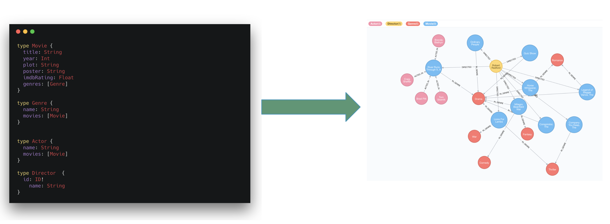
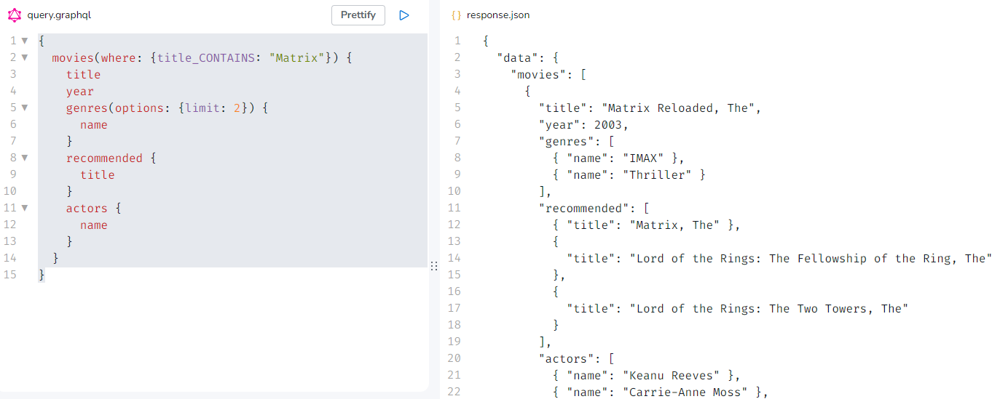
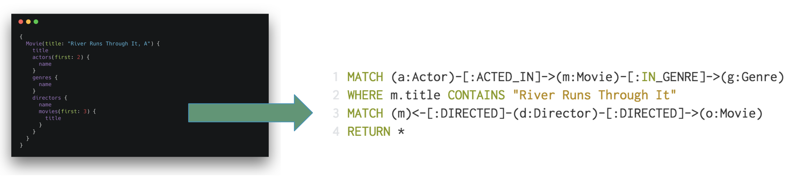
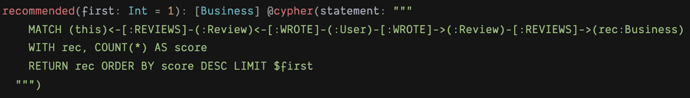

= The Neo4j GraphQL Library?
:order: 3
:sandbox: false

The fundamental goal of the Neo4j GraphQL Library is to make it easier to build GraphQL APIs backed by Neo4j.

> It's important to point out that GraphQL is an API query language and NOT a database query language. The goal of the Neo4j GraphQL Library is to help build the API layer that sits between the client and database, not to execute GraphQL queries directly against the database.

At a high level, the goals of the Neo4j GraphQL Library are focused on:

* Reducing boilerplate
* Developer productivity
* Extensibility
* Performance

== Goals of the Neo4j GraphQL Library

=== GraphQL First Development

GraphQL type definitions can drive the database data model, which means we don't need to maintain two separate schemas for our API and database.

=== Auto-generate GraphQL API Operations

With the Neo4j GraphQL Library, GraphQL type definitions provide the starting point for a generated API that includes:

* Query & Mutation types (an API entrypoint for each type defined in the schema)
* Ordering
* Pagination
* Complex filtering
* DateTime & Spatial types and filtering

=== Generate Cypher From GraphQL Operations

To reduce boilerplate and optimize for performance the Neo4j GraphQL Library automatically generates a single database query for any arbitrary GraphQL request. This means the developer does not need to implement resolvers and each GraphQL operation results in a single roundtrip to the database.

=== Extend GraphQL With Cypher

To add custom logic beyond CRUD operations, you can use the https://neo4j.com/docs/graphql-manual/current/type-definitions/cypher/[`@cypher` GraphQL schema directive] to add computed fields bound to a Cypher statement to the GraphQL schema.

== Neo4j GraphQL Library Quickstart

The focus of this course is using the Neo4j GraphQL Library to build GraphQL APIs backed by the Neo4j graph database.
Each lesson will be a hands-on mix of introducing concepts, examples, exercises, and quizzes.

[IMPORTANT]
As mentioned previously you won't be installing or running the Neo4j GraphQL Library locally, instead you will use the Neo4j GraphQL Toolbox to develop, test, and query your GraphQL API.

However, it's important to understand how to install and get started with the Neo4j GraphQL Library after you have completed this course.

The Neo4j GraphQL Library can be installed using `npm` as shown here:

[source,bash]
----
$ npm install @neo4j/graphql graphql neo4j-driver apollo-server
----

The Neo4j GraphQL Library is a *Node.js* JavaScript library that can be used with JavaScript GraphQL implementations.

[source,JavaScript,role=nocopy]
----
// index.js

const { Neo4jGraphQL } = require("@neo4j/graphql");
const neo4j = require("neo4j-driver");
const { ApolloServer } = require("apollo-server");

const typeDefs = `
    type Movie {
        title: String
        year: Int
        imdbRating: Float
        genres: [Genre] @relationship(type: "IN_GENRE", direction: OUT)
    }

    type Genre {
        name: String
        movies: [Movie] @relationship(type: "IN_GENRE", direction: IN)
    }
`;

const driver = neo4j.driver(
    "bolt://localhost:7687",
    neo4j.auth.basic("neo4j", "letmein")
);

const neoSchema = new Neo4jGraphQL({ typeDefs, driver });

const server = new ApolloServer({
    schema: neoSchema.schema,
    context: ({ req }) => ({ req }),
});

server.listen(4000).then(() => console.log("Online"));
----

Then to start a *local* GraphQL API:

[source,bash]
----
node index.js
----

This will start a *local* GraphQL API and will also serve the GraphQL Playground IDE for querying the API or exploring documentation using GraphQL's introspection feature.

[.quiz]
== Check Your Understanding

include::questions/ide.adoc[leveloffset=+1]

[.summary]
== Summary

In this lesson, you explored the features of the Neo4j GraphQL Library. 

In the next module, you will learn how to write GraphQL queries to query the API generated by the Neo4j GraphQL Library