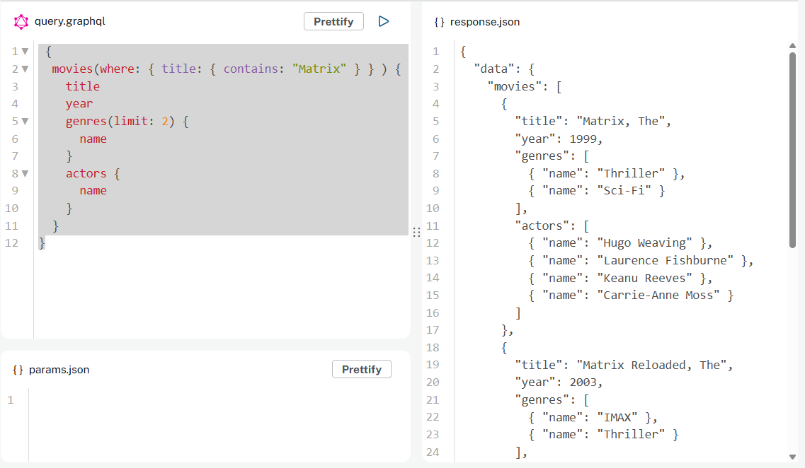

= The Neo4j GraphQL Library
:order: 3

The toolbox provides an easy-to-use interface over the https://neo4j.com/docs/graphql-manual/current/[Neo4j GraphQL Library ^].

The fundamental goal of the Neo4j GraphQL Library is to make it easier to build GraphQL APIs backed by Neo4j.

[TIP]
.Graphs and GraphQL
====
It's important to note that GraphQL is an API query language and NOT a database query language. The Neo4j GraphQL Library helps you build an API layer that sits between the client and database, not to execute GraphQL queries directly against the database.
====

The Neo4j GraphQL Library focuses on the following high-level objectives:

* Reducing boilerplate
* Developer productivity
* Extensibility
* Performance

== Goals of the Neo4j GraphQL Library

=== GraphQL First Development

GraphQL type definitions can drive the database data model, meaning you don't need to maintain two separate schemas for your API and database.

image::images/03graphqlfirst.png[GraphQL first development,width=500,align=center]

=== Auto-generate GraphQL API Operations

With the Neo4j GraphQL Library, GraphQL type definitions provide the starting point for a generated API that includes:

* Query & Mutation types (an API entry-point for each type defined in the schema)
* Ordering
* Pagination
* Complex filtering
* DateTime & Spatial types and filtering

// Query for image

// {
//   movies(where: {title_CONTAINS: "Matrix"}) {
//     title
//     year
//     genres(options: {limit: 2}) {
//       name
//     }
//     recommended {
//       title
//     }
//     actors {
//       name
//     }
//   }
// }

=== Generate Cypher From GraphQL Operations

The Neo4j GraphQL Library automatically generates a single database query for any arbitrary GraphQL request. 

Single automatically generated queries: 

* remove the need to implement resolvers
* reduce boilerplate code
* optimize the performance of queries
* GraphQL operations require only a single roundtrip to the database

image::images/03generate.png[Generate Cypher from GraphQL, width=500, align=center]

=== Extend GraphQL With Cypher

To add custom logic beyond CRUD operations, you can use the https://neo4j.com/docs/graphql-manual/current/type-definitions/cypher/[`@cypher` GraphQL schema directive] to add computed fields bound to a Cypher statement to the GraphQL schema.

image::images/03cypher.png[Extend GraphQL with Cypher, width=500, align=center]

[.quiz]
== Check Your Understanding

include::questions/objectives.adoc[leveloffset=+1]

[.summary]
== Summary

In this lesson, you explored the features of the Neo4j GraphQL Library. 

In the next module, you will learn how to write GraphQL queries to query the API generated by the Neo4j GraphQL Library