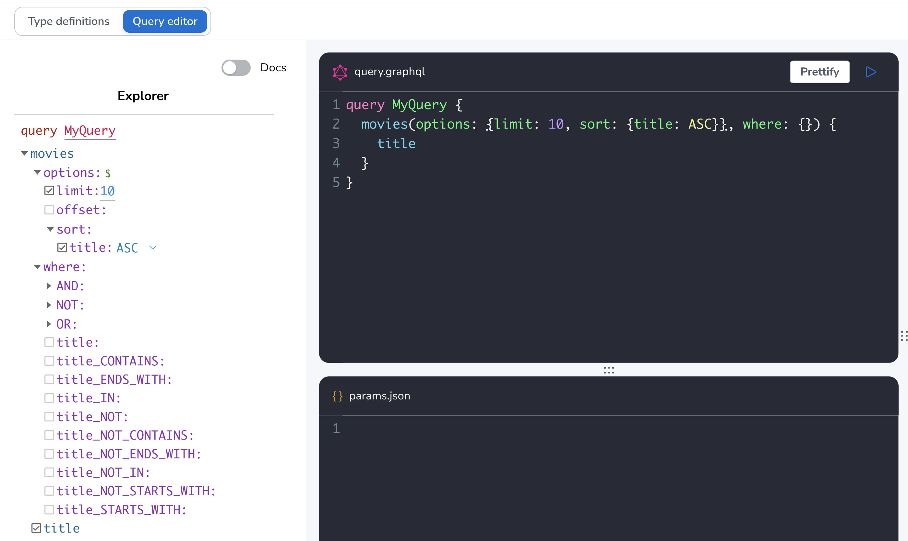

= GraphQL Queries
:order: 1
// :sandbox: https://graphql-toolbox.neo4j.io/?connectURL=neo4j%2Bs://neo4j:felt-airport-manuals@d8086e75a731979f82f10f93e02eadd2.neo4jsandbox.com:7687
:disable-cache: true

The Neo4j GraphQL Library is a GraphQL to Cypher query execution layer for Neo4j and JavaScript GraphQL implementations.

In the previous section we said the four main goals of the Neo4j GraphQL Library are to:

1. Support GraphQL First Development
2. Auto Generate GraphQL API Operations
3. Generate Cypher From GraphQL Operations
4. Extend GraphQL With Cypher

== GraphQL First Development

// link:./1-setup/[Setup the Repository →, role=btn]

To start off be sure to use the default GraphQL type definitions that are defining a simple `Movie` type with only one property `title`. 

> Replace the contents of the type definition editor with the following snippet:

[source,GraphQL]
----
type Movie {
  title: String
}
----

Our database contains other data, but for now we'll start with just this simple type definition. The Neo4j GraphQL Library uses the convention of mapping GraphQL types to Neo4j node labels in the property graph model.

The single movie type defined above maps to a Neo4j property graph model with a single node label `Movie` and a single node property `title`.

// TODO: add arrows image of data model

If we click on the "Build Schema" button we can see the following operations are generated for us:

* `Query.movies`
* `Query.moviesAggregate`
* `Query.moviesConnection`

Similarly, the following mutation operations are generated as part of the GraphQL API:

* `Mutation.createMovies`
* `Mutation.deleteMovies`
* `Mutation.updateMovies`

That's quite a few operations available for just one single type! Let's ignore the other generated operations and focus on `Query.movies` for now.

[source,GraphQL]
----
query MyQuery {
  movies(options: { limit: 10 }) {
    title
  }
}
----

[source,JSON]
----
{
  "data": {
    "movies": [
      { "title": "Toy Story" },
      { "title": "Jumanji" },
      { "title": "Grumpier Old Men" },
      { "title": "Waiting to Exhale" },
      { "title": "Father of the Bride Part II" },
      { "title": "Heat" },
      { "title": "Sabrina" },
      { "title": "Tom and Huck" },
      { "title": "Sudden Death" },
      { "title": "GoldenEye" }
    ]
  }
}
----

Let's learn a bit more about the generated GraphQL API provided by the Neo4j GraphQL Library.

== The Generated GraphQL API

== Queries

By default, a Query field is generated for each type / node label defined in the GraphQL type definitions (technially three fields, as we see above, one for top-level query access (`Query.movies`), one for aggregations (`Query.moviesAggregate`), and another for Relay-style connection type (`Query.moviesConnection`) - more on those latter two later).

This query field allow for top-level query access to search for data and begin the data graph traversal from this type/node label (remember that node labels map to GraphQL types defined in the type definitions when using the Neo4j GraphQL Library).

this generated query field takes two optional arguments: 

* `options` - used to specify sorting, offset, and limit arguments, to enable for example pagination
* `where` - use to filter search results by matching predicates for field / node property values

We've already used the `options` argument! Let's add sorting to our example GraphQL query to see more ways of using the `options` argument.

[source,GraphQL]
----

----

Note that you can use the Explorer feature of

== Filtering

????

[.quiz]
== Check Your Understanding

include::questions/question-1.adoc[leveloffset=+1]

include::questions/question-2.adoc[leveloffset=+1]

include::questions/question-3.adoc[leveloffset=+1]

[.summary]
== Summary

In this lesson, we introduced GraphQL and the features of the Neo4j GraphQL Library. In the next lesson we get started using the Neo4j GraphQL Library to build a GraphQL API backed by Neo4j.

