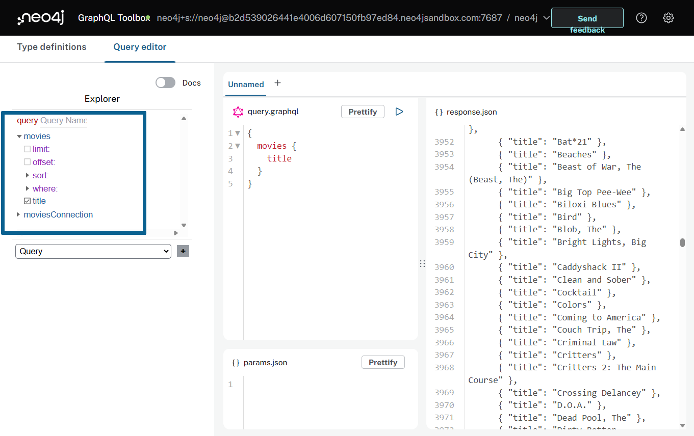
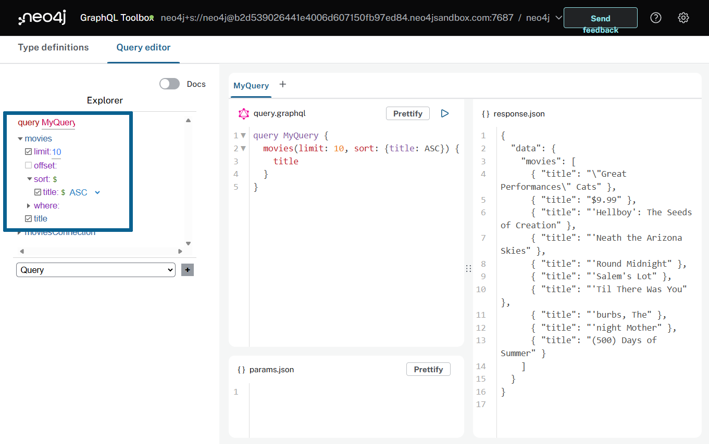
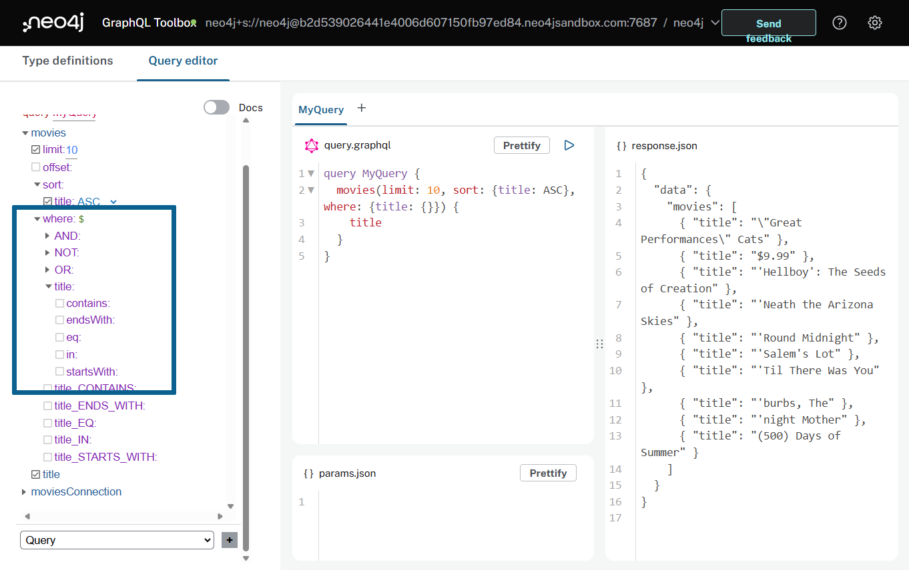
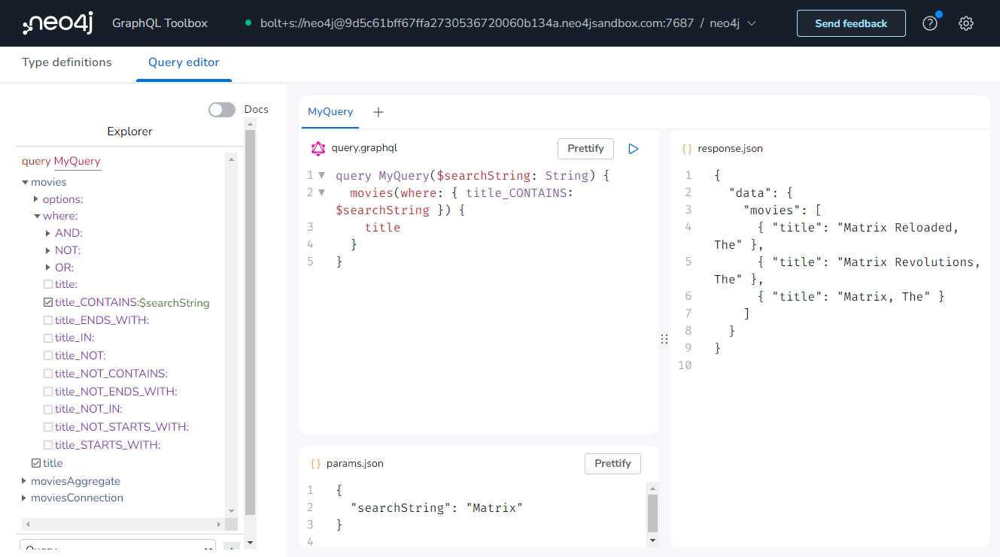

= GraphQL Queries
:order: 1
:disable-cache: true

In this lesson you will learn how the Neo4j GraphQL Library supports GraphQL queries.

== Type definitions

Start with using these GraphQL type definitions that define a simple `Movie` type with only one property `title`. The database contains other data, but for now you will start with this simple type definition. 

Replace the contents of the type definition editor with the following snippet:

[source,GraphQL]
----
type Movie @node {
  title: String
}
----

== The Generated GraphQL API

The Neo4j GraphQL Library uses the convention of mapping GraphQL types to Neo4j node labels in the property graph model. The single `Movie` type defined above maps to a Neo4j property graph model with a single node label `Movie` and a single node property `title`.

Click on the "Build Schema" button and note that three query field are generated for the `Movie` type:

* `Query.movies` - top-level query access
* `Query.moviesAggregate` - aggregations
* `Query.moviesConnection` - Relay-style connection type

[NOTE]
.Generated query fields
====
The GraphQL Library generates the same 3 query fields and mutation operations for each type / node label defined in the type definitions. You will learn about mutations in the next module.
====

In this lesson you will explore the `Query.movies` query field.

== Querying the GraphQL API

The `Query.movies` query field allow for top-level query access to search for data and begin the data graph traversal from the `Movie` type/node label (remember that node labels map to GraphQL types defined in the type definitions when using the Neo4j GraphQL Library).

Run the following query in the Neo4j GraphQL Toolbox to see the results of the generated GraphQL API operations.

[source,GraphQL]
----
query MyQuery {
  movies(limit: 10) {
    title
  }
}
----

[source,JSON]
----
{
  "data": {
    "movies": [
      { "title": "Toy Story" },
      { "title": "Jumanji" },
      { "title": "Grumpier Old Men" },
      { "title": "Waiting to Exhale" },
      { "title": "Father of the Bride Part II" },
      { "title": "Heat" },
      { "title": "Sabrina" },
      { "title": "Tom and Huck" },
      { "title": "Sudden Death" },
      { "title": "GoldenEye" }
    ]
  }
}
----

The `Query.movies` generated query field takes optional arguments, for example: 

* `sort`, `offset`, `limit` - used to specify sorting, offset, and limit arguments, to enable for example pagination
* `where` - use to filter search results by matching predicates for field / node property values

The `limit` argument was used in the example query to limit the number of results.  
A `sort` argument can also be added to change the sort order of the results.

[source,GraphQL]
----
query MyQuery {
  movies(limit: 10, sort: { title: ASC }) {
    title
  }
}
----

// TODO - update image post release
[TIP]
.Explore the schema
====
In addition to editing the GraphQL queries in the Query Editor you can use the Explorer feature integrated into the Neo4j GraphQL Toolbox to interactively explore the schema documentation and toggle fields on and off in the selection set.

====

=== Filtering With The `where` Argument

Now that you have seen how to use the `options` argument, let's explore the filtering functionality exposed by the `where` argument.

If you expand the `where` input object in Explorer you can see the various fields available on the input object. These input fields correspond to various string comparison operations with the `title` field on the `Movie` type.

You can filter for movies titles that contain a certain substring by creating a `where` argument against the `Movie.title` field. 

Run this query which searches for any movies with "Matrix" in the title.

[source,GraphQL]
----
query MyQuery {
  movies(where: { title_CONTAINS: "Matrix" }) {
    title
  }
}
----

[source,JSON]
----
{
  "data": {
    "movies": [
      { "title": "Matrix Reloaded, The" },
      { "title": "Matrix Revolutions, The" },
      { "title": "Matrix, The" }
    ]
  }
}
----

=== Parameters

You can also use GraphQL variables to write queries by passing parameter values in the `params.json` panel.

. Enter the following parameter into `params.json` tab in the Neo4j GraphQL Toolbox.
+ 
[source,json]
----
{
  "searchString": "Matrix"
}
----  
. Modify the query to accept and use the `$searchString` parameter.
+
[source,GraphQL]
----
query MyQuery($searchString: String) {
  movies(where: { title_CONTAINS: $searchString }) {
    title
  }
}
----
. Run the query and see the same results as before.

[.quiz]
== Check Your Understanding

include::questions/question-1.adoc[leveloffset=+1]

include::questions/question-2.adoc[leveloffset=+1]

include::questions/question-3.adoc[leveloffset=+1]

[.summary]
== Summary

In this lesson, you explored the Query API of the Neo4j GraphQL Library and the Neo4j GraphQL Toolbox. 

In the next lesson, you will see how to build a more complex data graph using the GraphQL schema type definitions and the Neo4j GraphQL Toolbox.
