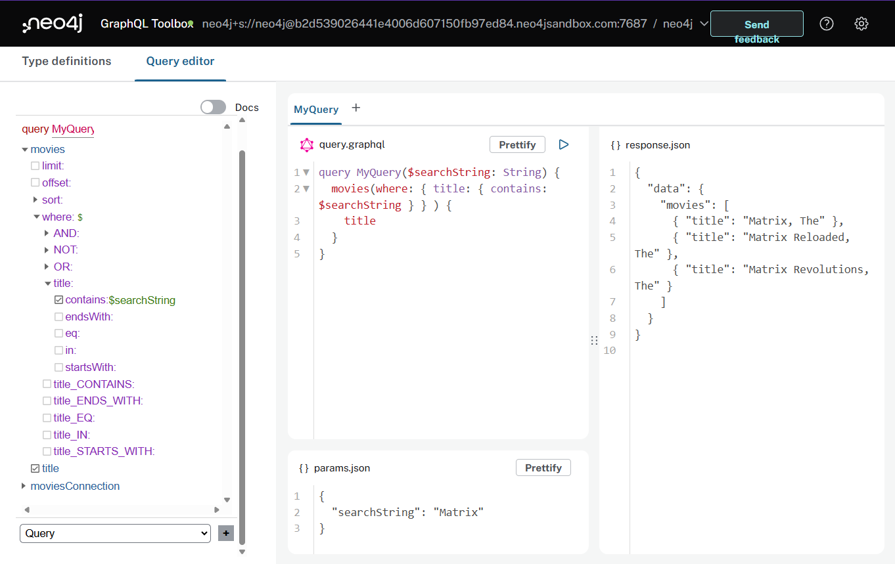

= GraphQL Queries
:order: 1
:disable-cache: true

The Neo4j GraphQL Library is a GraphQL to Cypher query execution layer for Neo4j and JavaScript GraphQL implementations.

In the previous section you learn't that the four main goals of the Neo4j GraphQL Library are to:

. Support GraphQL First Development
. Auto Generate GraphQL API Operations
. Generate Cypher From GraphQL Operations
. Extend GraphQL With Cypher

Let's see how the Neo4j GraphQL Library enables GraphQL First Development!

== GraphQL First Development

// link:./1-setup/[Setup the Repository →, role=btn]

To start off be sure to use these GraphQL type definitions that define a simple `Movie` type with only one property `title`. 

> Replace the contents of the type definition editor with the following snippet:

[source,GraphQL]
----
type Movie {
  title: String
}
----

The database contains other data, but for now you will start with just this simple type definition. 

The Neo4j GraphQL Library uses the convention of mapping GraphQL types to Neo4j node labels in the property graph model. The single `Movie` type defined above maps to a Neo4j property graph model with a single node label `Movie` and a single node property `title`.

// TODO: add arrows image of data model

When you click on the "Build Schema" button the following query operations are generated:

* `Query.movies`
* `Query.moviesAggregate`
* `Query.moviesConnection`

image::images/01queries-annotated.png[Toolbox highlighting the 3 query operations,width=500,align=center]

Similarly, the following mutation operations are also generated as part of the GraphQL API:

* `Mutation.createMovies`
* `Mutation.deleteMovies`
* `Mutation.updateMovies`

That's quite a few operations available for just one single type! Let's ignore the other generated operations and focus on `Query.movies` for now.

Run the following query in the Neo4j GraphQL Toolbox to see the results of the generated GraphQL API operations.

[source,GraphQL]
----
query MyQuery {
  movies(options: { limit: 10 }) {
    title
  }
}
----

> Note that the `options` argument is used to specify the limit of 10 results.

[source,JSON]
----
{
  "data": {
    "movies": [
      { "title": "Toy Story" },
      { "title": "Jumanji" },
      { "title": "Grumpier Old Men" },
      { "title": "Waiting to Exhale" },
      { "title": "Father of the Bride Part II" },
      { "title": "Heat" },
      { "title": "Sabrina" },
      { "title": "Tom and Huck" },
      { "title": "Sudden Death" },
      { "title": "GoldenEye" }
    ]
  }
}
----

Let's learn a bit more about the generated GraphQL API provided by the Neo4j GraphQL Library.

== The Generated GraphQL API

The second main goal of the Neo4j GraphQL Library is to auto-generate

Let's see the third goal in action, generating Cypher from GraphQL requests.

== Queries

As you saw above, by default, a Query field is generated for each type / node label defined in the GraphQL type definitions.

There are three query fields generated for the `Movie` type:

* `Query.movies` - top-level query access
* `Query.moviesAggregate` - aggregations
* `Query.moviesConnection` - Relay-style connection type

Let's explore the `Query.movies` query field.

This query field allow for top-level query access to search for data and begin the data graph traversal from this type/node label (remember that node labels map to GraphQL types defined in the type definitions when using the Neo4j GraphQL Library).

This generated query field takes two optional arguments: 

* `options` - used to specify sorting, offset, and limit arguments, to enable for example pagination
* `where` - use to filter search results by matching predicates for field / node property values

The `options` argument was used in the example above to limit the number of results.  Add a `sort` option to the example GraphQL query change the sort order of the results.

[source,GraphQL]
----
query MyQuery {
  movies(options: { limit: 10, sort: { title: ASC } }) {
    title
  }
}
----

> Note that in addition to editing the GraphQL type definitions in the type definitions editor you can use the Explorer feature integrated in the Neo4j GraphQL Toolbox to interactively explore the schema documentation and toggle fields on and off in the selection set:

image::images/01explorer-annotated.png[Neo4j GraphQL Toolbox Explorer feature,width=500,align=center]

== Filtering With The `where` Argument

Now that you have seen how to use the `options` argument, let's explore the filtering functionality exposed by the `where` argument.

If you expand the `where` input object toggle in Explorer you can see the various fields available on the input object. These input fields correspond to various string comparison operations with the `title` field on the `Movie` type.

image::images/01explorer-where-annotated.png[Neo4j GraphQL Toolbox Explorer feature,width=500,align=center]

Since a field is `Movie.title` you can filter for movies that contain a certain substring. 

Run this query which searches for any movies with "Matrix" in the title.

[source,GraphQL]
----
query MyQuery {
  movies(where: { title_CONTAINS: "Matrix" }) {
    title
  }
}
----

[source,JSON]
----
{
  "data": {
    "movies": [
      { "title": "Matrix Reloaded, The" },
      { "title": "Matrix Revolutions, The" },
      { "title": "Matrix, The" }
    ]
  }
}
----

=== Parameters

You can also use GraphQL variables to write queries by passing parameter values in the `params.json` panel.

. Enter the following parameter into `params.json` tab in the Neo4j GraphQL Toolbox.
+ 
[source,json]
----
{
  "searchString": "Matrix"
}
----  
. Modify the query to accept and use the `$searchString` parameter.
+
[source,GraphQL]
----
query MyQuery($searchString: String) {
  movies(where: { title_CONTAINS: $searchString }) {
    title
  }
}
----
. Run the query and see the same results as before.

[.quiz]
== Check Your Understanding

include::questions/question-1.adoc[leveloffset=+1]

include::questions/question-2.adoc[leveloffset=+1]

include::questions/question-3.adoc[leveloffset=+1]

[.summary]
== Summary

In this lesson, you were introduced the Query API of the Neo4j GraphQL Library and the Neo4j GraphQL Toolbox. In the next lesson you will see how to build a more complex data graph using the GraphQL schema type definitions and the Neo4j GraphQL Toolbox.

