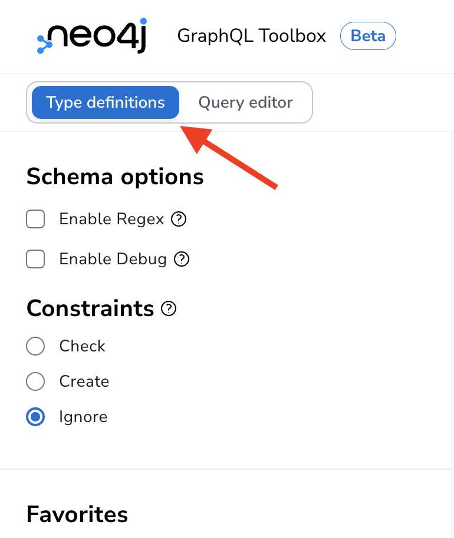
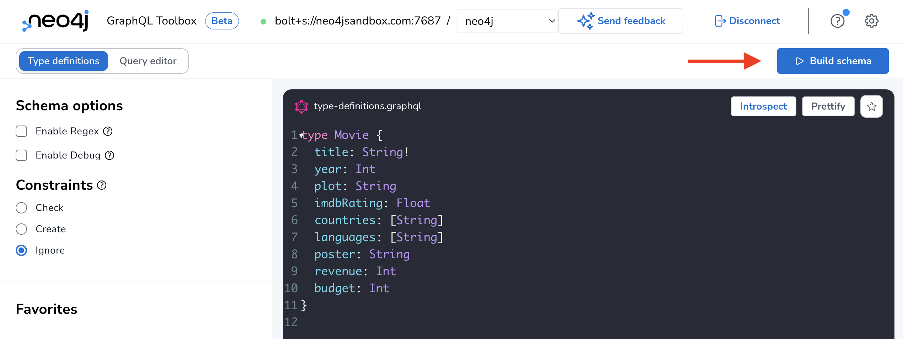
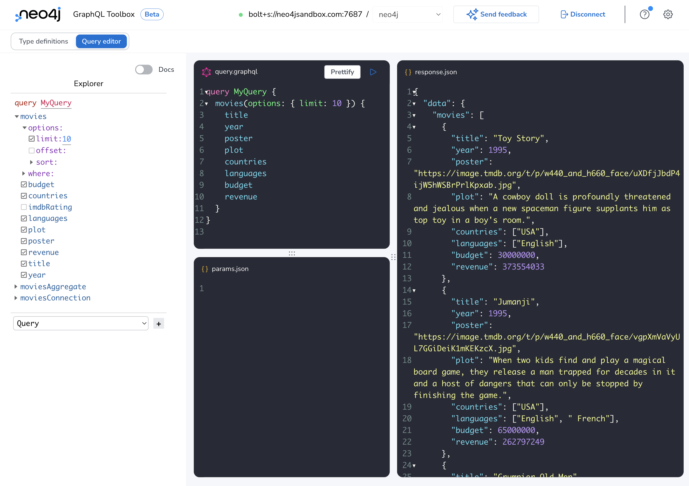

= Updating GraphQL Type Definitions 
:order: 2

== GraphQL Type Definitions And The Property Graph Model

The Neo4j GraphQL library maps GraphQL type definitions to the equivalent property graph data model in Neo4j in order to generate a single Cypher query to resolve an arbitrary GraphQL request.

So far we've used very simple GraphQL type definitions with our movie recommendations dataset:

[source,GraphQL]
----
type Movie {
  title: String
}
----

However, we have a much richer dataset loaded in our Neo4j database:

image::images/full_datamodel.png[Option to generate GraphQL type definitions,width=500,align=center]

Let's see how we can update our GraphQL type definitions to match this property graph data model.

== Adding Fields

First, let's see how we can add fields to our `Movie` type in the GraphQL type definitions to make additional node properties available in our GraphQL API.

Select the "Type definitions" button in the upper left corner of the Neo4j GraphQL Toolbox to returned to the type definitions editor. Here we'll be able to update the type definitions that define our GraphQL API and then rebuild the schema to start querying using the updated fields.

Let's add some additional fields to our `Movie` type. 

> Replace the contents of the type definition editor with the following GraphQL type definitions:

[source,GraphQL]
----
type Movie {
  title: String!
  year: Int
  plot: String
  imdbRating: Float
  countries: [String]
  languages: [String]
  poster: String
  revenue: Double
  budget
}
----

Click the "Build schema" button to update the generated GraphQL API to use these updated type definitions.

We can now include these fields in our GraphQL query. Try running the following query, either by using the Explorer checkbox approach to building the GraphQL query or by typing directly in the `query.graphql` pane.

[source,GraphQL]
----
query MyQuery {
  movies(options: { limit: 10 }) {
    title
    year
    poster
    plot
    countries
    languages
    budget
    revenue
  }
}
----

.Click to reveal the query result
[%collapsible]
====
[source,JSON]
----
{
  "data": {
    "movies": [
      {
        "title": "Toy Story",
        "year": 1995,
        "poster": "https://image.tmdb.org/t/p/w440_and_h660_face/uXDfjJbdP4ijW5hWSBrPrlKpxab.jpg",
        "plot": "A cowboy doll is profoundly threatened and jealous when a new spaceman figure supplants him as top toy in a boy's room.",
        "countries": ["USA"],
        "languages": ["English"],
        "budget": 30000000,
        "revenue": 373554033
      },
      {
        "title": "Jumanji",
        "year": 1995,
        "poster": "https://image.tmdb.org/t/p/w440_and_h660_face/vgpXmVaVyUL7GGiDeiK1mKEKzcX.jpg",
        "plot": "When two kids find and play a magical board game, they release a man trapped for decades in it and a host of dangers that can only be stopped by finishing the game.",
        "countries": ["USA"],
        "languages": ["English", " French"],
        "budget": 65000000,
        "revenue": 262797249
      },
      {
        "title": "Grumpier Old Men",
        "year": 1995,
        "poster": "https://image.tmdb.org/t/p/w440_and_h660_face/1FSXpj5e8l4KH6nVFO5SPUeraOt.jpg",
        "plot": "John and Max resolve to save their beloved bait shop from turning into an Italian restaurant, just as its new female owner catches Max's attention.",
        "countries": ["USA"],
        "languages": ["English"],
        "budget": null,
        "revenue": null
      },
      {
        "title": "Waiting to Exhale",
        "year": 1995,
        "poster": "https://image.tmdb.org/t/p/w440_and_h660_face/4wjGMwPsdlvi025ZqR4rXnFDvBz.jpg",
        "plot": "Based on Terry McMillan's novel, this film follows four very different African-American women and their relationships with the male gender.",
        "countries": ["USA"],
        "languages": ["English"],
        "budget": 16000000,
        "revenue": 81452156
      },
      {
        "title": "Father of the Bride Part II",
        "year": 1995,
        "poster": "https://image.tmdb.org/t/p/w440_and_h660_face/lf9RTErt8BSLQy98aSFblElvsCQ.jpg",
        "plot": "In this sequel, George Banks deals not only with the pregnancy of his daughter, but also with the unexpected pregnancy of his wife.",
        "countries": ["USA"],
        "languages": ["English"],
        "budget": null,
        "revenue": 76578911
      },
      {
        "title": "Heat",
        "year": 1995,
        "poster": "https://image.tmdb.org/t/p/w440_and_h660_face/rrBuGu0Pjq7Y2BWSI6teGfZzviY.jpg",
        "plot": "A group of professional bank robbers start to feel the heat from police when they unknowingly leave a clue at their latest heist.",
        "countries": ["USA"],
        "languages": ["English", " Spanish"],
        "budget": 60000000,
        "revenue": 187436818
      },
      {
        "title": "Sabrina",
        "year": 1995,
        "poster": "https://image.tmdb.org/t/p/w440_and_h660_face/z1oNjotUI7D06J4LWQFQzdIuPnf.jpg",
        "plot": "An ugly duckling having undergone a remarkable change, still harbors feelings for her crush: a carefree playboy, but not before his business-focused brother has something to say about it.",
        "countries": ["Germany", " USA"],
        "languages": ["English", " French"],
        "budget": 58000000,
        "revenue": 53672080
      },
      {
        "title": "Tom and Huck",
        "year": 1995,
        "poster": "https://image.tmdb.org/t/p/w440_and_h660_face/lOnbEStMnDGKWJGvPEsMoZDML1b.jpg",
        "plot": "Tom and Huck witness Injun Joe's killing of Doc Robinson one night at the graveyard. When an innocent man is accused of killing the Doc, Tom steps up as a witness, not respecting the promise made to Huck to lay low.",
        "countries": ["USA"],
        "languages": ["English"],
        "budget": null,
        "revenue": 23920048
      },
      {
        "title": "Sudden Death",
        "year": 1995,
        "poster": "https://image.tmdb.org/t/p/w440_and_h660_face/4Snihptli0we9I4W5QfufOdHSeV.jpg",
        "plot": "A former fireman takes on a group of terrorists holding the Vice President and others hostage during the seventh game of the NHL Stanley Cup finals.",
        "countries": ["USA"],
        "languages": ["English"],
        "budget": 35000000,
        "revenue": 64350171
      },
      {
        "title": "GoldenEye",
        "year": 1995,
        "poster": "https://image.tmdb.org/t/p/w440_and_h660_face/z0ljRnNxIO7CRBhLEO0DvLgAFPR.jpg",
        "plot": "James Bond teams up with the lone survivor of a destroyed Russian research center to stop the hijacking of a nuclear space weapon by a fellow agent formerly believed to be dead.",
        "countries": ["UK", " USA"],
        "languages": ["English", " Russian", " Spanish"],
        "budget": 58000000,
        "revenue": 352194034
      }
    ]
  }
}

----
====

== Adding Nodes

The Neo4j GraphQL Library maps GraphQL types to node labels in Neo4j. This means 

[source,GraphQL]
----
type Movie {
  title: String!
  year: Int
  plot: String
  imdbRating: Float
  countries: [String]
  languages: [String]
  poster: String
  revenue: Int
  budget: Int
}

type User {
  userId: ID!
  name: String!
}

type Actor {
  name: String!
}

type Genre {
  name: String!
}
----

Now click the "Build schema" button again to update the generated GraphQL API. After doing this and returning to the Query Editor tab in GraphQL Toolbox you'll notice we now have several more top-level Query fields. By default each type defined in our GraphQL type definitions will result in these top-level Query fields added to the schema. We can configure what operations are generated for each type using GraphQL schema directives, which we'll see how to do in the next section.

[source,GraphQL]
----
{
  genres {
    name
  }
}
----

[source,JSON]
----
{
  "data": {
    "genres": [
      { "name": "Adventure" },
      { "name": "Animation" },
      { "name": "Children" },
      { "name": "Comedy" },
      { "name": "Fantasy" },
      { "name": "Romance" },
      { "name": "Drama" },
      { "name": "Action" },
      { "name": "Crime" },
      { "name": "Thriller" },
      { "name": "Horror" },
      { "name": "Mystery" },
      { "name": "Sci-Fi" },
      { "name": "Documentary" },
      { "name": "IMAX" },
      { "name": "War" },
      { "name": "Musical" },
      { "name": "Western" },
      { "name": "Film-Noir" },
      { "name": "(no genres listed)" }
    ]
  }
}

----

But we have a big problem - our nodes are not connected in our GraphQL API! Let's fix that by adding relationships to our GraphQL type definitions.

== Adding Relationships

To add relationships to our GraphQL API using the Neo4j GraphQL Library we use the `@relationship` GraphQL schema directive. GraphQL schema directives are GraphQL's built in extension mechanism that allow developers to indicate some custom server-side logic should occur.

> GraphQL schema directives are extremely powerful and are used to configure the GraphQL API generated by the Neo4j GraphQL Library. We will see more examples of using GraphQL schema directives in the next section of this course.

To add relationships to our GraphQL API we need to do the following steps:

1. Add a new field(s) to represent the relationship
2. Define the type of this field (what type is on the other end of the relationship?)
3. Use the `@relationship` directive to define the relationship type (as stored in Neo4j) and the direction of the relationship (`IN` or `OUT`).

Let's add relationships by returning to the Type Definitions tab in GraphQL Toolbox and updating our type definitions to capture the relationships present in our property graph model above (`IN_GENRE`, `ACTED_IN` and `RATED`)

[source,GraphQL]
----
type Movie {
  title: String!
  year: Int
  plot: String
  imdbRating: Float
  countries: [String]
  languages: [String]
  poster: String
  revenue: Int
  budget: Int
  actors: [Actor!]! @relationship(type: "ACTED_IN", direction: IN)
  genres: [Genre!]! @relationship(type: "IN_GENRE", direction: OUT)
}

type User {
  userId: ID!
  name: String!
  rated: [Movie!]! @relationship(type: "RATED", direction: OUT)
}

type Actor {
  name: String!
  movies: [Movie!]! @relationship(type: "ACTED_IN", direction: OUT)
}

type Genre {
  name: String!
  movies: [Movie!]! @relationship(type: "IN_GENRE", direction: IN)
}
----

Note that our relationship fields are non-nullable (for example `[Actor!]!`) since if a relationship exists it will always connect exactly two nodes, therefore a relationship field will never be null.

// // Full type definitions

// [source,GraphQL]
// ----
// type Movie {
//   title: String
//   year: Int
//   plot: String
//   imdbRating: Float
//   countries: [String]
//   languages: [String]
//   poster: String
//   revenue: Double
//   budget: Double
//   inGenreGenre: Genre @relationship(type: "IN_GENRE", direction: OUT)
//   actorActedIn: Actor @relationship(type: "ACTED_IN", direction: IN, properties: "ActedIn")
//   userRated: User @relationship(type: "RATED", direction: IN, properties: "Rated")
// }

// type Actor {
//   name: String
//   actedInMovie: Movie @relationship(type: "ACTED_IN", direction: OUT, properties: "ActedIn")
// }

// type User {
//   name: String
//   userId: String
//   ratedMovie: Movie @relationship(type: "RATED", direction: OUT, properties: "Rated")
// }

// type Genre {
//   name: String
//   movieInGenre: Movie @relationship(type: "IN_GENRE", direction: IN)
// }

// interface ActedIn {
//   role: String
// }

// interface Rated {
//   rating: Float
// }

// ----

Select the "Build schema" button again to update the GraphQL schema and return to the query editor. Let's return to our Matrix movie search query from the previous section, but this time let's update our GraphQL selection set to traverse from the movie nodes to the actors and genres as well.

[source,GraphQL]
----
query MyQuery {
  movies(where: { title_CONTAINS: "Matrix" }) {
    title
    actors {
      name
    }
    genres {
      name
    }
  }
}
----

After running this query we now see the actors and genres connected to each Matrix movie.

[source,JSON]
----
{
  "data": {
    "movies": [
      {
        "title": "Matrix Reloaded, The",
        "actors": [
          { "name": "Keanu Reeves" },
          { "name": "Carrie-Anne Moss" },
          { "name": "Christine Anu" },
          { "name": "Andy Arness" }
        ],
        "genres": [
          { "name": "IMAX" },
          { "name": "Thriller" },
          { "name": "Action" },
          { "name": "Sci-Fi" },
          { "name": "Adventure" }
        ]
      },
      {
        "title": "Matrix Revolutions, The",
        "actors": [
          { "name": "Keanu Reeves" },
          { "name": "Mary Alice" },
          { "name": "Helmut Bakaitis" },
          { "name": "Kate Beahan" }
        ],
        "genres": [
          { "name": "Action" },
          { "name": "IMAX" },
          { "name": "Thriller" },
          { "name": "Sci-Fi" },
          { "name": "Adventure" }
        ]
      },
      {
        "title": "Matrix, The",
        "actors": [
          { "name": "Hugo Weaving" },
          { "name": "Laurence Fishburne" },
          { "name": "Keanu Reeves" },
          { "name": "Carrie-Anne Moss" }
        ],
        "genres": [
          { "name": "Thriller" },
          { "name": "Sci-Fi" },
          { "name": "Action" }
        ]
      }
    ]
  }
}
----

TODO: add section covering relationship properties for rated and acted_in? Maybe a 3rd lesson?

TODO: add section on the generated Cypher query here (how relationship traversals are added, etc)?

[.quiz]
== Check Your Understanding

include::questions/question-1.adoc[leveloffset=+1]

include::questions/question-2.adoc[leveloffset=+1]

include::questions/question-3.adoc[leveloffset=+1]

[.summary]
== Summary

In this lesson, we saw how GraphQL type definitions drive the GraphQL schema when using the Neo4j GraphQL Library and the Neo4j GraphQL Toolbox. In the next section we will see how to create, update, and delete data using GraphQL mutations.