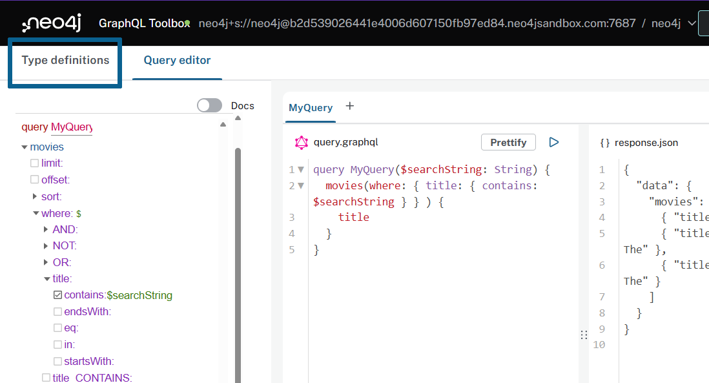
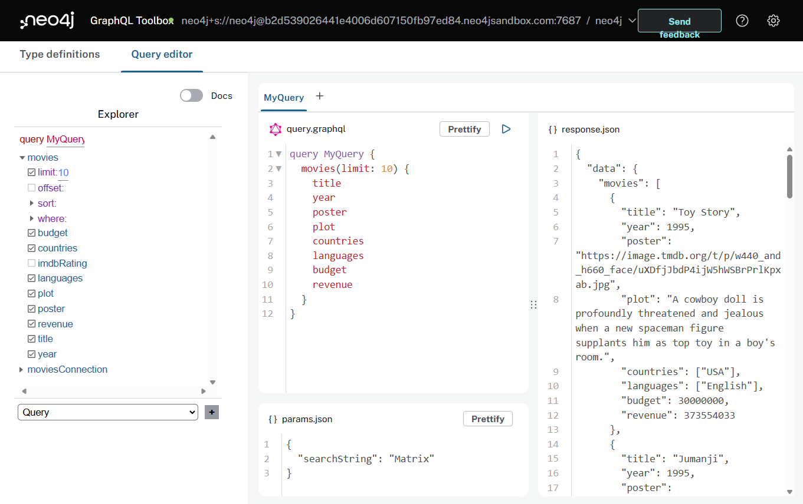

= Updating GraphQL Type Definitions 
:order: 2

== GraphQL Type Definitions And The Property Graph Model

The Neo4j GraphQL library maps GraphQL type definitions to the equivalent property graph data model in Neo4j in order to generate a single Cypher query to resolve an arbitrary GraphQL request.

So far you have used very simple GraphQL type definitions with the movie recommendations dataset:

[source,GraphQL]
----
type Movie {
  title: String
}
----

However, there is a much richer dataset loaded in the Neo4j database:

image::images/full_datamodel.png[Option to generate GraphQL type definitions,width=500,align=center]

Let's see how you can update the GraphQL type definitions to match this property graph data model.

== Adding Fields

First, let's see how to add fields to the `Movie` type in the GraphQL type definitions to make additional node properties available in the GraphQL API.

Select the "Type definitions" button in the upper left corner of the Neo4j GraphQL Toolbox to returned to the type definitions editor. Here you can update the type definitions that define the GraphQL API and then rebuild the schema to start querying using the updated fields.

. Replace the contents of the type definition editor with the following GraphQL type definitions to additional fields to the `Movie` type:
+
[source,GraphQL]
----
type Movie {
  title: String!
  year: Int
  plot: String
  imdbRating: Float
  countries: [String]
  languages: [String]
  poster: String
  revenue: Int
  budget: Int
}
----
> The ! after the `title` field indicates that this field is required and cannot be null (i.e. it is non-nullable).

. Click the "Build schema" button to update the generated GraphQL API to use these updated type definitions.
+ 
These fields can now be used in your GraphQL query. 
. Run the following query, either by using the Explorer checkbox approach to building the GraphQL query or by typing directly in the Query pane.
+
[source,GraphQL]
----
query MyQuery {
  movies(options: { limit: 10 }) {
    title
    year
    poster
    plot
    countries
    languages
    budget
    revenue
  }
}
----

.Click to reveal the query result
[%collapsible]
====
[source,JSON]
----
{
  "data": {
    "movies": [
      {
        "title": "Toy Story",
        "year": 1995,
        "poster": "https://image.tmdb.org/t/p/w440_and_h660_face/uXDfjJbdP4ijW5hWSBrPrlKpxab.jpg",
        "plot": "A cowboy doll is profoundly threatened and jealous when a new spaceman figure supplants him as top toy in a boy's room.",
        "countries": ["USA"],
        "languages": ["English"],
        "budget": 30000000,
        "revenue": 373554033
      },
      {
        "title": "Jumanji",
        "year": 1995,
        "poster": "https://image.tmdb.org/t/p/w440_and_h660_face/vgpXmVaVyUL7GGiDeiK1mKEKzcX.jpg",
        "plot": "When two kids find and play a magical board game, they release a man trapped for decades in it and a host of dangers that can only be stopped by finishing the game.",
        "countries": ["USA"],
        "languages": ["English", " French"],
        "budget": 65000000,
        "revenue": 262797249
      },
      {
        "title": "Grumpier Old Men",
        "year": 1995,
        "poster": "https://image.tmdb.org/t/p/w440_and_h660_face/1FSXpj5e8l4KH6nVFO5SPUeraOt.jpg",
        "plot": "John and Max resolve to save their beloved bait shop from turning into an Italian restaurant, just as its new female owner catches Max's attention.",
        "countries": ["USA"],
        "languages": ["English"],
        "budget": null,
        "revenue": null
      },
      {
        "title": "Waiting to Exhale",
        "year": 1995,
        "poster": "https://image.tmdb.org/t/p/w440_and_h660_face/4wjGMwPsdlvi025ZqR4rXnFDvBz.jpg",
        "plot": "Based on Terry McMillan's novel, this film follows four very different African-American women and their relationships with the male gender.",
        "countries": ["USA"],
        "languages": ["English"],
        "budget": 16000000,
        "revenue": 81452156
      },
      {
        "title": "Father of the Bride Part II",
        "year": 1995,
        "poster": "https://image.tmdb.org/t/p/w440_and_h660_face/lf9RTErt8BSLQy98aSFblElvsCQ.jpg",
        "plot": "In this sequel, George Banks deals not only with the pregnancy of his daughter, but also with the unexpected pregnancy of his wife.",
        "countries": ["USA"],
        "languages": ["English"],
        "budget": null,
        "revenue": 76578911
      },
      {
        "title": "Heat",
        "year": 1995,
        "poster": "https://image.tmdb.org/t/p/w440_and_h660_face/rrBuGu0Pjq7Y2BWSI6teGfZzviY.jpg",
        "plot": "A group of professional bank robbers start to feel the heat from police when they unknowingly leave a clue at their latest heist.",
        "countries": ["USA"],
        "languages": ["English", " Spanish"],
        "budget": 60000000,
        "revenue": 187436818
      },
      {
        "title": "Sabrina",
        "year": 1995,
        "poster": "https://image.tmdb.org/t/p/w440_and_h660_face/z1oNjotUI7D06J4LWQFQzdIuPnf.jpg",
        "plot": "An ugly duckling having undergone a remarkable change, still harbors feelings for her crush: a carefree playboy, but not before his business-focused brother has something to say about it.",
        "countries": ["Germany", " USA"],
        "languages": ["English", " French"],
        "budget": 58000000,
        "revenue": 53672080
      },
      {
        "title": "Tom and Huck",
        "year": 1995,
        "poster": "https://image.tmdb.org/t/p/w440_and_h660_face/lOnbEStMnDGKWJGvPEsMoZDML1b.jpg",
        "plot": "Tom and Huck witness Injun Joe's killing of Doc Robinson one night at the graveyard. When an innocent man is accused of killing the Doc, Tom steps up as a witness, not respecting the promise made to Huck to lay low.",
        "countries": ["USA"],
        "languages": ["English"],
        "budget": null,
        "revenue": 23920048
      },
      {
        "title": "Sudden Death",
        "year": 1995,
        "poster": "https://image.tmdb.org/t/p/w440_and_h660_face/4Snihptli0we9I4W5QfufOdHSeV.jpg",
        "plot": "A former fireman takes on a group of terrorists holding the Vice President and others hostage during the seventh game of the NHL Stanley Cup finals.",
        "countries": ["USA"],
        "languages": ["English"],
        "budget": 35000000,
        "revenue": 64350171
      },
      {
        "title": "GoldenEye",
        "year": 1995,
        "poster": "https://image.tmdb.org/t/p/w440_and_h660_face/z0ljRnNxIO7CRBhLEO0DvLgAFPR.jpg",
        "plot": "James Bond teams up with the lone survivor of a destroyed Russian research center to stop the hijacking of a nuclear space weapon by a fellow agent formerly believed to be dead.",
        "countries": ["UK", " USA"],
        "languages": ["English", " Russian", " Spanish"],
        "budget": 58000000,
        "revenue": 352194034
      }
    ]
  }
}
----
====

== Adding Nodes

The Neo4j GraphQL Library maps GraphQL types to node labels in Neo4j. This means you can include additional nodes in the GraphQL API by modifying the type definition.

. Modify the type definitions to include the `User`, `Actor` and `Genre` types as follows:
+
[source,GraphQL]
----
type Movie {
  title: String!
  year: Int
  plot: String
  imdbRating: Float
  countries: [String]
  languages: [String]
  poster: String
  revenue: Int
  budget: Int
}

type User {
  userId: ID!
  name: String!
}

type Actor {
  name: String!
}

type Genre {
  name: String!
}
----
. Build the schema to update the generated GraphQL API.
 
After doing this and returning to the Query Editor tab in GraphQL Toolbox you'll notice there are now more top-level Query fields for the additional types in the Explorer. 

By default each type defined in our GraphQL type definitions will result in these top-level Query fields added to the schema.  

You can now use these new types in your GraphQL queries e.g. this query will return the name of all the movie genres.

[source,GraphQL]
----
{
  genres {
    name
  }
}
----

[source,JSON]
----
{
  "data": {
    "genres": [
      { "name": "Adventure" },
      { "name": "Animation" },
      { "name": "Children" },
      { "name": "Comedy" },
      { "name": "Fantasy" },
      { "name": "Romance" },
      { "name": "Drama" },
      { "name": "Action" },
      { "name": "Crime" },
      { "name": "Thriller" },
      { "name": "Horror" },
      { "name": "Mystery" },
      { "name": "Sci-Fi" },
      { "name": "Documentary" },
      { "name": "IMAX" },
      { "name": "War" },
      { "name": "Musical" },
      { "name": "Western" },
      { "name": "Film-Noir" },
      { "name": "(no genres listed)" }
    ]
  }
}

----

But there is a problem - the nodes are not connected in the GraphQL API! e.g. You can't see what movies are in which genre or what genre a movie is in.

Let's fix that by adding relationships to the GraphQL type definitions.

== Adding Relationships

To add relationships to a GraphQL API using the Neo4j GraphQL Library you use the `@relationship` GraphQL schema directive. 

GraphQL schema directives are GraphQL's built in extension mechanism that allow developers to indicate some custom server-side logic should occur.

> GraphQL schema directives are extremely powerful and are used to configure the GraphQL API generated by the Neo4j GraphQL Library. You will see more examples of using GraphQL schema directives in the next section of this course.

To add a relationship to the GraphQL API you need to take the following steps:

. Add a new field to represent the relationship
. Define the type of this field (what type is on the other end of the relationship?)
. Use the `@relationship` directive to define the relationship type (as stored in Neo4j) and the direction of the relationship (`IN` or `OUT`).

Let's update the GraphQL type definitions to add the relationship between `Movie`, `Actor` and `Genre` nodes.

Start by Updating the type definitions in the GraphQL Toolbox to capture the relationships present in the property graph model above i.e. `IN_GENRE`, `ACTED_IN` and `RATED`.

[source,GraphQL]
----
type Movie {
  ...
  actors: [Actor!]! @relationship(type: "ACTED_IN", direction: IN)
  genres: [Genre!]! @relationship(type: "IN_GENRE", direction: OUT)
}

type Actor {
  ...
  movies: [Movie!]! @relationship(type: "ACTED_IN", direction: OUT)
}

type Genre {
  ...
  movies: [Movie!]! @relationship(type: "IN_GENRE", direction: IN)
}
----

> Note that the relationship fields are non-nullable (for example `[Actor!]!`) since if a relationship exists it will always connect exactly two nodes, therefore a relationship field will never be null.

[%collapsible]
.Click to show the complete type definition 
====
[source,GraphQL]
----
type Movie {
  title: String!
  year: Int
  plot: String
  imdbRating: Float
  countries: [String]
  languages: [String]
  poster: String
  revenue: Int
  budget: Int
  actors: [Actor!]! @relationship(type: "ACTED_IN", direction: IN)
  genres: [Genre!]! @relationship(type: "IN_GENRE", direction: OUT)
}

type User {
  userId: ID!
  name: String!
}

type Actor {
  name: String!
  movies: [Movie!]! @relationship(type: "ACTED_IN", direction: OUT)
}

type Genre {
  name: String!
  movies: [Movie!]! @relationship(type: "IN_GENRE", direction: IN)
}
----
====

Rebuild the schema to update the GraphQL schema and return to the query editor. 

Finally update the Matrix movie search query to traverse from the movie nodes to the actors and genres.

[source,GraphQL]
----
query MyQuery {
  movies(where: { title_CONTAINS: "Matrix" }) {
    title
    actors {
      name
    }
    genres {
      name
    }
  }
}
----

Run the query and note how the actors and genres connected to each Matrix movie are returned.

[source,JSON]
----
{
  "data": {
    "movies": [
      {
        "title": "Matrix Reloaded, The",
        "actors": [
          { "name": "Keanu Reeves" },
          { "name": "Carrie-Anne Moss" },
          { "name": "Christine Anu" },
          { "name": "Andy Arness" }
        ],
        "genres": [
          { "name": "IMAX" },
          { "name": "Thriller" },
          { "name": "Action" },
          { "name": "Sci-Fi" },
          { "name": "Adventure" }
        ]
      },
      {
        "title": "Matrix Revolutions, The",
        "actors": [
          { "name": "Keanu Reeves" },
          { "name": "Mary Alice" },
          { "name": "Helmut Bakaitis" },
          { "name": "Kate Beahan" }
        ],
        "genres": [
          { "name": "Action" },
          { "name": "IMAX" },
          { "name": "Thriller" },
          { "name": "Sci-Fi" },
          { "name": "Adventure" }
        ]
      },
      {
        "title": "Matrix, The",
        "actors": [
          { "name": "Hugo Weaving" },
          { "name": "Laurence Fishburne" },
          { "name": "Keanu Reeves" },
          { "name": "Carrie-Anne Moss" }
        ],
        "genres": [
          { "name": "Thriller" },
          { "name": "Sci-Fi" },
          { "name": "Action" }
        ]
      }
    ]
  }
}
----

[%collapsible]
.Click to explore the how the generated Cypher query traverses the relationships
====

The Neo4j GraphQL library generates the following Cypher query for the above GraphQL query:

[source,cypher]
----
MATCH (this:`Movie`)
WHERE this.title CONTAINS $param0
CALL {
    WITH this
    MATCH (this)<-[this0:ACTED_IN]-(this1:`Actor`)
    WITH this1 { .name } AS this1
    RETURN collect(this1) AS var2
}
CALL {
    WITH this
    MATCH (this)-[this3:IN_GENRE]->(this4:`Genre`)
    WITH this4 { .name } AS this4
    RETURN collect(this4) AS var5
}
RETURN this { .title, actors: var2, genres: var5 } AS this
Params:
{
  "param0": "Matrix"
}
----

Try and identify the following in the Cypher query above:

* How the `actors` and `genres` fields are added to the Cypher query
* What relationship types are used to traverse from the `Movie` nodes to the `Actor` and `Genre` nodes
* How the `actors` and `genres` fields are returned in the Cypher query
====

== Relationship properties

Relations in Neo4j can have properties e.g. the `ACTED_IN` relationship between an `Actor` and a `Movie` can have a `roles` property that describes the role the actor played in the movie.

To add relationship properties to the GraphQL API you need to:

. Add an interface to the GraphQL schema that represents the `roles` relationship property:
+ 
[source,GraphQL]
----
interface ActedIn @relationshipProperties {
    role: String
}
----
> To find out more about interfaces in GraphQL see the [GraphQL documentation](https://graphql.org/learn/schema/#interfaces).

. Modify the `actors` field in the `Movie` type to pass the `ActedIn` interface to the `properties` parameter of `@relationship` directive.
+
[source,GraphQL]
----
type Movie {
  actors: [Actor!]! @relationship(type: "ACTED_IN", properties: "ActedIn", direction: IN)
}
----
. Add the same `ActedIn` interface to the `actedInMovies` field in the `Actor` type:
+
[source,GraphQL]
----
type Actor {
  actedInMovies: [Movie!]! @relationship(type: "ACTED_IN", properties: "ActedIn", direction: OUT)
}
----

[%collapsible]
.Click to show the complete type definition 
====
[source,GraphQL]
----
type Movie {
  title: String!
  year: Int
  plot: String
  imdbRating: Float
  countries: [String]
  languages: [String]
  poster: String
  revenue: Int
  budget: Int
  actors: [Actor!]! @relationship(type: "ACTED_IN", properties: "ActedIn", direction: IN)
  genres: [Genre!]! @relationship(type: "IN_GENRE", direction: OUT)
}

type User {
  userId: ID!
  name: String!
}

type Actor {
  name: String!
  movies: [Movie!]! @relationship(type: "ACTED_IN", direction: OUT)
  actedInMovies: [Movie!]! @relationship(type: "ACTED_IN", properties: "ActedIn", direction: OUT)
}

type Genre {
  name: String!
  movies: [Movie!]! @relationship(type: "IN_GENRE", direction: IN)
}

interface ActedIn @relationshipProperties {
    role: String
}
----
====

Relationship properties can be accessed via the `Connection` fields that are generated for the relationship type e.g. the `actorsConnection` of `movies` field can be used to access the `role` property of the `ACTED_IN` relationship between an `Actor` and a `Movie`:

[source,GraphQL]
----
query MyQuery {
  movies(where: {title: "Matrix, The"}) {
    title
    actors {
      name
    }
    actorsConnection {
      edges {
        role
      }
    }
    genres {
      name
    }
  }
}
----

For more information on relationship properties see the link:https://neo4j.com/docs/graphql-manual/current/type-definitions/relationships/#_relationship_properties[Neo4j GraphQL Library Relationship Properties documentation^].

[.quiz]
== Check Your Understanding

include::questions/question-1.adoc[leveloffset=+1]

include::questions/question-2.adoc[leveloffset=+1]

include::questions/question-3.adoc[leveloffset=+1]

[.summary]
== Summary

In this lesson, you saw how GraphQL type definitions drive the GraphQL schema when using the Neo4j GraphQL Library and the Neo4j GraphQL Toolbox. 

// Full type definitions

// type Movie {
//   title: String!
//   year: Int
//   plot: String
//   imdbRating: Float
//   countries: [String]
//   languages: [String]
//   poster: String
//   revenue: Int
//   budget: Int
//   actors: [Actor!]! @relationship(type: "ACTED_IN", properties: "ActedIn", direction: IN)
//   genres: [Genre!]! @relationship(type: "IN_GENRE", direction: OUT)
// }

// type User {
//   userId: ID!
//   name: String!
//   rated: [Movie!]! @relationship(type: "RATED", direction: OUT)
// }

// type Actor {
//   name: String!
//   movies: [Movie!]! @relationship(type: "ACTED_IN", direction: OUT)
//   actedInMovies: [Movie!]! @relationship(type: "ACTED_IN", properties: "ActedIn", direction: OUT)
// }

// type Genre {
//   name: String!
//   movies: [Movie!]! @relationship(type: "IN_GENRE", direction: IN)
// }

// interface ActedIn @relationshipProperties {
//     role: String
// }