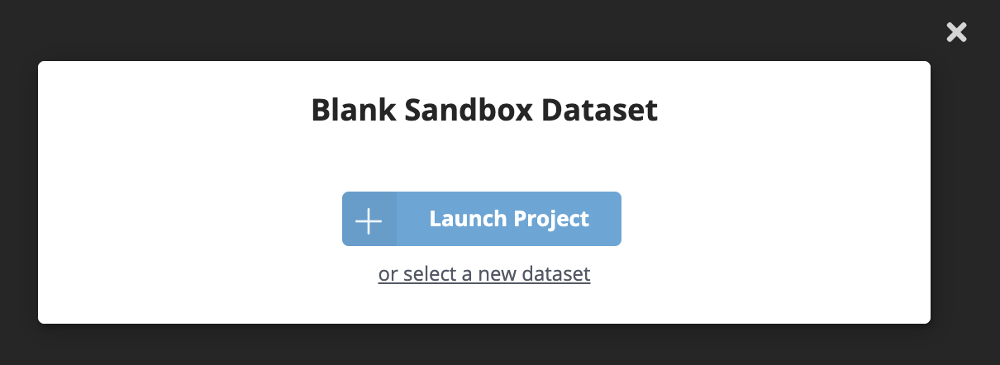

= Setting Up Your Environment
:order: 1
:sandbox: https://codesandbox.io/s/github/johnymontana/training-v3/tree/master/modules/graphql-apis/supplemental/code/02-graphql-apis-overview-of-neo4j-graphql/begin?file=/.env

[TIP]
This information is taken from the Sandbox API... 🔥

.Place this in your .env file
[source,env,subs=attributes+]
----
// NAME={name}
NEO4J_URI={sandbox-uri}
NEO4J_USERNAME={sandbox-username}
NEO4J_PASSWORD={sandbox-password}
----

Now it's time to start using the Neo4j GraphQL Library to build GraphQL APIs!
We'll be using a browser-based service called Codesandbox to run Node.js JavaScript code, which in this case will be a GraphQL API application making use of the Neo4j GraphQL Library. Using Codesandbox means we won't have to troubleshoot local development environment issues and makes it easier to share code. Each lesson will start with an initial skeleton application that we'll modify as we explore new concepts. If you get stuck, each lesson also has the solution available as a Codesandbox.

We'll also be using Neo4j Sandbox to spin up a hosted Neo4j instance in the cloud. We'll connect to our Neo4j Sandbox instance from the GraphQL API application running in Codesandbox. To do this we'll use the connection credentials specific to our Neo4j Sandbox instance.

Follow these steps to get your development environment set up using Codesandbox and Neo4j Sandbox:

. Create a blank Neo4j Sandbox instance using https://sandbox.neo4j.com/?usecase=blank-sandbox[this link.^]
You'll need to sign in to Neo4j Sandbox if you're not already authenticated, then click the "Launch Project" button.

[start=2]
. Once your blank Neo4j Sandbox instance is ready, you can go through the guide or close it. Then navigate to the "Connection details" tab for the sandbox instance.
Make note of the "Bolt URL", "Username", and "Password" values for your sandbox instance.
You'll need these values in the next step to connect to Neo4j from the GraphQL API application we'll be building and running in Codesandbox.

image::images/02blanksandboxconnection.png[Neo4j Sandbox connection credentials,width=500,align=center]

[start=3]
. Open the Codesandbox for this lesson using https://codesandbox.io/s/github/johnymontana/training-v3/tree/master/modules/graphql-apis/supplemental/code/02-graphql-apis-overview-of-neo4j-graphql/begin?file=/.env[this link^].
This Codesandbox contains the initial code for a GraphQL API application, however the application is throwing an error because it's not able to connect to a Neo4j instance.
Fix this by adding *your* Neo4j Sandbox connection credentials.

image::images/02codesandboxerror.png[Codesandbox connection error,width=500,align=center]

[start=4]
. In order to save changes to the Codesandbox you'll be prompted to sign in to Codesandbox so that the changes are specific to your Codesandbox. Open the `.env` file, adding values for `NEO4J_URI`, `NEO4J_USER`, and `NEO4J_PASSWORD` specific to your Neo4j Sandbox instance. Save the file and wait for the application to reload. You will now see the GraphQL Playground application running in Codesandbox.

You can test that it's working by running the following query in the GraphQL Playground window in your Codesandbox (you will get back an empty array without any error messages).

[source,GraphQL]
----
{
  books {
    title
  }
}
----

You will see a screen like this after updating the values in the `.env` file, with GraphQL Playground allowing your to execute GraphQL operations against your GraphQL API application connected to Neo4j Sandbox.

image::images/02codesandboxcredentials.png[Codesandbox credentials, width=500, align=center]

== Check Your Understanding

[WARNING]
TODO: Add a question here - maybe something that tests that they have run the code above correctly?