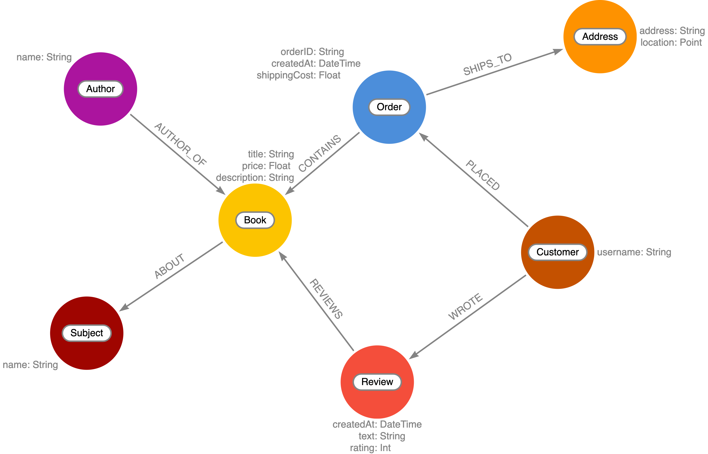

= GraphQL Type Definitions
:order: 2

== GraphQL Type Definitions And The Property Graph Model

Now that your development environment is set up, let's take a look at what we'll be building throughout this course.
The goal of this course is to build a GraphQL API application for an online bookstore.
We'll need to handle customers searching for books, placing orders, as well as leaving reviews for books they've purchased.

We'll start with the following property graph data model:

Let's see how we would define this property graph model using GraphQL type definitions.
Each node label becomes a GraphQL type.
Node properties are defined as GraphQL fields.
Relationships are expressed as GraphQL objects or object array fields and include a special GraphQL schema directive `@relationship` that is used to capture the direction and relationship type.

Open the schema.graphql file, then make sure types as defined here are in Schema of your Codesandbox.

[source,GraphQL]
----
#schema.graphql

type Order {
  orderID: ID! @id
  placedAt: DateTime @timestamp
  shippingCost: Float
  shipTo: Address @relationship(type: "SHIPS_TO", direction: OUT)
  customer: Customer @relationship(type: "PLACED", direction: IN)
  books: [Book] @relationship(type: "CONTAINS", direction: OUT)
}

type Customer {
  username: String
  orders: [Order] @relationship(type: "PLACED", direction: OUT)
  reviews: [Review] @relationship(type: "WROTE", direction: OUT)
}

type Address {
  address: String
  location: Point
  order: Order @relationship(type: "SHIPS_TO", direction: IN)
}

type Book {
  isbn: ID!
  title: String
  price: Float
  description: String
  reviews: [Review] @relationship(type: "REVIEWS", direction: IN)
}

type Review {
  rating: Int
  text: String
  createdAt: DateTime @timestamp
  book: Book @relationship(type: "REVIEWS", direction: OUT)
  author: Customer @relationship(type: "WROTE", direction: IN)
}
----

A few important concepts to note:

* The `@relationship` directive is used to define relationships.
* `DateTime` and `Point` scalar types are available and map to the equivalent native Neo4j database types.
* The `@timestamp` directive is used to indicate the property will be automatically updated when the node is created and updated.
* The `@id` directive marks a field as a unique identifier and enables auto-generation when the node is created.

Read more about using GraphQL type definitions with the Neo4j GraphQL Library in the documentation https://neo4j.com/docs/graphql-manual/current/type-definitions/[here^].
For more information on the GraphQL schema directives available with the Neo4j GraphQL Library refer to https://neo4j.com/docs/graphql-manual/current/directives/[this page.^]

== Check Your Understanding

[WARNING]
TODO: Add a question here