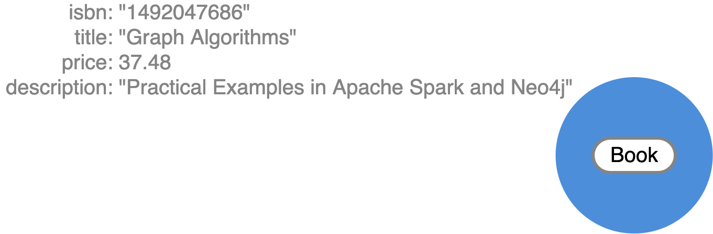
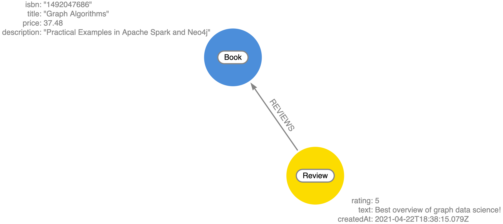

= Generated Mutations
:order: 3

== Generated Mutations

The first thing we'll need to do is add some books to our catalog using the GraphQL API - we wouldn't have much of a bookstore without any books! We'll do this using a GraphQL mutation. There are several ways to use mutations generated by the Neo4j GraphQL Library.

First, let's add a single book using the `createBooks` mutation. Copy and paste this mutation to run it in GraphQL Playground running in your Codesandbox:

[source,GraphQL]
----
mutation {
  createBooks(
    input: {
      isbn: "1492047686"
      title: "Graph Algorithms"
      price: 37.48
      description: "Practical Examples in Apache Spark and Neo4j"
    }
  ) {
    books {
      isbn
      title
      price
      description
      __typename
    }
  }
}
----

This will create a single node in the database with the label `Book` and properties `isbn`, `title`, `price`, and `description`.

When executing create GraphQL mutations generated by the Neo4j GraphQL Library we can also "connect" the newly created nodes to other nodes, which will create a relationship in the database. Here we create a `Review` node and connect it to the `Book` node we created in the previous mutation. Go ahead and run this mutation as well:

[source,GraphQL]
----
mutation {
  createReviews(
    input: {
      rating: 5
      text: "Best overview of graph data science!"
      book: { connect: { where: { title: "Graph Algorithms" } } }
    }
  ) {
    reviews {
      rating
      text
      createdAt
      book {
        title
      }
    }
  }
}
----

The data in our database now looks like this:

> Note that we didn't need to specify an input value for the `createdAt` field. Since we used the https://neo4j.com/docs/graphql-manual/current/type-definitions/autogeneration/#type-definitions-autogeneration-timestamp[`@timestamp` directive] in our GraphQL type definitions this value was added automatically when the mutation was executed.

We can even create more complex nested structures using this nested mutation feature of the Neo4j GraphQL Library. Here we'll create a `Customer`, `Order`, and `Address` nodes and their associated relationships in this single mutation.

[source,GraphQL]
----
mutation {
  createCustomers(
    input: {
      username: "EmilEifrem7474"
      reviews: {
        connect: { where: { text: "Best overview of graph data science!" } }
      }
      orders: {
        create: {
          books: { connect: { where: { title: "Graph Algorithms" } } }
          shipTo: {
            create: {
              address: "111 E 5th Ave, San Mateo, CA 94401"
              location: {
                latitude: 37.5635980790
                longitude: -122.322243272725
              }
            }
          }
        }
      }
    }
  ) {
    customers {
      username
      orders {
        placedAt
        books {
          title
        }
        shipTo {
          address
        }
      }
      reviews {
        text
        rating
        book {
          title
        }
      }
    }
  }
}
----

The response data from this mutation will match the shape of our selection set. We don't need to include all the fields we created in the mutation, the data will be created even if not returned. Here's what the response to the above mutation will look like:

[source,JSON,role=nocopy]
----
{
  "data": {
    "createCustomers": {
      "customers": [
        {
          "username": "EmilEifrem7474",
          "orders": [
            {
              "placedAt": "2021-04-22T19:01:27.189Z",
              "books": [
                {
                  "title": "Graph Algorithms"
                }
              ],
              "shipTo": {
                "address": "111 E 5th Ave, San Mateo, CA 94401"
              }
            }
          ],
          "reviews": [
            {
              "text": "Best overview of graph data science!",
              "rating": 5,
              "book": {
                "title": "Graph Algorithms"
              }
            }
          ]
        }
      ]
    }
  }
}
----

And in the database our graph now look like this:

image::images/02bookdata3.png[Book data graph,width=500,align=center]

In addition to the create mutations, mutations are also generated for update and delete operations. You can explore the "Docs" tab in GraphQL Playground to see all the mutation operations available and refer to https://neo4j.com/docs/graphql-manual/current/schema/mutations/[the Mutations section] in the documentation for more detail.

== Check Your Understanding

[WARNING]
TODO: Add a question here - maybe something that tests that they have run the code above correctly?