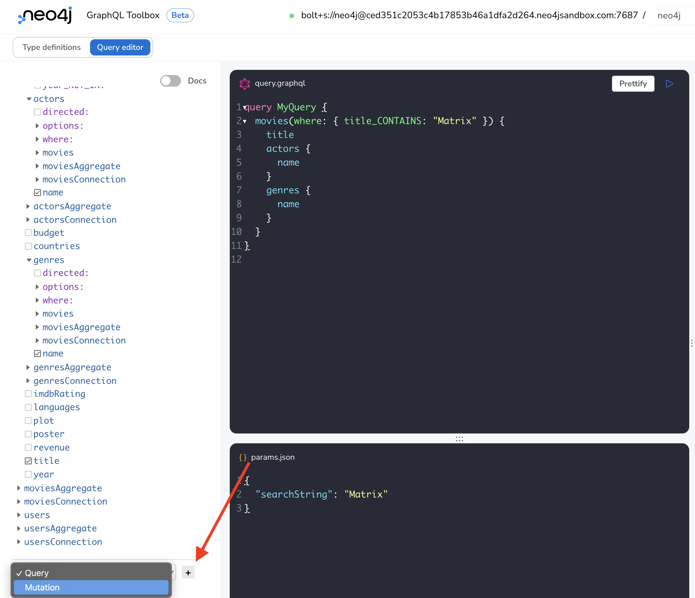

= Creating, Updating, And Deleting Nodes
:order: 1

So far we've focused on the Query API of the Neo4j GraphQL Library. In this section we'll turn our attention to GraphQL mutation operations that create, update, or delete nodes and their properties in the database.

In the Neo4j GraphQL Toolbox, at the bottom of the Explorer pane, select the type dropdown and select "Mutation" then click the "+" button to add the Mutation fields to the Explorer pane.

We can see that by default create, update, and delete mutation operations are generated for each type in the GraphQL schema. Let's see how to use these mutations!

== Create

First, let's create a new Genre node to represent my favorite genre Cli-Fi or, Science Fiction focused around Climate Change.

[source,GraphQL]
----
mutation MyMutation {
  createGenres(input: {name: "CliFi"}) {
    genres {
      name
    }
  }
}
----

And the response shows we created this node in the database:

[source,JSON]
----
{
  "data": {
    "createGenres": { "genres": [{ "name": "CliFi" }] }
  }
}
----

Oops - we mispelled "Cli-Fi"! Let's use the update mutation to change the name property of this node.

== Update

We typically want to use the update mutation operations with a `where` argument to filter for the node(s) we want to update. In this case we'll filter for our misseplled CliFi node, then specify the field values we want to update:

[source,GraphQL]
----
mutation MyMutation {
  updateGenres(where: { name: "CliFi" }, update: { name: "Cli-Fi" }) {
    genres {
      name
    }
  }
}

----

And now we can see we've updated and fixed the spelling in the response:

[source,JSON]
----
{
  "data": {
    "updateGenres": { "genres": [{ "name": "Cli-Fi" }] }
  }
}
----

== Delete

If we want to delete our new genre node we can do that with a delete mutation. Similarly to the update mutation operation we will use the `where` argument to filter for the nodes we want to delete. 

[source,GraphQL]
----
mutation MyMutation {
  deleteGenres(where: { name: "Cli-Fi" }) {
    nodesDeleted
    relationshipsDeleted
  }
}
----

Note the use of the `nodesDeleted` and `relationshipDeleted` fields, which return information about what database operations were completed as part of the mutation. In this case 1 node was deleted (our Cli-Fi genre node) which is the behavior we expected.

[source,JSON]
----
{
  "data": {
    "deleteGenres": {
      "nodesDeleted": 1,
      "relationshipsDeleted": 0
    }
  }
}
----

[.quiz]
== Check Your Understanding

include::questions/question-1.adoc[leveloffset=+1]

include::questions/question-2.adoc[leveloffset=+1]

[.summary]
== Summary

In this lesson, we introduced some of the GraphQL mutation operations available with the Neo4j GraphQL Library for working with nodes. In the next section we will see how to perform mutations with relationships and more complex mutation operations with the nested mutation feature of the Neo4j GraphQL Library.