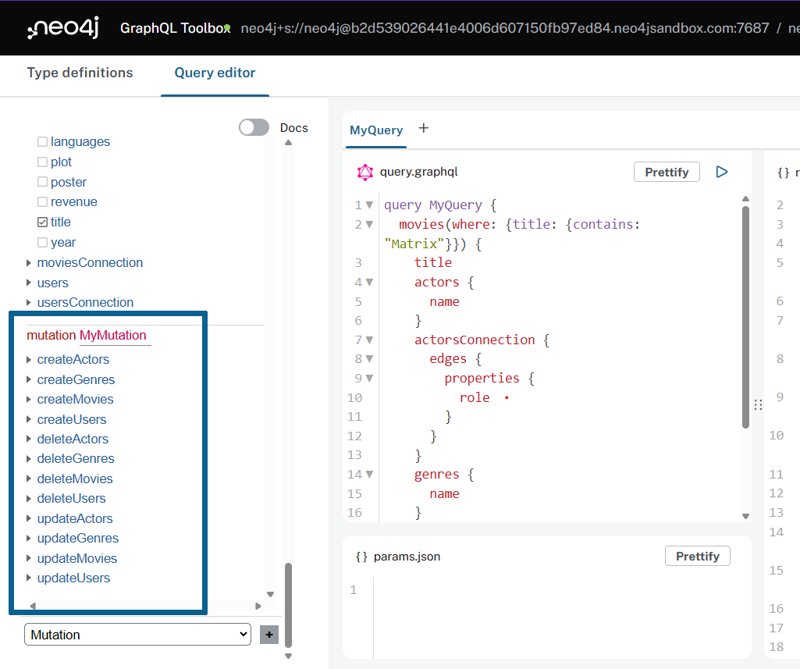

= Creating, Updating, And Deleting Nodes
:order: 1

So far we've focused on the Query API of the Neo4j GraphQL Library. In this section you will learn about GraphQL mutation operations that create, update, or delete nodes and their properties in the database.

In the Neo4j GraphQL Toolbox, at the bottom of the Explorer pane, select the type dropdown and select "Mutation" then click the "+" button to add the Mutation fields to the Explorer pane.

image::images/01explorer-mutation-annotated.png[Toolbox explorer with the type dropdown selected ,width=500,align=center]

The default create, update, and delete mutation operations are generated for each type in the GraphQL schema and displayed in the query editor. Let's see how to use these mutations!

== Create

First, let's create a new Genre node to represent my favorite genre link:https://en.wikipedia.org/wiki/Climate_fiction[Cli-Fi^] or, Science Fiction focused around Climate Change.

Run the following mutation query to create a new genre. 

[source,GraphQL]
----
mutation MyMutation {
  createGenres(input: {name: "CliFi"}) {
    genres {
      name
    }
  }
}
----

The response includes the details of the new "CliFi" node which has been created in the database:

[source,JSON]
----
{
  "data": {
    "createGenres": { "genres": [{ "name": "CliFi" }] }
  }
}
----

Oops - I mispelled "Cli-Fi"! You can use the update mutation to change the name property of this node.

== Update

You would typically use an update mutation operations with a `where` argument to filter for the node(s) you want to update. 

This query filters for the misseplled "CliFi" node, then specifies the field values to be updated.

[source,GraphQL]
----
mutation MyMutation {
  updateGenres(where: { name: "CliFi" }, update: { name: "Cli-Fi" }) {
    genres {
      name
    }
  }
}
----

The response shows that the `name` property has been updated:

[source,JSON]
----
{
  "data": {
    "updateGenres": { "genres": [{ "name": "Cli-Fi" }] }
  }
}
----

== Delete

A delete mutation can be used to delete nodes. Similarly to the update mutation operation a `where` argument is used to filter for the nodes to be deleted.

This query will delete the "Cli-Fi" node:

[source,GraphQL]
----
mutation MyMutation {
  deleteGenres(where: { name: "Cli-Fi" }) {
    nodesDeleted
    relationshipsDeleted
  }
}
----

The `nodesDeleted` and `relationshipDeleted` fields are used to return information about what database operations were completed as part of the mutation. In this case 1 node was deleted (the Cli-Fi genre node) which was the expected result.

[source,JSON]
----
{
  "data": {
    "deleteGenres": {
      "nodesDeleted": 1,
      "relationshipsDeleted": 0
    }
  }
}
----

[.quiz]
== Check Your Understanding

include::questions/question-1.adoc[leveloffset=+1]

include::questions/question-2.adoc[leveloffset=+1]

[.summary]
== Summary

In this lesson, you were introduced to some of the GraphQL mutation operations available with the Neo4j GraphQL Library for working with nodes. 

In the next lesson you will see how to perform mutations with relationships and more complex mutation operations with the nested mutation feature of the Neo4j GraphQL Library.