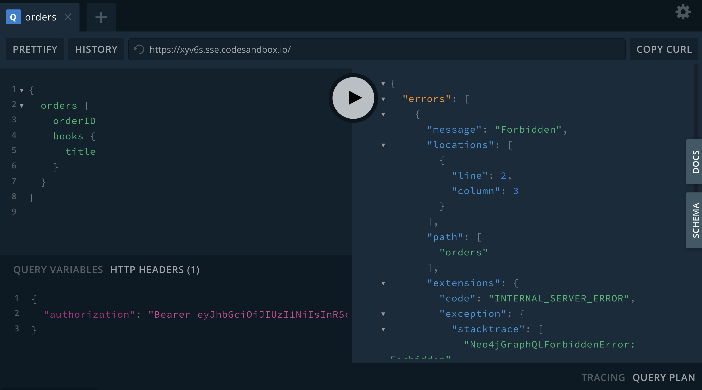
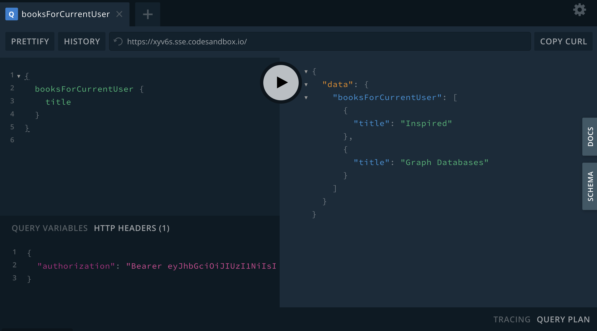

= Adding Authorization Rules
:order: 2

Now that we have our sample tokens we're ready to start adding authorization rules using the `@auth` schema directive in our GraphQL type definitions.

== `isAuthenticated`

The `isAuthenticated` rule is the simplest authorization rule we can add. It means that any GraphQL operation that accesses a field or object protected by the `isAuthenticated` rule must have a valid JWT in the request header.

Let's make use of the `isAuthenticated` authorization rule in our bookstore GraphQL API to protect the `Subject` type. Let's say we want to make returning a book's subjects a "premium" feature to encourage users to sign-up for our application. To do this we'll make the following addition to our GraphQL type definitions, extending the `Subject` type:

[source,GraphQL]
----
# schema.graphql

extend type Subject @auth(rules: [{isAuthenticated: true}])
----

Now any request that accesses the `Subject` type must include a valid signed JWT or an error will be returned.

Here we query as usual without including a JWT in the request header:

image::images/04playgrounderror.png[Decoding a token using jwt.io,width=500,align=center]

In GraphQL Playground to add a request header we add the following to the "HTTP Headers" box in the lower left window. Now that our request includes a valid token, the data is returned as expected:

image::images/04playgroundnoerror.png[Decoding a token using jwt.io,width=500,align=center]

== Roles

https://neo4j.com/docs/graphql-manual/current/auth/authorization/roles/[Roles^] are the next type of authorization rule that we will explore. A JWT payload can include an array of "roles" that describe the permissions associated with the token. For example, our example token for the "admin" user includes the following payload:

[source,JSON,role=nocopy]
----
{
  "sub": "BobLoblaw7687",
  "roles": ["admin"],
  "iat": 1516239022
}
----

which means that this user has the "admin" role. Let's add a rule to our GraphQL type definitions that in order to create, update, or delete books, the user must have the "admin" role.

[source,GraphQL]
----
# schema.graphql

extend type Book @auth(rules: [{operations: [CREATE, UPDATE, DELETE], roles: ["admin"]}])
----

Note that we've included the `operations` array to specify this rule only applies to `CREATE`, `UPDATE`, and `DELETE` operations - all users will still be able to read book objects, but if any request tries to create or update a book the operation will fail unless a valid "admin" role is included in the token.

Try to execute the following mutation using our example tokens. What error do you get when not using the admin token? What is the result when using the admin token?

[source,GraphQL]
----
mutation {
  createBooks(
    input: {
      title: "Graph Databases"
      isbn: "1491930896"
      subjects: { connect: { where: { name: "Neo4j" } } }
    }
  ) {
    books {
      title
      subjects {
        name
      }
    }
  }
}
----

=== Allow

A customer must not be able to view orders placed by other customers. Adding an https://neo4j.com/docs/graphql-manual/current/auth/authorization/allow/[Allow^] rule will allow us to protect orders from other nosy customers.

Here we add a rule to the `Order` type that a customer's "sub" (the subject) claim in the JWT must match the username of the customer who placed the order.

[source,GraphQL]
----
# schema.graphql

extend type Order @auth(rules: [{allow: {customer: {username: "$jwt.sub"}}}])
----

If we try to access orders that aren't ours we'll see a "Forbidden" error:

but if we filter only for the orders placed by the customer we  have access:

image::images/04notforbidden.png[Filtering orders,width=500,align=center]

Of course we will also allow admins to have access to orders, so let's update the rule to also grant access to any requests with the "admin" role:

[source,GraphQL]
----
# schema.graphql

extend type Order @auth(rules: [{allow: {customer: {username: "$jwt.sub"}}}, {roles: ["admin"]}])
----

=== Where

In the previous example the client was required to filter for orders that the customer had placed. We don't always want to expect the client to include this filtering logic in the GraphQL query. In some cases we simply want to return whatever data the currently authenticated user has access to. For these cases we can use a https://neo4j.com/docs/graphql-manual/current/auth/authorization/where/[Where^] authorization rule to apply a filter to the generated database queries - ensuring only the data the user has access to is returned.

We want a user to only be able to view their own customer information. Here we add a rule to the `Customer` type that will apply a filter any time the customer type is accessed that filters for the currently authenticated customer by adding a predicate that matches the `username` property to the `sub` claim in the JWT.

[source,GraphQL]
----
# schema.graphql

extend type Customer @auth(rules: [{where: {username: "$jwt.sub"}}])
----

image::images/04customer.png[Where auth rule,width=500,align=center]

Note that our query doesn't specify which customer to return - we're requesting all customers - but we only get back the customer that we have access to.

=== Bind

The final type of authorization rule that we will explore is the https://neo4j.com/docs/graphql-manual/current/auth/authorization/bind/[Bind^] rule. Bind allows us to specify connections that must exist in the graph when creating or updating data based on claims in the JWT.

We want to add a rule that when creating a review, the review node is connected to the currently authenticated customer - we don't want customers to be writing reviews on behalf of other users! This rule means the username of the author of a review must match the `sub` claim in the JWT when creating or updating reviews:

[source,GraphQL]
----
# schema.graphql

extend type Review @auth(rules: [{operations: [CREATE,UPDATE], bind: {author: {username: "$jwt.sub"} }}])
----

If a customer tries to create a review and connect it to a customer other than themselves the mutation will return an error. Try running this mutation using our example JWT. Does it work? Can you tell why?

[source,GraphQL]
----
mutation {
  createReviews(
    input: {
      rating: 1
      text: "Borrring"
      book: { connect: { where: { title: "Ross Poldark" } } }
      author: { connect: { where: { username: "BookLover123" } } }
    }
  ) {
    reviews {
      text
      rating
      book {
        title
      }
    }
  }
}

----

=== Auth In Cypher Directive Fields

There are two ways to make use of authorization features when using the `@cypher` schema directive:

1. Apply the authorization rules `isAuthenticated` and `roles` using the `@auth` directive.
2. Reference the JWT payload values in the Cypher statement attached to a `@cypher` schema directive.

Let's make use of both of those aspects by adding a Query field that returns personalized recommendations for a customer. In our Cypher statement we'll have access to a `$auth.jwt` parameter that represents the payload of the JWT. We'll use that value to look up the currently authenticated customer by username, then traverse the graph to find relevant recommendations based on their purchase history. We'll also include the `isAuthenticated` rule since we only want authenticated customers to use this Query field.

[source,GraphQL]
----
# schema.graphql

extend type Query {
 booksForCurrentUser: [Book] @auth(rules: [{ isAuthenticated: true }]) @cypher(statement: """
 MATCH (c:Customer {username: $auth.jwt.sub})-[:PLACED]->(:Order)-[:CONTAINS]->(b:Book)
 MATCH (b)-[:ABOUT]->(s:Subject)<-[:ABOUT]-(rec:Book)
 WITH rec, COUNT(*) AS score ORDER BY score DESC
 RETURN rec
 """)
}
----

Try running this GraphQL query. What results do you get?

[source,GraphQL]
----
{
  booksForCurrentUser {
    title
  }
}
----

