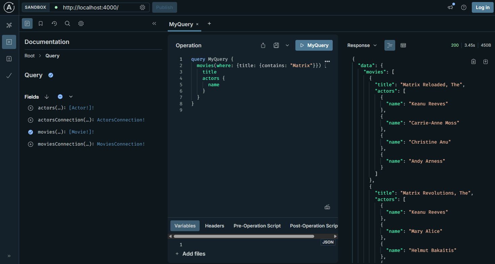

= Getting started
:order: 1
:disable-cache: true

The focus of this course has been using the Neo4j GraphQL Library via the Toolbox to develop, test, and query your GraphQL API.

However, it's useful to understand how to install and get started with the Neo4j GraphQL Library.

The Neo4j GraphQL Library is a *Node.js* JavaScript library that can be used with JavaScript GraphQL implementations.

Use `npm` to install The Neo4j GraphQL Library as shown here:

[source,bash]
----
$ npm install @neo4j/graphql graphql neo4j-driver @apollo/server
----

This program uses the Neo4j GraphQL Library to generate a GraphQL schema and start a *local* GraphQL API.

[source,JavaScript]
.index.mjs
----
import { ApolloServer } from '@apollo/server';
import { startStandaloneServer } from '@apollo/server/standalone';
import { Neo4jGraphQL } from "@neo4j/graphql";
import neo4j from "neo4j-driver";

const typeDefs = `#graphql
    type Movie @node {
        title: String
        actors: [Actor!]! @relationship(type: "ACTED_IN", direction: IN)
    }

    type Actor @node {
        name: String
        movies: [Movie!]! @relationship(type: "ACTED_IN", direction: OUT)
    }
`;

const driver = neo4j.driver(
    "bolt://localhost:7687",
    neo4j.auth.basic("neo4j", "letmein")
);

const neoSchema = new Neo4jGraphQL({ typeDefs, driver });

const server = new ApolloServer({
    schema: await neoSchema.getSchema(),
});

const { url } = await startStandaloneServer(server, {
    context: async ({ req }) => ({ req }),
    listen: { port: 4000 },
});

console.log(`🚀 Server ready at ${url}`);
----

Review the program and identify where:

* The GraphQL type definition is created.
* The connection to the Neo4j database is defined.
* The schema is created using the Neo4j GraphQL library.

To run the program, you would need to update the connection details. Here are the connection details for your Neo4j Sandbox:

Bolt URI:: [copy]#bolt://{sandbox-ip}:{sandbox-boltPort}#
Username:: [copy]#{sandbox-username}#
Password:: [copy]#{sandbox-password}#

To start a *local* GraphQL API run:

[source,bash]
----
node index.mjs
----

The program will also serve the GraphQL Playground IDE at link:http://localhost:4000[https://localhost:4000]. You can use it to query the API and explore documentation using GraphQL's introspection feature.

The link:https://neo4j.com/docs/graphql-manual/current/getting-started/[Neo4j GraphQL Library Getting Started^] guide is a great place to continue your learning of using GraphQL and Neo4j.

[.quiz]
== Check Your Understanding

include::questions/typedef.adoc[leveloffset=+1]

include::questions/ide.adoc[leveloffset=+1]

[.summary]
== Summary

In this lesson, you explored the features of the Neo4j GraphQL Library.
