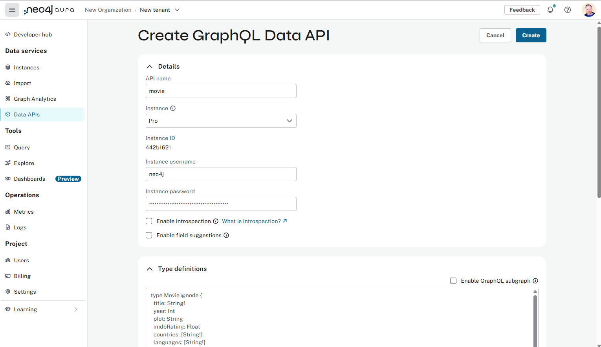

= Getting started
:order: 1
:type: lesson
:disable-cache: true

To use your GraphQL API you will need to setup and run the Neo4j GraphQL Library. 

You can host your GraphQL API on link:https://console.neo4j.io[Neo4j Aura DB^] or setup your own server.

== GraphQL for Neo4j AuraDB

You can setup GraphQL Data APIs on any Aura DB instances (excluding free).

You create a new GraphQL Data API using the link:https://console.neo4j.io[Aura DB console^].

You will need to provide:

* The connection details to your Aura instance.
* The type definitions for your API.
* An authentication provider.
* Instance sizing information.

Hosting GraphQL Data API on Aura is the quickest and easiest method to get started using GraphQL and Neo4j.

The link:https://neo4j.com/docs/graphql/current/aura-graphql/[GraphQL for Neo4j AuraDB Documentation] describes how to get started.

== Installation GraphQL Library

You can install and use the Neo4j GraphQL Library on your own machine and infrastructure. 

The Neo4j GraphQL Library is a *Node.js* JavaScript library.

Use `npm` to install The Neo4j GraphQL Library as shown here:

[source,bash]
----
$ npm install @neo4j/graphql graphql neo4j-driver @apollo/server
----

This program uses the Neo4j GraphQL Library to generate a GraphQL schema and start a *local* GraphQL API.

[source,JavaScript]
.index.mjs
----
import { ApolloServer } from '@apollo/server';
import { startStandaloneServer } from '@apollo/server/standalone';
import { Neo4jGraphQL } from "@neo4j/graphql";
import neo4j from "neo4j-driver";

const typeDefs = `#graphql
    type Movie @node {
        title: String
        actors: [Actor!]! @relationship(type: "ACTED_IN", direction: IN)
    }

    type Actor @node {
        name: String
        movies: [Movie!]! @relationship(type: "ACTED_IN", direction: OUT)
    }
`;

const driver = neo4j.driver(
    "bolt://localhost:7687",
    neo4j.auth.basic("neo4j", "letmein")
);

const neoSchema = new Neo4jGraphQL({ typeDefs, driver });

const server = new ApolloServer({
    schema: await neoSchema.getSchema(),
});

const { url } = await startStandaloneServer(server, {
    context: async ({ req }) => ({ req }),
    listen: { port: 4000 },
});

console.log(`🚀 Server ready at ${url}`);
----

Review the program and identify where:

* The GraphQL type definition is created.
* The connection to the Neo4j database is defined.
* The schema is created using the Neo4j GraphQL library.

To start a *local* GraphQL API run:

[source,bash]
----
node index.mjs
----

The program will also serve the GraphQL Playground IDE at link:http://localhost:4000[https://localhost:4000]. You can use it to query the API and explore documentation using GraphQL's introspection feature.

image::images/01graphql-playground.png[Screenshot of the GraphQL Playground IDE,width=500,align=center]

The link:https://neo4j.com/docs/graphql-manual/current/getting-started/[Neo4j GraphQL Library Getting Started^] guide is a great place to continue your learning of using GraphQL and Neo4j.

== Continue

When you are ready continue to complete the course.

read::[Continue]

[.summary]
== Summary

In this lesson, you explored the options for getting started with the Neo4j GraphQL Library.
