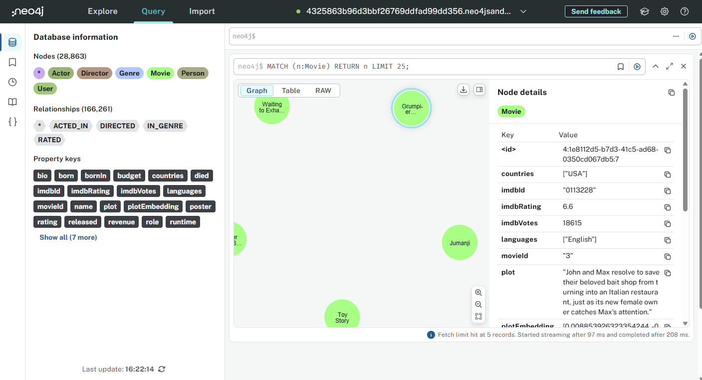

= Query
:order: 2

The Neo4j browser or Query allows you to run Cypher queries and review the results.

link:https://workspace.neo4j.io/workspace/query[Open Workspace Query]

Enter your connection details:

Protocol:: bolt+s://
Connection URL:: [copy]#{instance-host}:{instance-boltPort}#
Username:: [copy]#{instance-username}#
Password:: [copy]#{instance-password}#

[.summary]
== Lesson Summary

You learned how to access Query.