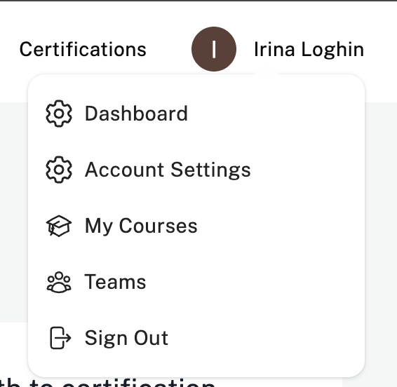
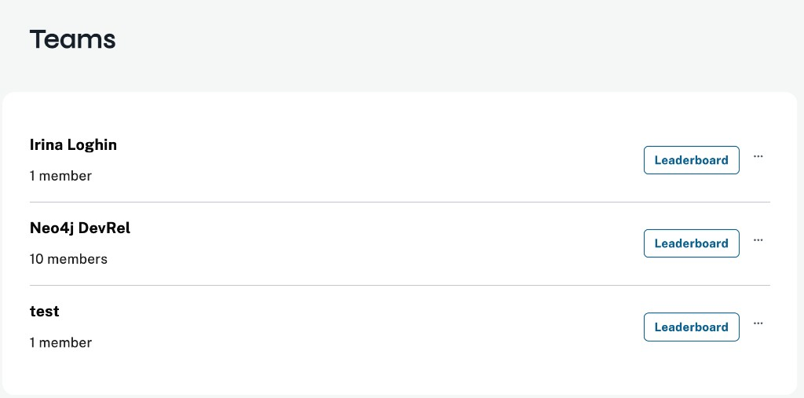
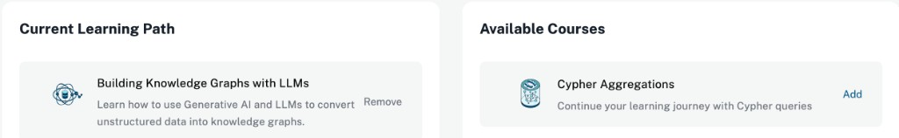
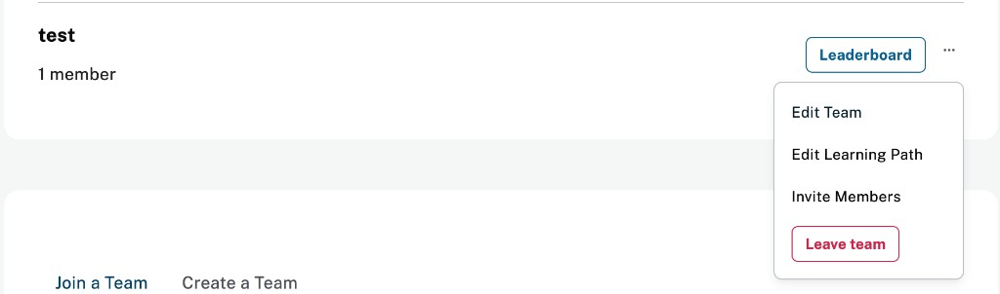
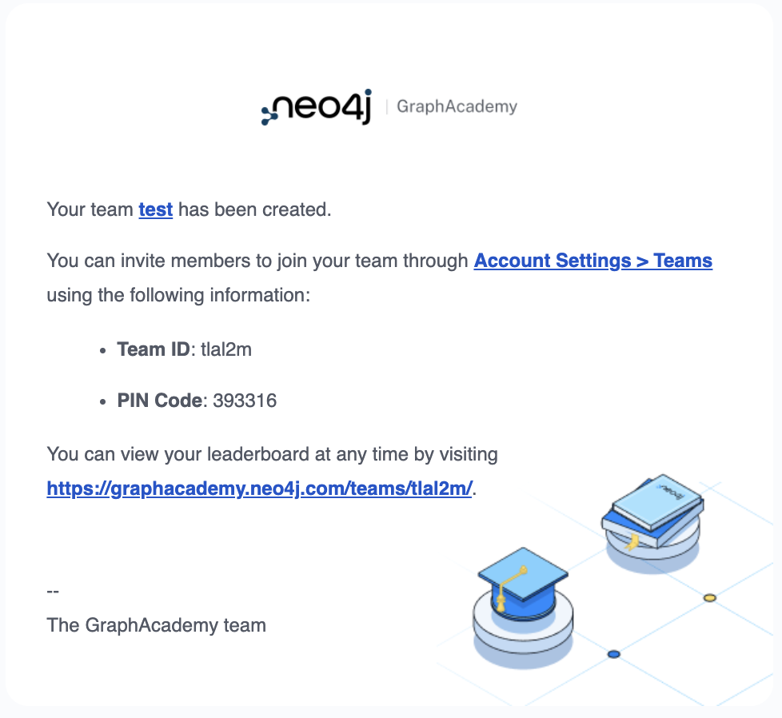

= Creating teams on GraphAcademy
:type: lesson
:order: 5

**Teams** on GraphAcademy let learners study together, compare progress on a **leaderboard**, and follow a shared set of courses. Private teams use a **PIN** so only invited people join. When you design or run cohort experiences, you should know where teams live in the product and how to create one.

In this lesson, you will learn how to:

* Open **Teams** from your account menu
* Create a team, set visibility, and use the confirmation details (team ID, PIN, leaderboard link)
* Use the **…** menu to edit the team, adjust the shared learning path, or invite members

== Open Teams from your account menu

In the header, open your **profile** menu, then choose **Teams**.

You land on the **Teams** page. It lists every team you belong to, with **Leaderboard** on each row and **…** for more actions. At the bottom of the page you can **Join a Team** or **Create a Team**.

== Create a team

Choose **Create a Team**. Enter a **team name** (required), an optional **description**, and **visibility**. **Private** teams stay visible only to members; GraphAcademy generates a **PIN** that new members must enter when they join.

Click **Save Changes**. GraphAcademy emails you a confirmation that includes the **team ID**, **PIN**, and a link to the team **leaderboard**. Keep that message so you can share join instructions through the channels your organization already uses.

== Manage a team

On a team row, open **…** to reach **Edit Team**, **Edit Learning Path**, **Invite Members**, or **Leave team**.

== Curate the shared learning path

Choose **Edit Learning Path** when you want every member to see the same course stack. You get two columns—**Current Learning Path** and **Available Courses**—so you can add or remove courses for the whole team.

[TIP]
.PINs and team IDs
====
Treat **PIN** and **team ID** like lightweight credentials for private teams: share them only with people who should enroll, and rotate or recreate the team if a PIN leaks.
====

read::Move On[]

[.summary]
== Summary

In this lesson, you learned where **Teams** lives in GraphAcademy, how to **create** a team (including visibility and PIN behavior), how to use the **…** menu for common management tasks, and how **Edit Learning Path** keeps a cohort on the same courses.

In the next lesson, you will learn about **Asciidoc** and explore common snippets used in GraphAcademy course content.
