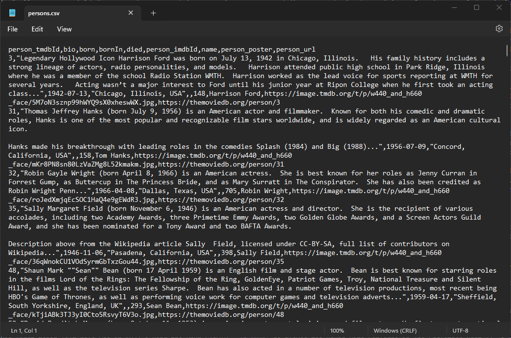

= Nodes
:order: 1
:type: lesson

[.video]
video::YouTubeVideoID

[.transcript]

In this lesson, you will learn how to use the MERGE clause to create nodes from a CSV file.

You will load a CSV file of "person" data into `Person` nodes in Neo4j. The CSV file contains the following fields:

* `person_tmdbId`
* `bio`
* `born`
* `bornIn` 
* `died`
* `person_imdb`
* `Id`
* `name`
* `person_poster` 
* `person_url`

== Load the CSV file

. Download the link:https://data.neo4j.com/importing-cypher/persons.csv[persons.csv] file
. Open the file using a text editor to look at the contents.
+

+ You should see that the file contains headers, and the field delimiter is a comma (`,`).
. Run the following Cypher statement to load the CSV file and return the contents: 
+
[source,cypher]
----
LOAD CSV WITH HEADERS FROM "https://data.neo4j.com/importing-cypher/persons.csv" AS row
RETURN row
----

== Create Person nodes

The next step is to use the data in the CSV file to create `Person` nodes.

Before running it, review the following Cypher statement:

[source, cypher]
----
LOAD CSV WITH HEADERS FROM "https://data.neo4j.com/importing-cypher/persons.csv" AS row
MERGE (p:Person {tmdbId: toInteger(row.person_tmdbId)})
SET
p.imdbId = toInteger(row.person_imdbId),
p.bornIn = row.bornIn,
p.name = row.name,
p.bio = row.bio,
p.poster = row.poster,
p.url = row.url,
p.born = row.born,
p.died = row.died
----

Try and answer the following questions:

. Where does the CSV data come from?
. What does the `MERGE` clause do?
. What variable holds the data from the CSV file?
. Where are the properties set?
. Why is the `toInteger` function used?

[%collapsible]
.Review the answers
====
. The LOAD CSV clause loads the CSV file from the specified URL.
. The MERGE clause creates a new `Person` if one does not already exist with the same `tmdbId` value.
. The `row` variable holds the data from the CSV file.
. The SET clause sets the properties of the `Person` node to the values of the corresponding fields in the CSV file.
. The `toInteger` function converts the `person_tmdbId` and `person_imdbId` values from strings to integers.
====

. Run the Cypher statement to create the `Person` nodes:
+
[source, cypher]
----
LOAD CSV WITH HEADERS FROM "https://data.neo4j.com/importing-cypher/persons.csv" AS row
MERGE (p:Person {tmdbId: toInteger(row.person_tmdbId)})
SET
p.imdbId = toInteger(row.person_imdbId),
p.bornIn = row.bornIn,
p.name = row.name,
p.bio = row.bio,
p.poster = row.poster,
p.url = row.url,
p.born = row.born,
p.died = row.died
----
. Confirm the data is in the graph by returning the first 25 `Person` nodes:
+
[source, cypher]
----
MATCH (p:Person) RETURN p LIMIT 25
----
. Check the results. Do the nodes have the correct properties?

read::I'm ready![]

[.summary]
== Summary

In this lesson, you