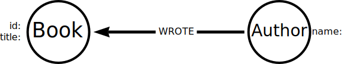

= Multiple passes
:order: 3
:type: lesson

In the examples you have been exploring, a single file represents a single entity in the graph - `persons.csv` contained `Person` nodes and `movies.csv` contained `Movie` nodes. 

In this lesson, you will explore a single file that stores multiple nodes and relationships and the challenges of importing it into the graph.

Here is the book data you reviewed in a previous lesson:

[source,csv]
----
id,title,author,publication_year,genre,rating,still_in_print,last_purchased
19515,The Heights,Anne Conrad,2012,Comedy,5,true,2023/4/12 8:17:00
39913,Starship Ghost,Michael Tyler,1985,Science Fiction|Horror,4.2,false,2022/01/16 17:15:56
60980,The Death Proxy,Tim Brown,2002,Horror,2.1,true,2023/11/26 8:34:26
18793,Chocolate Timeline,Mary R. Robb,1924,Romance,3.5,false,2022/9/17 14:23:45
67162,Stories of Three,Eleanor Link,2022,Romance|Comedy,2,true,2023/03/12 16:01:23
25987,Route Down Below,Tim Brown,2006,Horror,4.1,true,2023/09/24 15:34:18
----

The data could be modeled in a graph as follows:

The data is relatively simple, and a single Cypher query could import it into the graph:

[source, cypher]
----
LOAD CSV WITH HEADERS 
FROM 'https://data.neo4j.com/importing-cypher/books.csv'
AS row
MERGE (b:Book {id: row.id})
SET b.title = row.title
MERGE (a:Author {name: row.author})
MERGE (a)-[:WROTE]->(b)
----

Review the query and identify where it creates the `Book` and `Author` nodes and `WROTE` relationship.

However, if this was a more complicated data set with significantly more rows, you may experience issues with the import as it creates related data in a single pass.

Queries with multiple operations chained together have the potential to write data and then read data that is out of sync - which can result in an *Eager* operator.

The Eager operator will cause any operations to execute in their entirety before continuing, ensuring isolation between the different parts of the query. When importing data the Eager operator can cause high memory usage and performance issues. 

A mechanism for avoiding the Eager operator is to break the import into smaller parts. By taking multiple passes over the data file, the query also becomes simpler to understand and change to fit the data model.

In this example, the import could be broken into three parts:

* Create `Book` nodes
* Create `Author` nodes
* Create `WROTE` relationships

[source, cypher]
----
// Create `Book` nodes
LOAD CSV WITH HEADERS 
FROM 'https://data.neo4j.com/importing-cypher/books.csv'
AS row
MERGE (b:Book {id: row.id})
SET b.title = row.title;

// Create `Author` nodes
LOAD CSV WITH HEADERS 
FROM 'https://data.neo4j.com/importing-cypher/books.csv'
AS row
MERGE (a:Author {name: row.author});

// Create `WROTE` relationships
LOAD CSV WITH HEADERS 
FROM 'https://data.neo4j.com/importing-cypher/books.csv'
AS row
MATCH (a:Author{name: row.author})
MATCH (b:Book{id: row.id})
MERGE (a)-[:WROTE]->(b);
----

You can read more about the link:https://neo4j.com/docs/cypher-manual/current/execution-plans/operators/#query-plan-eager[Eager operator in the Neo4j documentation^], how to avoid it while importing data in the link:https://www.markhneedham.com/blog/2014/10/23/neo4j-cypher-avoiding-the-eager/[Avoiding the Eager Operator^] blog post, and link:https://medium.com/neo4j/cypher-sleuthing-the-eager-operator-84a64d91a452[Cypher Sleuthing: the eager operator^] for a detailed walk-through.

[.quiz]
== Check Your Understanding

include::questions/1-eager-operator.adoc[leveloffset=+1]

[.summary]
== Summary

In this lesson, you learned about the challenges of importing data that contains multiple nodes and relationships in a single file. You also learned to avoid the Eager operator by breaking the import into multiple passes.

In the next lesson, you will learn about other solutions for importing data.