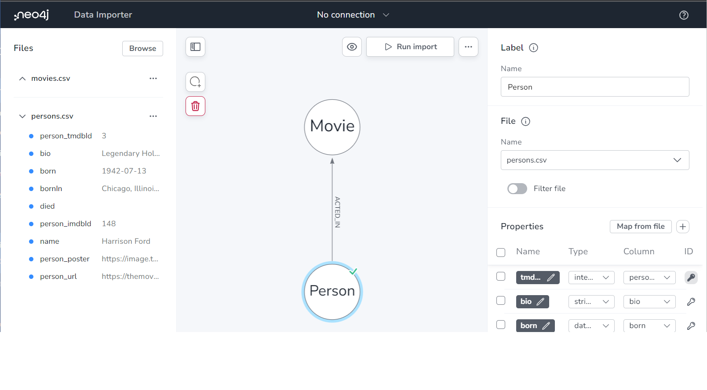

= Other Import Options
:order: 4
:type: lesson

`LOAD CSV` is a convenient tool for importing data into Neo4j; there are however some considerations:

* You may need to write Cypher statements to transform the data into the desired format. Depending on the data complexity, this can be time-consuming.
* `LOAD CSV` may not be suitable for large data sets. The definition of large data sets depends on multiple factors, including the data structure, the use case, and the environment. A guideline of over 10 million rows is a good indicator for considering other import options.
* You may need to import data from multiple sources, and `LOAD CSV` may not be the best option for all of them.
* Complex business rules may require integration to other systems or data sources.

There are a multitude of options for importing data into Neo4j. The following sections provide an overview of some of the possibilities.

== Neo4j Data Importer

The link:https://data-importer.neo4j.io[Neo4j Data Importer^] is a UI-based data importing tool. The data importer is ideal to get started quickly with testing and prototyping. However, there are limited options for data transformation, and it is unsuitable for large data sets.

== neo4j-admin

The link:https://neo4j.com/docs/operations-manual/current/tools/neo4j-admin/neo4j-admin-import/[`neo4j-admin import` command line interface^] supports importing large data sets. `neo4j-admin import` converts CSV files into the internal binary format of Neo4j and can import millions of rows within minutes. 

You need to structure the import files in a specific way, and the database needs to be offline when the import is run.

== ETL (Extract, Transform, Load) Tool

An ETL tool, for example link:https://hop.apache.org/[Apache Hop^], is a good choice for importing data from multiple sources. ETL tools generally support various data sources, can transform data into the desired format, and have visualization tools.

== Custom integration using Neo4j drivers

Building a custom application to load data into the graph database is a good option if you have complex business rules or need to integrate with other systems. You can use the link:https://neo4j.com/developer/neo4j-driver/[Neo4j drivers^] to connect to the database and load data.

[.quiz]
== Check Your Understanding

include::questions/1-neo4j-admin-flexible.adoc[leveloffset=+1]

[.summary]
== Summary

In this lesson, you learned about other options for importing data into Neo4j.

