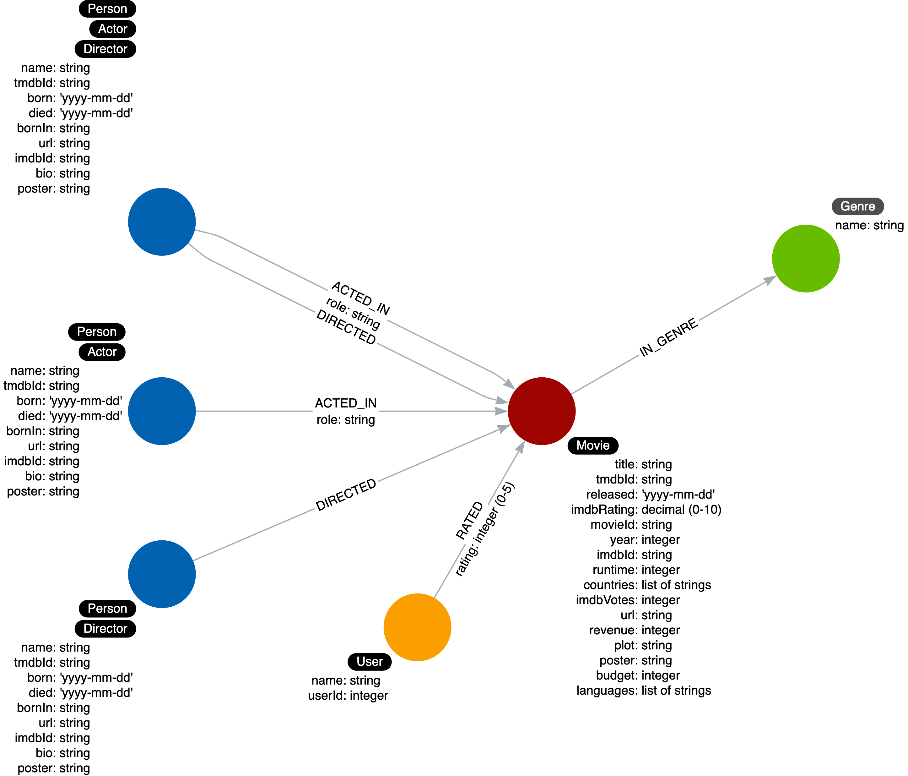

= Transforming Data
:type: challenge
:sandbox: true

This challenge has *five* steps.

Here is the graph data model we will be preparing our CSV data for:

You have already learned that the Person CSV data does not need any transformation.

*Step 1:* Execute this Cypher code to confirm that the types for each property match what we see in the graph data model as strings:

[source,Cypher]
----
LOAD CSV WITH HEADERS
FROM 'https://data.neo4j.com/importing/persons.csv'
AS row
RETURN
 row.person_imdbId AS imdbId,
 row.person_tmdbId AS tmdbId,
 row.bornIn AS bornIn,
 row.born AS born,
 row.name AS name,
 row.bio AS bio,
 row.person_poster AS poster,
 row.died AS died,
 row.person_url AS url
LIMIT 10
----

Notice that each field returned is a String, which is what we have in our graph data model. This CSV data requires no transformation.

*Step 2:* Observing the transformed Movie data.

You have already learned that the Movie CSV data does indeed need transformation.
Execute this Cypher code to confirm that the types for each property match what we see in the graph data model:

[source,Cypher]
----
LOAD CSV WITH HEADERS
FROM 'https://data.neo4j.com/importing/movies.csv'
AS row
RETURN
row.movie_imdbId AS imdbId,
row.movie_tmdbId AS tmdbId,
row.movieId AS movieId,
toFloat(row.imdbRating) AS imdbRating,
row.released AS released,
row.title AS title,
toInteger(row.year) AS year,
row.movie_poster AS poster,
toInteger(row.runtime) AS runtime,
split(coalesce(row.countries,""), "|") AS countries,
toInteger(row.imdbVotes) AS imdbVotes,
toInteger(row.revenue) AS revenue,
row.plot AS plot,
row.movie_url AS url,
toInteger(row.budget) AS budget,
split(coalesce(row.languages,""), "|") AS languages,
split(coalesce(row.genres,""), "|") AS genres
LIMIT 10
----

*Step 3:* Viewing the ratings header names.

There is a CSV file you will be using to load User nodes. It contains the following headers:

* *name* (the name of the user who rated a movie)
* *rating* (the rating value that will be associated with the RATED relationship you will be creating.
* *movieId* (the ID of a movie that has been rated)
* *userId* (unique identifier for a user)

Execute this code to return the first 2 rows of the ratings CSV file:

[source,Cypher]
----
LOAD CSV WITH HEADERS
FROM 'https://data.neo4j.com/importing/ratings.csv'
AS row
RETURN row
LIMIT 2
----

You can now see the header names used in the CSV file.

*Step 4:* Viewing the ratings data.

Add to this code to return each field of the first 10 rows of the ratings CSV file:

[source,Cypher,role= noplay]
----
LOAD CSV WITH HEADERS
FROM 'https://data.neo4j.com/importing/ratings.csv'
AS row
RETURN
// specify all fields here
LIMIT 10
----

Compare the types returned with what is in the data model. Do you see a difference?

*Step 5:* Modify the code you just executed to transform the data as required by the graph data model.

Then answer these questions:

include::./questions/verify.adoc[]

[.summary]
== Summary

In this challenge, you executed code to ensure that the types in the CSV data will match what is in the graph data model.

In the next lesson, you will learn how to do the final step to prepare for loading your CSV data, creating constraints.