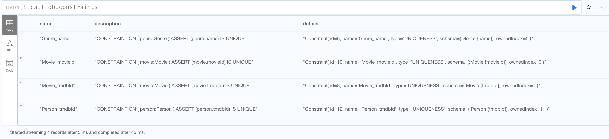

= Constraints
:type: quiz

//[.video]
//video::jEIE_b1MzAE[youtube,width=560,height=315]

//https://youtu.be/jEIE_b1MzAE

[.transcript]
== Why constraints?

A best practice is to always specify one or more properties for a node with a given label to uniquely identify it in the graph.

For example, the name of a person or the title of a movie may not be sufficient in the Movie graph because there may be people with the same name or movies with the same title.

You have already seen in the CSV data thus far that IDs are used to identify a person, user,  or movie.
In addition, we will use the name property of a Genre node as a unique ID.
Based upon the data in the CSV files and per our graph data model, we use the following node properties as unique IDs:

* Movie: tmdbId
* Movie: movieId
* Person: tmdbId
* User: userId
* Genre: name

== What is a uniqueness constraint?

A uniqueness constraint is an index in the graph that can be used as a primary key for a node.
For a particular value for a property of a node, there is exactly one value in the graph.
That value can be used to quickly find a node using the property value.

You add uniqueness constraints to the graph before you load the data from the CSV files.
When you load CSV data into the graph, you will be using `MERGE` to create nodes.

Here is an example of how Person data will be loaded into the graph:

[source,Cypher,role=nocopy noplay]
----
LOAD CSV WITH HEADERS
FROM 'https://data.neo4j.com/importing/persons.csv'
AS row
MERGE (p:Person {tmdbId: row.person_tmdbId})
ON CREATE SET
p.imdbId = row.person_imdbId,
p.bornIn = row.bornIn,
p.born = row.born,
p.name = row.name,
p.bio = row.bio,
p.poster = row.person_poster,
p.died = row.died,
p.url = row.person_url
----

Notice that we use `MERGE` to create the Person node where we specify the tmdbId property. With `MERGE`, it first attempts to find the Person node with that value for tmdbId. It it is found, nothing is added to the graph.
If it is not found, the node is created in the graph and the properties are set. This code executes very quickly when a uniqueness constraint has been defined for the tmdbId property.
If there was no uniqueness constraint defined, the query would need to retrieve all Person nodes to determine if one exists with the tmdbId value. This would make the loading of the data VERY slow.

== Creating a uniqueness constraint

When you create a uniqueness constraint in the graph, you specify:

* The node label for which you want to define uniqueness.
* The property for which will be used as the value for uniqueness.
* The name of the constraint (optional, but a best practice).

Here is the code you use to create a uniqueness constraint for a Movie node using the movieId property.

[source,Cypher,role=nocopy noplay]
----
CREATE CONSTRAINT Movie_movieId ON (m:Movie) ASSERT m.movieId IS UNIQUE
----

The name of the constraint is Movie_movieId. We recommend that you name your constraints that match the node label and property used for the constraint.

After you create a constraint in the graph, you can confirm it with:

[source,Cypher,role=nocopy noplay]
----
CALL db.constraints()
----

Here is a result of this call where all of the required constraints have been created in the graph:

== Check your understanding

include::questions/1-merge-behavior.adoc[]
include::questions/2-constraint-code.adoc[]

[.summary]
== Summary

In this lesson, you learned what a constraint is and why it is important for loading data into the graph.
In the next challenge, you will create all of the constraints needed before you load data into the grapn.
