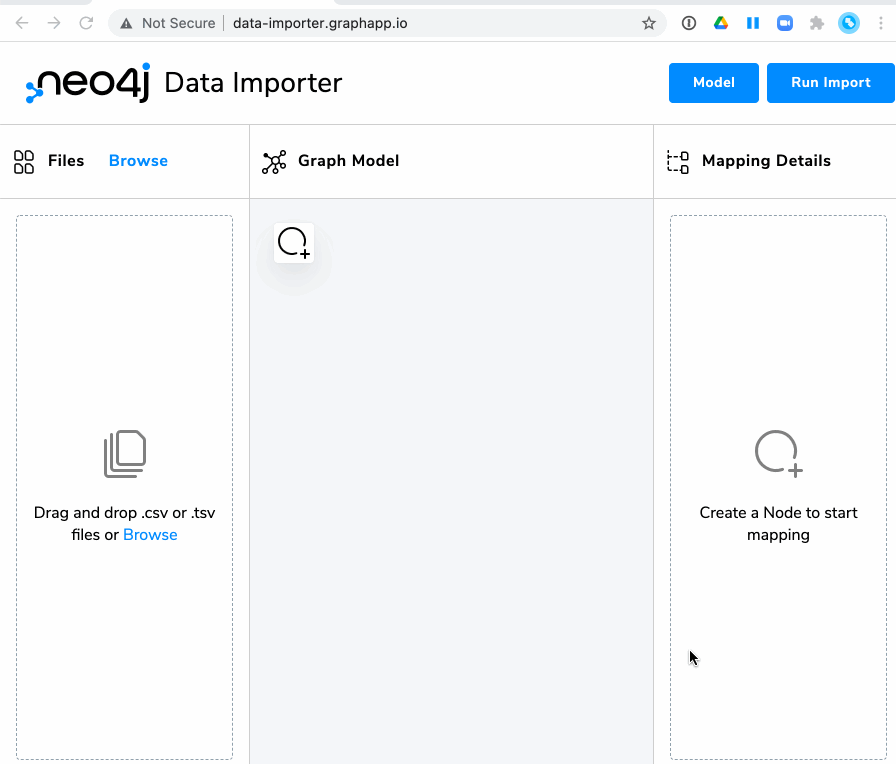
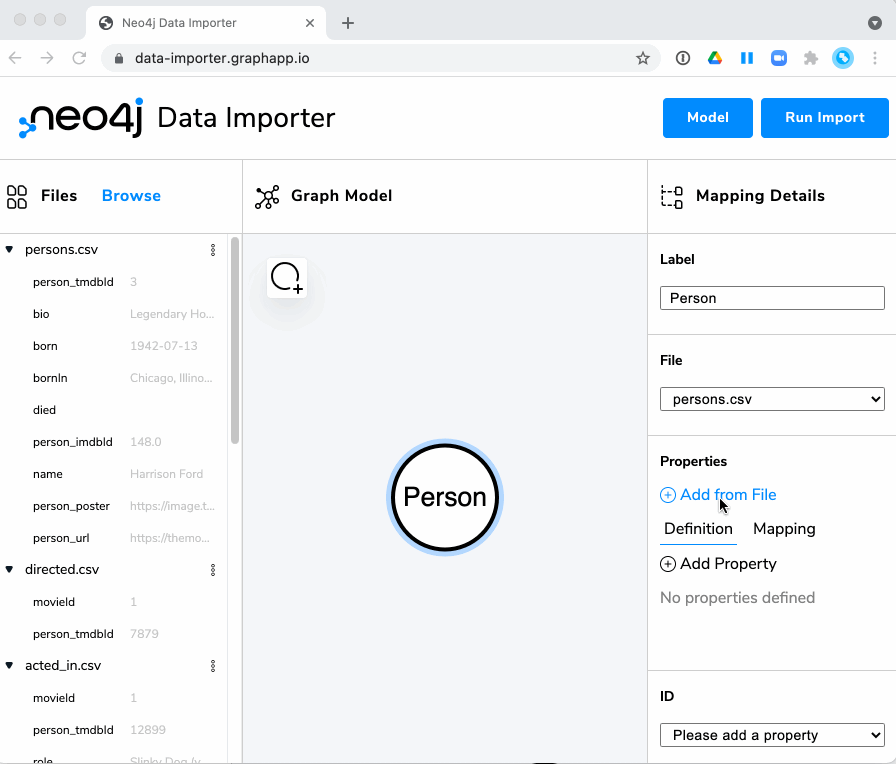
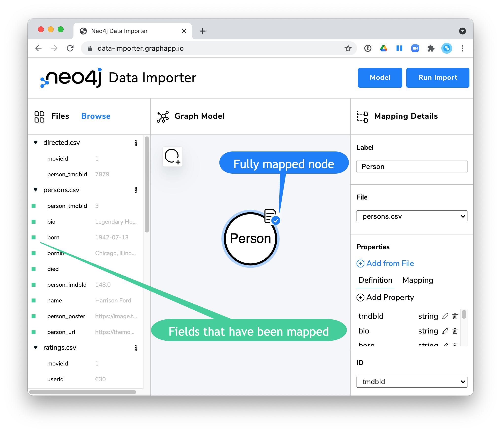

= Overview of the Neo4j Data Importer
:type: quiz

//[.video]
//video::jEIE_b1MzAE[youtube,width=560,height=315]

//https://youtu.be/jEIE_b1MzAE

[.transcript]
== What is the Neo4j Data Importer?

The Neo4j Data Importer can be found here: https://data-importer.graphapp.io/

It is a graph app the allows you to import CSV files from your local system into the graph. With this graph app, you can examine the CSV file headers, and map them to nodes and relationships in a Neo4j graph.
After you have defined the mapping, you connect to a running Neo4j DBMS to perform the import.
The benefit of the Data Importer is that you need not know Cypher to load the data.

It is useful for loading small to medium CSV files that contain fewer that 1M rows.

Data that is imported into the graph can be interpreted as string, integer, float, or boolean data.
If a field in a row needs to be stored in the graph as a date or list, it will be by default stored in the graph as a string and you will need to post-process the graph after the import.
You will learn about this later in this course.

=== Requirements for using the Data Importer

* You must use CSV files for import.
* CSV files must reside on your local system so you can load them into the graph app.
* CSV data must be clean (you learned this in an earlier lesson).
* IDs must be unique for all nodes you will be creating.
* The CSV file must have headers.

=== Steps for using the Data Importer

Before you do the import, you should have a starting idea of how your graph data model should be implemented.
The UI for the Data Importer uses the same UI elements that are used in the https://arrows.app/[Arrows app^].

[IMPORTANT]
In this lesson, we describe the steps that you will follow in the next Challenge. Do *NOT* perform these steps in this lesson.

==== Step 1: Placing the CSV file(s) on your local system and ensure they have headers and are clean.

You will examine the files and make sure they have headers and are "clean", as you learned about in an earlier lesson.

==== Step 2: Opening the Neo4j Data Importer

You will open the Data Importer app from any Web browser using this URL: https://data-importer.graphapp.io/

==== Step 3: Loading the CSV files on your local system into the graph app

You will either drag the CSV files into the Files pane on the left or use *Browse* to select them as shown here.

==== Step 4: Examining the CSV header names used in the CSV files

You will examine the first rows of each CSV file to determine:

* Files to be used to create nodes.
* Files to be used to create relationships.
* How IDs are used to uniquely identify data.

==== Step 5: Adding a node

You will:

. Add the node in the UI by clicking the *Add Node* icon.
. Specify a label for the node in the Mapping Details pane.
. Select the CSV file to use in the Mapping Details pane.

image::images/add-node.gif[Select CSV file for node,width=400,align=center]

==== Step 6: Defining mapping details for the node

You will:

. Specify properties for the node (select from file where here we select all fields).

[start=2]
. If you want a property to use a different name or type, edit the property.

image::images/edit-property.gif[Edit property,width=400,align=center]

. Specify the unique ID  property for the node.
. Confirm CSV file in the left panel is all set for import. The fields in the CSV file will have a green indicator that they have been mapped.

==== Step 7: Creating the relationships between nodes

You will:

. Add the relationship in the UI by dragging the edge of a node to itself or another node.
. Specify a type for the relationship in the Mapping Details pane.
. Select the CSV file to use in the Mapping Details pane.

image::images/add-relationship.gif[Add relationship,width=400,align=center]

==== Step 8: Defining the mapping details for the relationship

You will:

. In the Mapping Details pane, specify the from and to unique property IDs to use.
. If applicable, add properties for the relationship fom the file (optional).
. Confirm CSV in the left panel is all set for import.

==== Step 9: Performing the import

You will:

. Specify connection URL and credentials.
. View the import results.

==== Step 10: Viewing the imported data in Neo4j Browser

You will view the imported data in Neo4j Browser.

If you have de-normalized data, you will  need to perform a multi-pass import. That is, you cannot create multiple nodes and relationship types from a single CSV file.

[IMPORTANT]
Watch the video for this lesson. You will be doing the import yourself in the next Challenge.

=== Other features of the Neo4j Data Importer

You can import or export your mappings to a JSON file or to a ZIP file if you also want to include the CSV files.

== Check your understanding

include::questions/1-importer-features.adoc[leveloffset=+1]
include::questions/2-importer-files.adoc[leveloffset=+1]

[.summary]
== Summary

In this lesson, you learned what the Neo4j Data Importer is and the steps for using it.
In the next challenge, you will use the Data Importer to import CSV data.