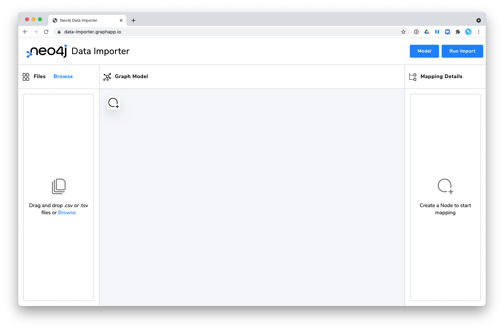
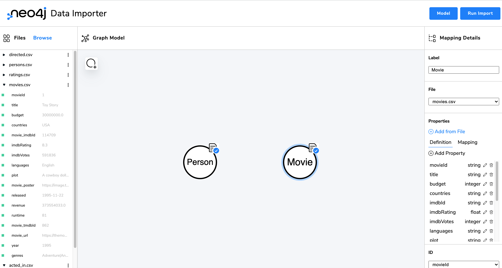
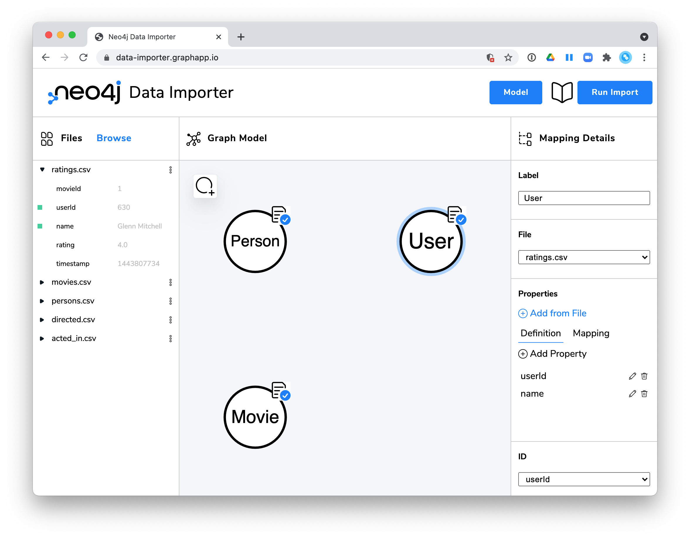
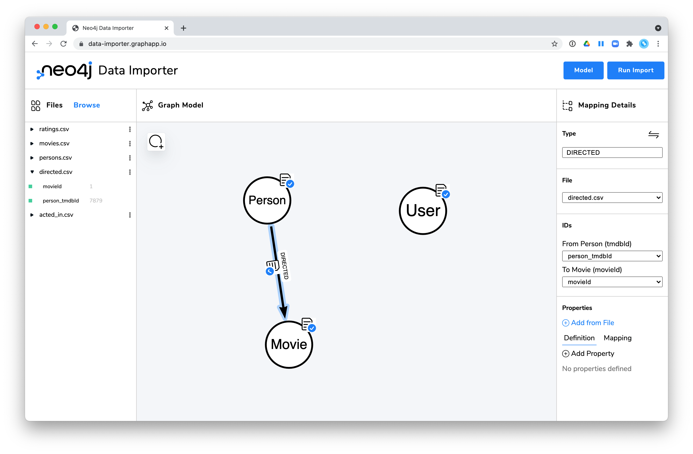
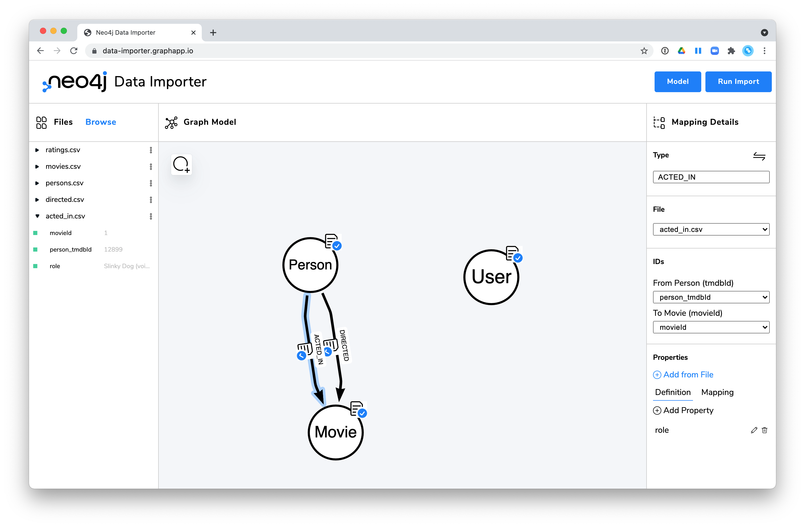
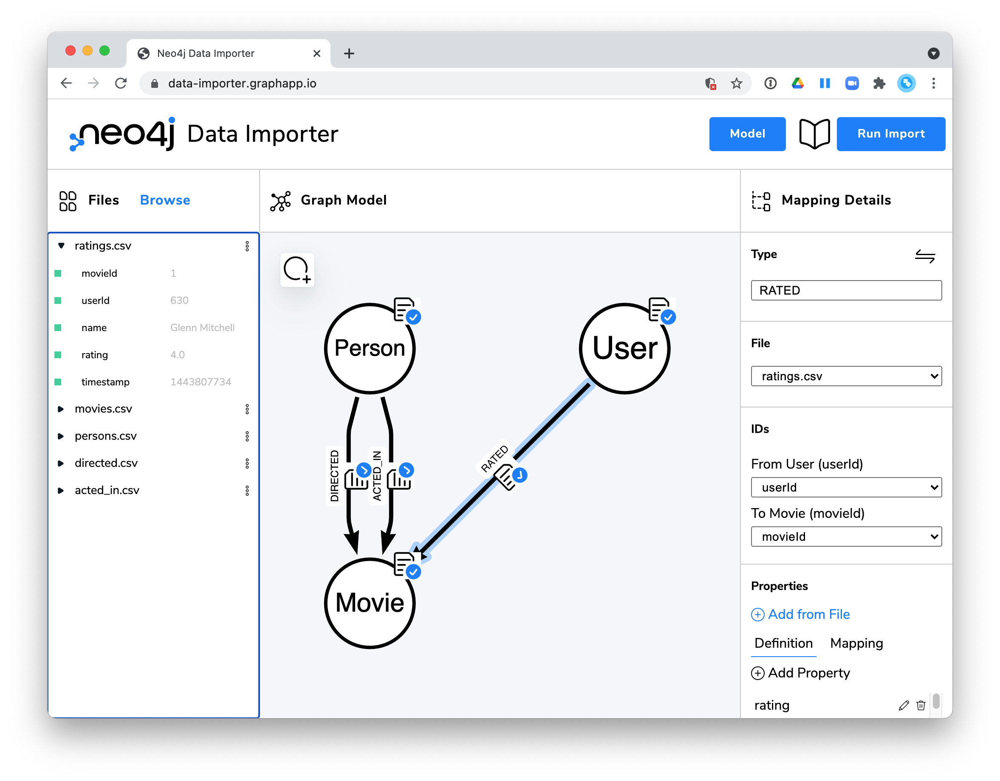
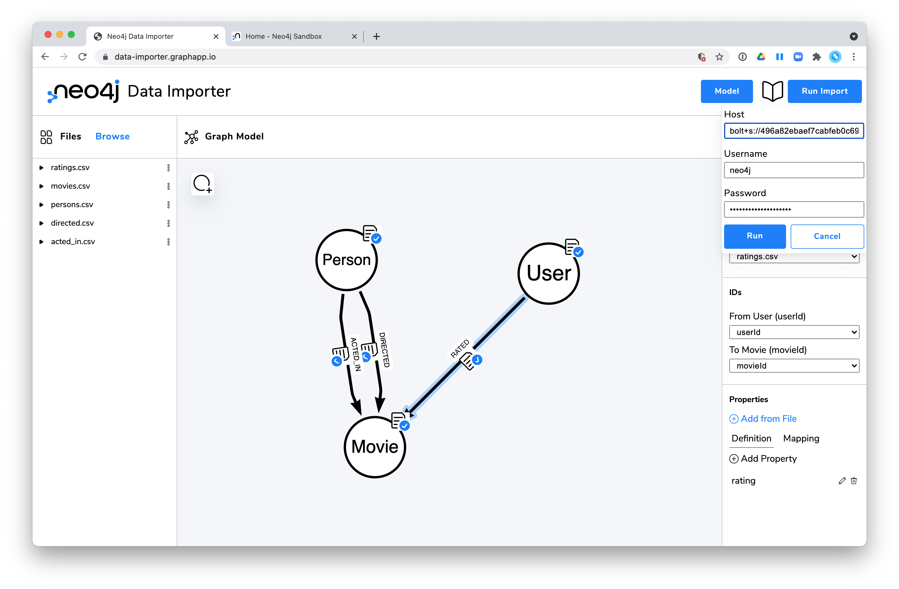
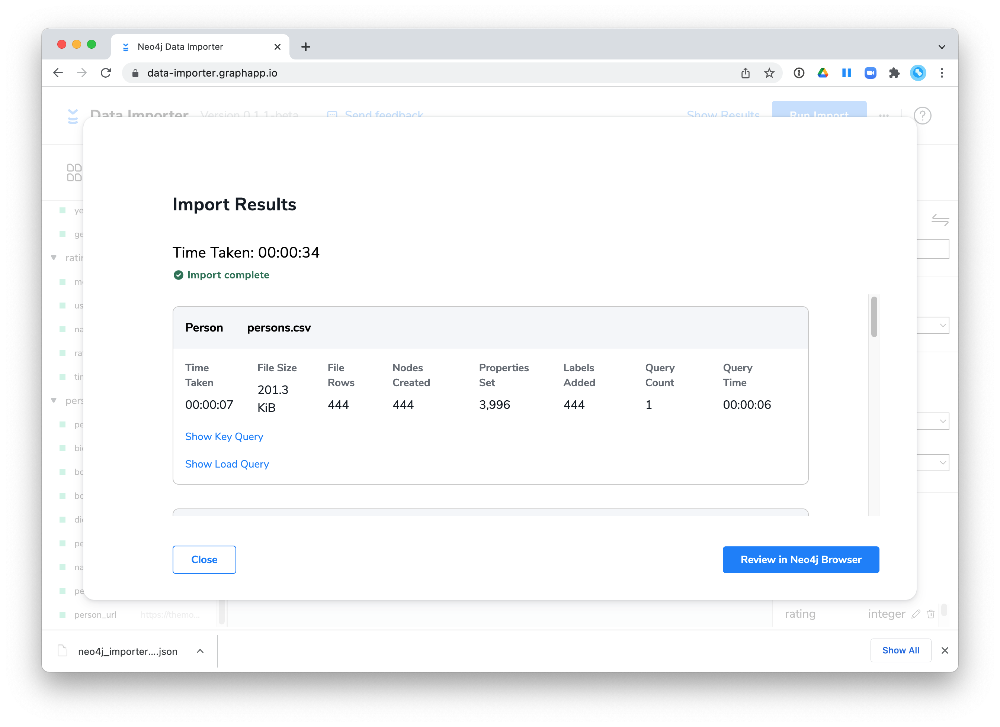

= Importing CSV files with the Neo4j Data Importer
:type: challenge
:sandbox: true

In this Challenge, you will import the movie data that you have seen in the previous module.

This challenge has 11 steps:

. Download the CSV files.
. Open the Data Importer.
. Load the CSV files into the Data Importer.
. Define the Person nodes mapping.
. Define the Movie nodes mapping.
. Define the User nodes mapping.
. Define the DIRECTED relationships mapping.
. Define the ACTED_IN relationships mapping.
. Define the RATED relationships mapping.
. Save your mappings.
. Import the CSV data
. View the imported data.

The graph data model you will be implementing is the following:

image::images/movie-data-model.png[Movie Data Model,width=600,align=center]

== Step 1: Download the CSV files

Download the following files to your system:

* https://data.neo4j.com/importing/persons.csv
* https://data.neo4j.com/importing/movies.csv
* https://data.neo4j.com/importing/ratings.csv
* https://data.neo4j.com/importing/directed.csv
* https://data.neo4j.com/importing/acted_in.csv

== Step 2: Open the Data Importer

In a Web browser window, go to: https://data-importer.graphapp.io/

You should see this:

== Step 3: Load the CSV files into the Data Importer

In the left *Files* panel, add the five CSV files you downloaded in *Step 1*.

After you have added them, you should see this:

image::images/files-added.png[Files added to Data Importer,width=600,align=center]

After you have loaded them, take a few minutes to review the headers used for each file.

== Step 4: Define the Person nodes mapping

. Click the Add node icon in the Graph Model pane.
. In the Mapping Details pane on the right:
.. Enter *Person* for the label.
.. Select the *persons.csv* file.
.. Under Properties, click *Add from File*.
... Select *All*.
... Click *Confirm*.
.. Notice that some of the property names do not match the graph data model. Modify them as follows:
... person_tmdbId --> tmdbId
... person_imdbId --> imdbId
... person_poster --> poster
... person_url --> url
.. Select *tmdbId* as the unique ID that will be used for these Person nodes.

After you have completed the mapping, you should see a check mark in the Graph Model and you should also see that in the Files panel, all properties have a green indicator that they have been mapped.

image::images/person-nodes-mapped.png[Person nodes mapped,width=600,align=center]

== Step 5: Define the Movie nodes mapping

. Click the Add node icon in the Graph Model pane.
. In the Mapping Details pane on the right:
.. Enter *Movie* for the label.
.. Select the *movies.csv* file.
.. Under Properties, click *Add from File*.
... Select *All*.
... Click *Confirm*.
.. Notice that some of the property names do not match the graph data model. Modify them as follows:
... movie_tmdbId --> tmdbId
... movie_imdbId --> imdbId
... movie_poster --> poster
... movie_url --> url
.. Select *movieId* as the unique ID that will be used for these Movie nodes. Note that we have selected movieID as the unique ID because it is used in the other files when we define the relationships to movies.

After you have completed the mapping, you should see a check mark in the Graph Model and you should also see that in the Files panel, all properties have a green indicator that they have been mapped.

== Step 6: Define the User nodes mapping

. Click the Add node icon in the Graph Model pane.
. In the Mapping Details pane on the right:
.. Enter *User* for the label.
.. Select the *ratings.csv* file.
.. Under Properties, click *Add from File*.
... Select only the *userId* and *name* properties. The other values will be used later to define relationships.
... Click *Confirm*.
.. Select *userId* as the unique ID that will be used for these Person nodes.

After you have completed the mapping, you should see a check mark in the Graph Model and you should also see that in the Files panel, all properties have a green indicator that they have been mapped.

== Step 7: Define the DIRECTED relationships mapping

. In the Graph Model pane, drag the edge of the *Person* node onto the *Movie* node. This will define a relationship between these nodes in the graph.
. In the Mapping Details pane on the right:
.. Enter *DIRECTED* for the type.
.. Select the *directed.csv* file.
.. In the IDs section:
... Select tmdbId as the Person ID.
... Select movieId as the Movie ID.

There are no properties associated with this relationship in the graph data model so you are done.

After you have completed the mapping, you should see a check mark in the Graph Model and you should also see that in the Files panel, all properties have a green indicator that they have been mapped.

== Step 8: Define the ACTED_IN relationships mapping

. In the Graph Model pane, drag the edge of the *Person* node onto the *Movie* node. This will define a relationship between these nodes in the graph.
. In the Mapping Details pane on the right:
.. Enter *ACTED_IN* for the type.
.. Select the *acted_in.csv* file.
.. In the IDs section:
... Select tmdbId as the Person ID.
... Select movieId as the Movie ID.
.. In the Properties section, select the *role* property.

After you have completed the mapping, you should see a check mark in the Graph Model and you should also see that in the Files panel, all properties have a green indicator that they have been mapped.

== Step 9: Define the RATED relationships mapping

Note that this mapping will reuse the same file you used to define the User nodes.

. In the Graph Model pane, drag the edge of the *User* node onto the *Movie* node. This will define a relationship between these nodes in the graph.
. In the Mapping Details pane on the right:
.. Enter *RATED* for the type.
.. Select the *ratings.csv* file.
.. In the IDs section:
... Select userId as the User ID.
... Select movieId as the Movie ID.
.. In the Properties section, select the *rating* property.

After you have completed the mapping, you should see a check mark in the Graph Model and you should also see that in the Files panel, all properties have a green indicator that they have been mapped.

== Step 10: Save your mappings

In the event that something goes wrong during the import, we recommend that you save what you have mapped.

. Click the *Model* button.
. Select *Export Model*. The file with the name *neo4j_importer_model_yyyy-mm-dd.json* will be downloaded to your system.

== Step 11: Import the CSV data

Before you import the data, you must have the information about the Neo4j instance you will be importing into.
The Host location should be a bolt URL for the sandbox that was created for you for this course.
You should have received an email with this information, but if you do not have the information about the sandbox instance for this course, you can simply go to https://sandbox.neo4j.com, where you can log in to see the details of your blank sandbox instance:

You can view the blank sandbox details by clicking the right-most dropdown for the sandbox. Here is where you will see the connection details:

image::images/blank-sandbox-credentials.png[Blank Sandbox credentials,width=600,align=center]

Follow these steps to import the data:

. Click the *Run Import* button.
. In the *Host* field, enter the Websocket Bolt URL from the blank sandbox instance.
. In the *Username* field, enter *neo4j*.
. In the *Password* field, enter the password from the sandbox instance.

[start=5]
. Click *Run*.
. It should import the data into your empty graph. (It will take a couple of minutes.)

== Step: 12: View the imported data

In the sandbox pane for this course, execute the following code to confirm that the data was imported.

Your graph should have 1097 nodes:

[source,cypher]
----
MATCH (n) RETURN count(n)
----

And it should have 4065 relationships:

[source,cypher]
----
MATCH ()-[r]->() RETURN count(r)
----

include::./questions/verify.adoc[leveloffset=+1]

[.summary]
== Summary

In this challenge, you imported a small set of movie data from CSV files using the Neo4j Data Importer.

In the next lesson, you learn that in some cases, you may need to perform some post-import processing.

