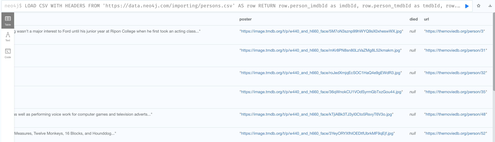

= Data Transformation
:type: quiz

//[.video]
//video::jEIE_b1MzAE[youtube,width=560,height=315]

//https://youtu.be/jEIE_b1MzAE

[.transcript]
== Steps for data transformation

You must ensure that the data read from CSV files conforms to the types specified in the graph data model.
Here are the steps to identify the transformation code you will write when loading CSV data into the graph:

. View subset of data to be loaded based upon the graph data model and compare values to be loaded with properties defined in the graph data model.
. Write transformation code for selected properties.

=== Step 1: Viewing a subset of CSV data to be loaded

Given the header names and the properties defined for a node in the graph data model, you first write the code to read a subset of the data that will be loaded into each node.

Here is our graph data model:

image::images/movie-data-model.png[Movie data model,width=600,align=center]

Here is a subset of the data that you will eventually load into the Person nodes.
We specify the column header names (for example, row.person_imdbId) that will correspond to the properties (for example, imdbId) for the Person nodes in our graph data model and we return ten of them:
Notice here that the header column names do not match exactly the property names in the graph data model.

[source,Cypher,role=nocopy noplay]
----
LOAD CSV WITH HEADERS
FROM 'https://data.neo4j.com/importing/persons.csv'
AS row
RETURN
 row.person_imdbId AS imdbId,
 row.person_tmdbId AS tmdbId,
 row.bornIn AS bornIn,
 row.born AS born,
 row.name AS name,
 row.bio AS bio,
 row.person_poster AS poster,
 row.died AS died,
 row.person_url AS url
LIMIT 10
----

Here is the result of executing this cypher code:

image::images/check-transform-person.png[Check for transformation - Person nodes,width=600,align=center]

Here we see that the default type of string for each field matches what we want in our graph data model for Person nodes.

If we scroll to the right in our results returned, we see that the _died_ property will not be set if there is no value in the CSV file.

Suppose we do the same for the Movie data:

[source,Cypher,role=nocopy noplay]
----
LOAD CSV WITH HEADERS
FROM 'https://data.neo4j.com/importing/movies.csv'
AS row
RETURN
row.movie_imdbId AS imdbId,
row.movie_tmdbId AS tmdbId,
row.movieId AS movieId,
row.imdbRating AS imdbRating,
row.released AS released,
row.title AS title,
row.year AS year,
row.movie_poster AS poster,
row.runtime AS runtime,
row.countries AS countries,
row.imdbVotes AS imdbVotes,
row.revenue AS revenue,
row.plot AS plot,
row.movie_url AS url,
row.budget AS budget,
row.languages AS languages,
row.genres AS genres
LIMIT 10
----

Here are the results:

image::images/check-transform-movie.png[Check for transformation - Movie nodes - part 1,width=600,align=center]

image::images/check-transform-movie-2.png[Check for transformation - Movie nodes - part 2,width=600,align=center]

For this CSV data, we must transform these values to match the types in the graph data model:

* imdbRating: decimal
* year: integer
* runtime: integer
* countries: list of strings
* imdbVotes: integer
* revenue: integer
* budget: integer
* languages: list of strings
* genres: list of strings that will be used to create Genre nodes

*Note*: There is no genres property for a Movie node, but we will use the genres list to create the Genre nodes during the load.

=== Step 2: Writing the transformation code

With Cypher it is pretty straightforward to transform a string value to decimal and integer values using `toFloat()` and `toInteger()` respectively.

For those fields that need numeric transformation, we do the following to match what is in the graph data model:

[source,Cypher,role=nocopy noplay]
----
LOAD CSV WITH HEADERS
FROM 'https://data.neo4j.com/importing/movies.csv'
AS row
RETURN
row.movie_imdbId AS imdbId,
row.movie_tmdbId AS tmdbId,
row.movieId AS movieId,
toFloat(row.imdbRating) AS imdbRating, // transformed to decimal
row.released AS released,
row.title AS title,
toInteger(row.year) AS year,           // transformed to integer
row.movie_poster AS poster,
toInteger(row.runtime) AS runtime,     // transformed to integer
row.countries AS countries,
toInteger(row.imdbVotes) AS imdbVotes, // transformed to integer
toInteger(row.revenue) AS revenue,     // transformed to integer
row.plot AS plot,
row.movie_url AS url,
toInteger(row.budget) AS budget,       // transformed to integer
row.languages AS languages,
row.genres AS genres
LIMIT 10
----

Transforming multi-value fields as lists can be done as follows where we use two Cypher built-in functions to help us:

[source,Cypher,role=nocopy noplay]
----
LOAD CSV WITH HEADERS
FROM 'https://data.neo4j.com/importing/movies.csv'
AS row
RETURN
// other properties
split(coalesce(row.countries,""), "|") AS countries,
// other properties
split(coalesce(row.languages,""), "|") AS languages,
split(coalesce(row.genres,""), "|") AS genres
LIMIT 10
----

`coalesce()` identifies each element in the multi-value field where the "|" character is the separator. It then uses `split()` to create a list of each element.

So the resulting transformations look like this:

image::images/transformed-movie.png[Movie data transformed,width=600,align=center]

== Check your understanding

include::questions/1-default-type.adoc[]
include::questions/2-transform-list.adoc[]

[.summary]
== Summary

In this lesson, you learned about some of transformations you need to do to load CSV data into your graph where the data types match the graph data model.
In the next challenge, you practice transforming data from  CSV files.
