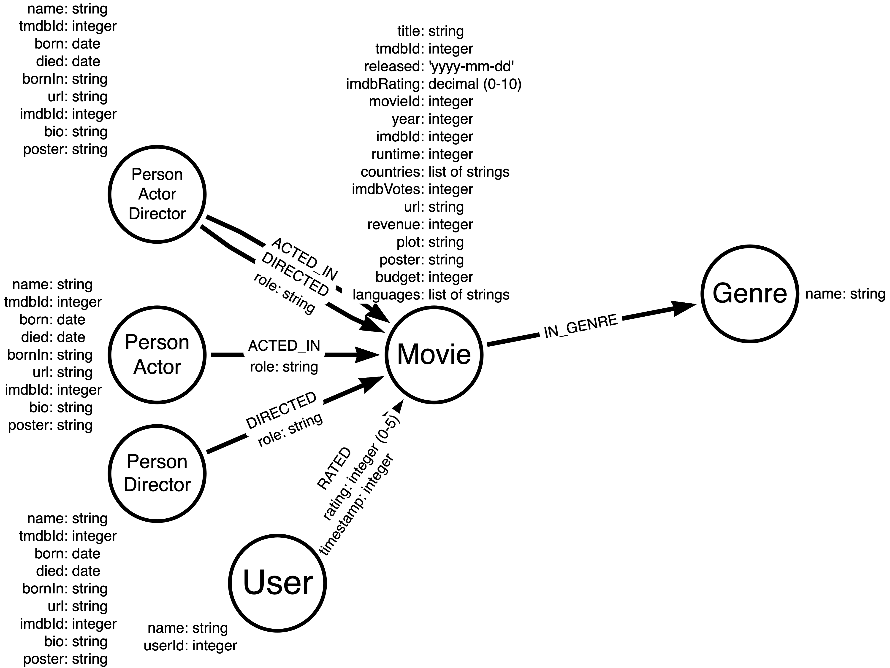
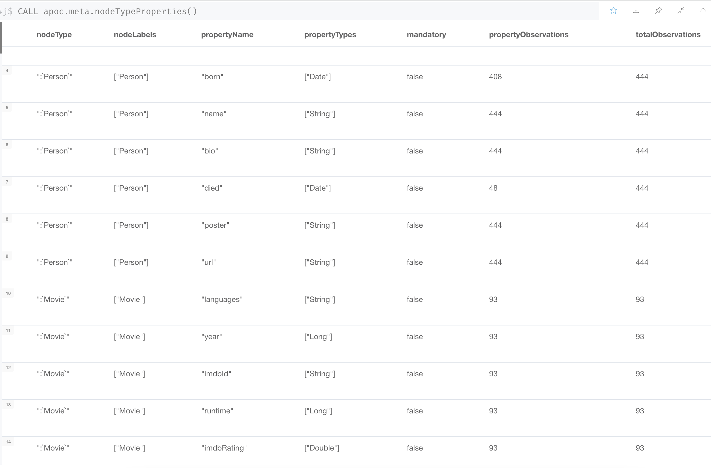
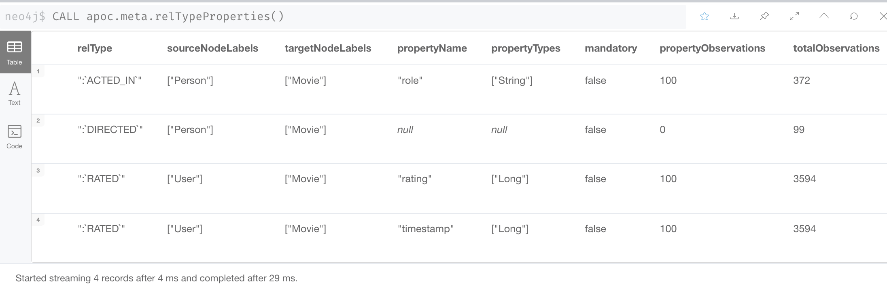

= Transforming String Properties
:type: quiz

//[.video]
//video::jEIE_b1MzAE[youtube,width=560,height=315]

//https://youtu.be/jEIE_b1MzAE

[.transcript]
== Moving toward the data model

Our data model contains some properties that should be stored as numeric data or dates.

We must transform these _Movie_ properties to match the types in the graph data model:

* imdbRating: decimal (stored in graph as Double)
* year: integer (stored in graph as Long)
* runtime: integer
* imdbVotes: integer
* revenue: integer
* budget: integer

We must transform these _Person_ properties to match the types in the graph data model:

* born: date (store in graph as Date)
* died: date

The _User_ nodes are all set with string types for their properties. However, the _RATED_ relationship's _rating_ and _timestamp_ properties need to be transformed to Long types (integer).

As part of the process of ensuring the CSV data is "clean", you must ensure that values for fields that will be transformed match the type of data they are being transformed to, otherwise you will raise errors during the transformation.
For example, if you were to attempt to transform "abc" to an Long, the transformation would return null.
If you were to attempt to transform "abc" to a Date, the transformation would raise an error that the string is not in the correct format.

== Converting to numeric values

To covert a string to a numeric value, we use:

`toInteger(property)` to convert to an Long and `toFloat(property)` to convert to Double.

So we can retrieve all _Movie_ nodes to transform the appropriate properties to their type per the data model:

[source,Cypher,role=nocopy noplay]
----
MATCH (m:Movie)
SET
m.imdbRating = toFloat(m.imdbRating),         // transformed to Double
m.year = toInteger(m.year),                   // transformed to Long
m.runtime = toInteger(m.runtime),             // transformed to Long
m.imdbVotes = toInteger(m.imdbVotes),         // transformed to Long
m.revenue = toInteger(m.revenue),             // transformed to Long
m.budget = toInteger(m.budget)                // transformed to Long
----

*Note*: You will be performing these transformations in the next challenge.

And here is how we would transform the _rating_ property to an integer:

[source,Cypher,role=nocopy noplay]
----
MATCH ()-[r:RATED]-()
SET
r.rating = toInteger(r.rating),                // transformed to Long
r.timestamp = toInteger(r.timestamp)
----

If a property has value of "" (empty string), it will be set to a value of null.

== Converting to Date values

To convert a string to a date value, we use `date(property)`.
One caveat of the `date()` function is that it does not work for empty strings or strings that do not have the correct format.
For example "abc" is not a correct string format for a date.
A correct format for a date string is "yyyy-mm-dd".
Since both the _born_ and _died_ properties could contain empty strings (""), we use the following code to transform these properties correctly.

[source,Cypher,role=nocopy noplay]
----
MATCH (p:Person)
SET p.born = CASE p.born WHEN "" THEN null ELSE date(p.born) END
WITH p
SET p.died = CASE p.died WHEN "" THEN null ELSE date(p.died) END
----

We test whether the value of the property is an empty string. It it is we remove it (set it to null).
Otherwise we transform the string to a date.

== Confirming types in the graph

Neo4j Browser returns date properties as strings and it is sometimes hard to determine what the type stored in the graph is.

For example, here we return the _born_ property of five _Person_ nodes.

image::images/return-new-born-property.png[Born property,width=600,align=center]

In Neo4j Browser, the _born_ property appears like a string, but it is not a string.
We can actually extract the year from the property because it is a date:

image::images/return-year-of-born-property.png[Born property year,width=600,align=center]

As you move closer to the data model, you may want to confirm that the properties in the graph represent the types in the data model.

You can use this type of Cypher code to show the stored type for the node properties in the graph:

[source,Cypher,role=nocopy noplay]
----
CALL apoc.meta.nodeTypeProperties()
----

Here we see that our properties have been properly transformed to Long, Double, Date types in the graph.

And you can do the same type of investigation of types for relationship properties:

[source,Cypher,role=nocopy noplay]
----
CALL apoc.meta.relTypeProperties()
----

== Check your understanding

include::questions/1-storage-types.adoc[leveloffset=+1]
include::questions/2-string-to-date.adoc[leveloffset=+1]

[.summary]
== Summary

In this lesson, you learned about some of transformations you need to do to load CSV data into your graph where the data types match the graph data model.
In the next challenge, you practice transforming data the data that you previously imported from  CSV files.
