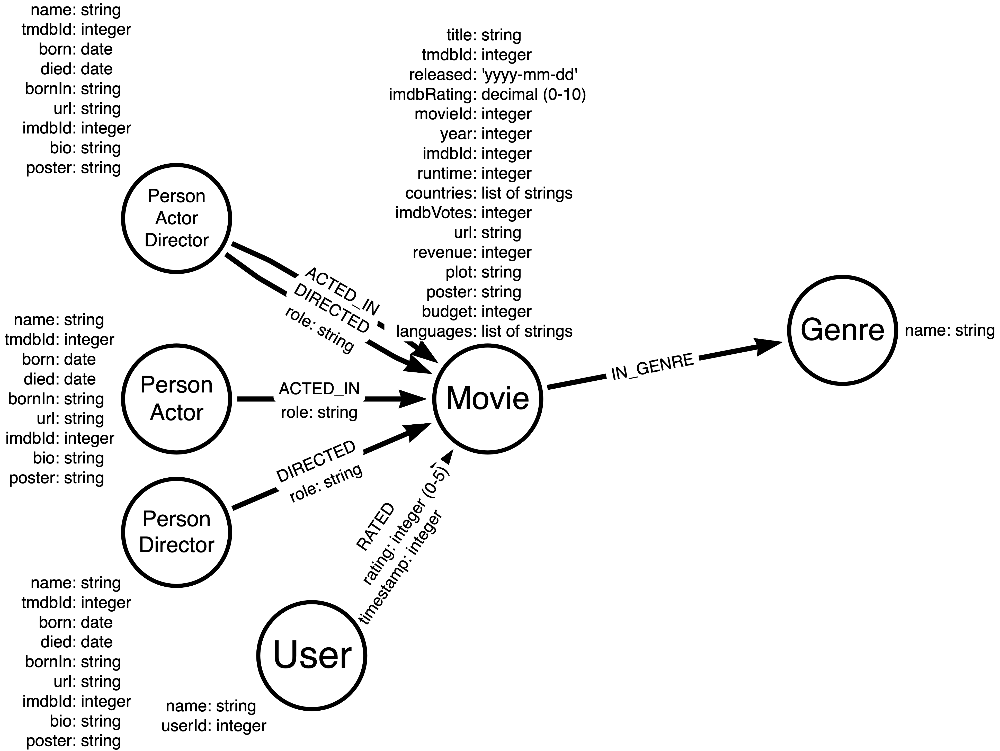

= Transform String Properties
:type: challenge
:sandbox: true

In this Challenge, you will working with the data you previously imported with the Data Importer.

[IMPORTANT]
You can only perform the steps of this Challenge if you have imported the data in the previous Challenge.

This challenge has 2 steps:

. Transform the _Person_ properties to dates.
. View the types stored in the graph.

Here is our target graph data model we are moving toward:

== Step 1: Transform Person properties to dates

Execute this code in the sandbox on the right.

[source,Cypher]
----
MATCH (p:Person)
SET p.born = CASE p.born WHEN "" THEN null ELSE date(p.born) END
WITH p
SET p.died = CASE p.died WHEN "" THEN null ELSE date(p.died) END
----

This code should have set 888 properties.

== Step 2: View the types stored in the graph

Now that you have transformed properties in the graph to match what we want for numeric and date values in the graph, confirm that their types are correct:

[source,Cypher]
----
CALL apoc.meta.nodeTypeProperties()
----

Modify the code to check relationship properties.

include::./questions/verify.adoc[leveloffset=+1]

[.summary]
== Summary

In this challenge, you transformed some of the string data to date types to match our target data model.
In the next lesson, you learn how to transform multi-value properties into lists.

