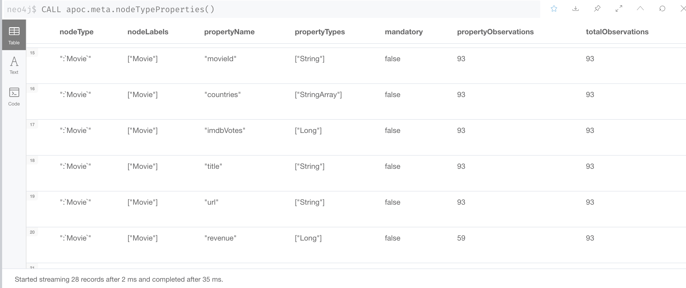

= Transforming Multi-value Properties
:type: quiz

[.video]
video::BrRHgX0n8dg[youtube,width=560,height=315]

[.transcript]
== What is a multi-value property?

A multi-value property is a property that can hold one or more values. This type of data in Neo4j is represented as a list.
All values in a list must have the same type. For example:

* ["USA", "Germany", "France"]
* [100, 55, 4]

=== Multi-value properties in our data model

Our current data model defines lists for these properties:

* Movie: countries
* Movie: languages

Because of the way that we imported the data, we have an additional multi-value property, Movie: genres.
Although our data model does not contain a genres property for Movie nodes, we will transform the data for this property as it will be a means to our goal of creating the Genre nodes in the graph in a later transformation.

All of these properties were imported as strings with data that looks as follows:

image::images/multi-value-props.png[Multi-value properties,width=600,align=center]

Notice that for this particular set of CSV files, the "|" character is specified as the separator.

=== Transforming list properties

Transforming multi-value fields as lists can be done as follows where we use two Cypher built-in functions to help us:

[source,Cypher,role=nocopy noplay]
----
MATCH (m:Movie)
SET m.countries = split(coalesce(m.countries,""), "|"),
m.languages = split(coalesce(m.languages,""), "|"),
m.genres = split(coalesce(m.genres,""), "|")
----

`coalesce()` identifies each element in the multi-value field where the "|" character is the separator. It then uses `split()` to create a list of each element.

So the resulting transformations look like this:

image::images/transformed-lists.png[Movie list properties transformed,width=600,align=center]

=== Checking the property types

Again, you can confirm that the property types for the three Movie properties has been completed also by viewing the types again:

The three list properties have been transformed to the type StringArray.

== Check your understanding

include::questions/1-string-array.adoc[leveloffset=+1]
include::questions/2-transform-list.adoc[leveloffset=+1]

[.summary]
== Summary

In this lesson, you learned how to transform multi-value properties to lists.
In the next Challenge, you will transform multi-value properties in the graph you have been working with to list properties.