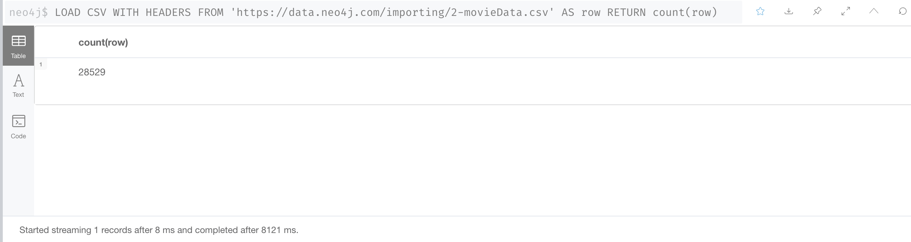
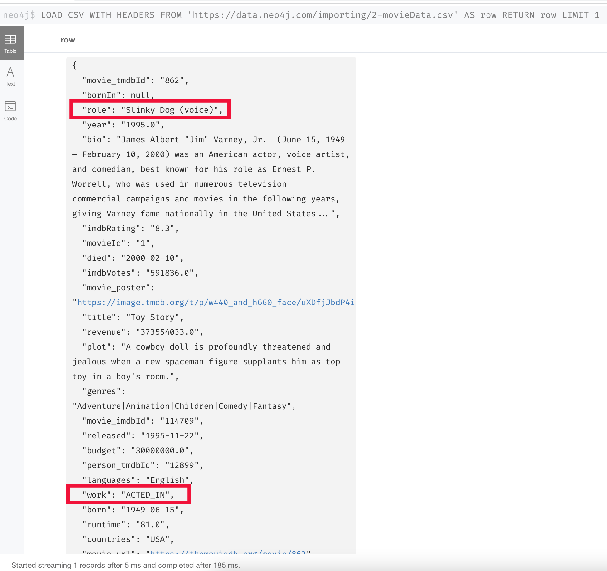
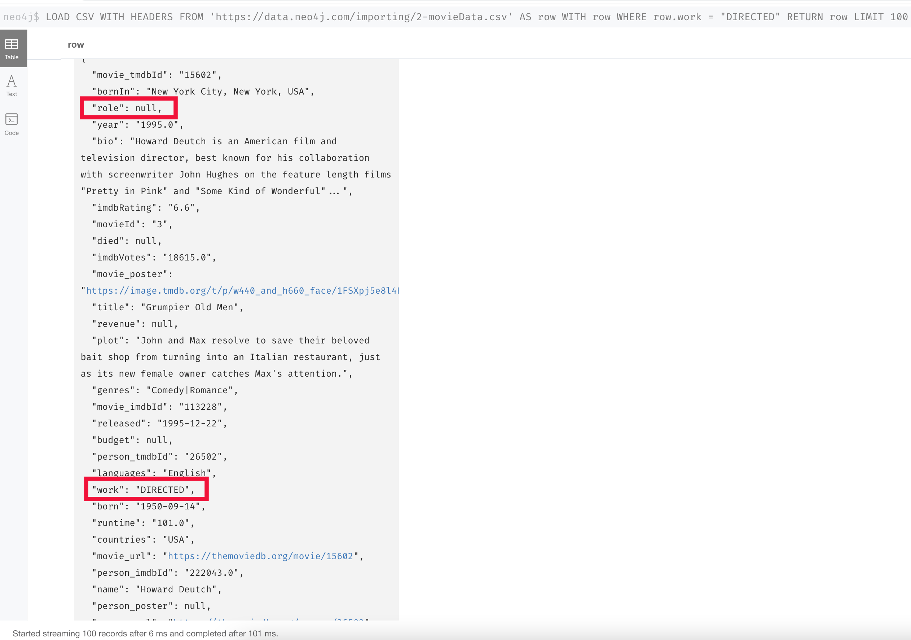

= Importing Large Datasets with Cypher
:type: quiz

//[.video]
//video::jEIE_b1MzAE[youtube,width=560,height=315]

//https://youtu.be/jEIE_b1MzAE

[.transcript]
== Memory requirements

As you learned earlier, the Data Importer can be used for small to medium datasets containing less than 1M rows.
The Data Importer is a generalized tool as you saw that creates all properties in the graph as strings and you need to possibly post-process or refactor the graph after the import.
It is also designed to handle a smaller memory footprint so it may not be useful for all of your data import needs.

When you import using Cypher statements, you have control over the amount of memory used for the import.
In Cypher, by default, the execution of your code is a single transaction.
In order to process large CSV imports, you need to break up the execution of the Cypher into multiple transactions.

== Using `:auto USING PERIODIC COMMIT` in Neo4j Browser

In Neo4j Browser, you can use this code structure to import a large dataset:

[source,Cypher,role=nocopy noplay]
----
:auto USING PERIODIC COMMIT LOAD CSV WITH HEADERS
FROM 'url-for-CSV-file'
AS row
/// add data to the graph
----

The default transaction size for this type of import is 500 rows. That is, after 500 rows have been read from the CSV file, the data will be committed to the graph and the import will continue.
This enables you to load extremely large CSV files into the graph without running out of memory.

== Specialized processing using Cypher

One advantage of using Cypher for loading your CSV data is that you can perform the type transformations and some of the "refactoring" during the import.
That is, you can customize how property types are managed so you need not do any post-processing after the load.
At this writing, there is no capability to "customize" the import using the Data Importer.

== Importing de-normalized data

Recall that de-normalized data represents CSV files where data for an entity such as a movie or person may be repeated in multiple rows.

Here is an example where we have de-normalized data for the same dataset:

image::images/denormalized-data.png[Denormalized data,width=600,align=center]

With de-normalized data, the data is represented by multiple rows corresponding to the same entity, which will be loaded as a node.
The difference, however, is that de-normalized data typically represents data from multiple tables in the RDBMS.
For example, the movie and person data (including the ID) is repeated in multiple rows in the file, but a row represents a particular actor's role in a particular movie.
That is, a Movie and Person data will be represented in multiple rows, but an actor's role will be represented by a single row.

== Planning for the import

You must inspect and possibly clean the data before you import it.
The large CSV data files you will be working with have already been cleaned.

First we determine the number of rows in each file:

image::images/2-rating-data-count.png[Rating data rows,width=600,align=center]

They do not exceed the 1M row limitation for the Data Importer, but you may run out of memory during the import so in this course we will use Cypher to load these CSV files.

=== Planning the Movie, Genre, Person import

Next, we examine the fields in our first CSV file.
Each row in the 2-movieData.CSV file represents either an actor and his/her role in a move or a director for a movie.
You see here that the column labels are identical to what you worked with using the smaller CSV files.
One difference, however is that there is a _worked_ header that represents a value of either "ACTED_IN" or "DIRECTED".
In addition, if the row represents an actor, the _role_ is set to a value.

You must decide whether you want to process the file in multiple passes or in a single pass.

We recommend three passes to:

. Create the Movie nodes, Genre nodes, and the IN_GENRE relationships.
. Create the Person:Actor nodes and the ACTED_IN relationships.
. Create the Person:Director nodes and the DIRECTED relationships.

The advantage of performing the import in three passes is that you can check the graph after each import to see if it is getting closer to the data model.
If the CSV file were extremely large, you might want to consider a single pass.

=== Planning the User import

Here are the fields in our second CSV file.

image::images/row-rating-data.png[Rating data row,width=600,align=center]

These fields again are what you worked with earlier. the _userId_ is the unique ID for _User_ nodes and _movieId_ is the unique ID for _Movie_ nodes.
We know from our previous import using the Data Importer that these constraints already exist in the graph.

== Check your understanding

include::questions/1-memory.adoc[leveloffset=+1]

[.summary]
== Summary

In this lesson, you learned some considerations for importing large CSV files and when you may want to use Cypher to import data, rather than the Data Importer.
In the next Challenge, you will import CSV data with Cypher.
