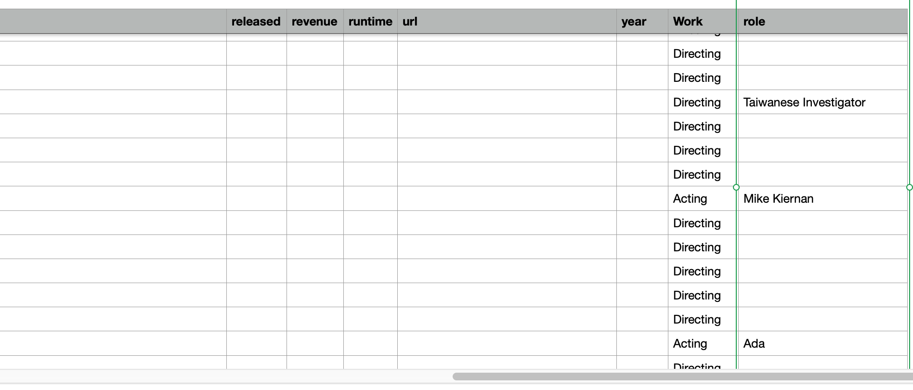
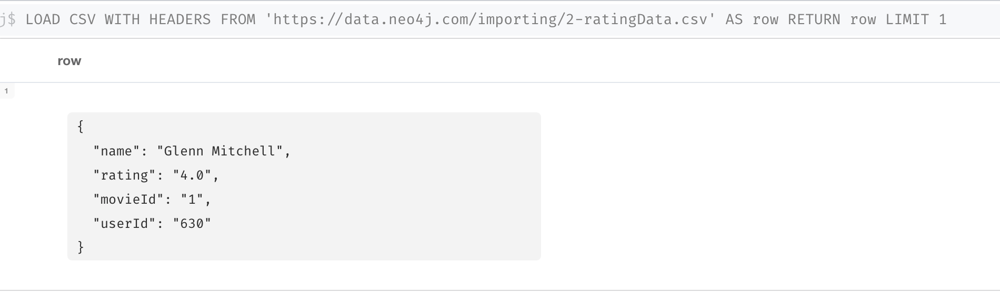

= Importing Large Datasets with Cypher
:type: quiz

//[.video]
//video::jEIE_b1MzAE[youtube,width=560,height=315]

//https://youtu.be/jEIE_b1MzAE

[.transcript]
== Memory requirements

As you learned earlier, the Data Importer can be used for small to medium datasets containing less than 1M rows.
The Data Importer is a generalized app as you saw that creates all properties in the graph as strings, integers, decimals, or boolean, and you need to possibly post-process or refactor the graph after the import.
It is also designed to handle a smaller memory footprint so it may not be useful for all of your data import needs.

When you import using Cypher statements, you have control over the amount of memory used for the import.
In Cypher, by default, the execution of your code is a single transaction.
In order to process large CSV imports, you need to break up the execution of the Cypher into multiple transactions.

== Using `USING PERIODIC COMMIT`

You can use this code structure to import a large dataset:

[source,Cypher,role=nocopy noplay]
----
USING PERIODIC COMMIT LOAD CSV WITH HEADERS
FROM 'url-for-CSV-file'
AS row
/// add data to the graph
----

The default transaction size for this type of import is 500 rows. That is, after 500 rows have been read from the CSV file, the data will be committed to the graph and the import will continue.
This enables you to load extremely large CSV files into the graph without running out of memory.

[IMPORTANT]
In Neo4j Browser, you must prefix this Cypher with `:auto`, that is `:auto USING PERIODIC COMMIT LOAD CSV...`
This tells Neo4j to use automatic detection of transactions.

== Specialized processing using Cypher

One advantage of using Cypher for loading your CSV data is that you can perform the type transformations and some of the "refactoring" during the import.
That is, you can customize how property types are managed so you need not do any post-processing after the load.
At this writing, there is no capability to "customize" the import using the Data Importer.

== Planning for the import

You must inspect and possibly clean the data before you import it.
The large CSV data files you will be working with have already been cleaned.

First we determine the number of rows in each file:

image::images/2-movie-data-count.png[Movie data rows,width=600,align=center]

image::images/2-rating-data-count.png[Rating data rows,width=600,align=center]

They do not exceed the 1M row limitation for the Data Importer, but you may run out of memory during the import so in this course we will use Cypher to load these CSV files.

=== Planning the Movie, Genre, Person import

Next, we examine the fields in our first CSV file.
Each row in the *2-movieData.csv* file represents either an Entity or a relationship between two entities.

==== Entities

An Entity row has a value of Person, Movie, or Join, where the Movie rows have the genre data. We will continue to use these unique IDs for our _Movie_, _Person_, and _Genre_ nodes:

* Movie.movieId
* Person.tmdbId
* Genre.name

Here is what the Movie and Person entities look like in our CSV file:

image::images/movie-person-data.png[Movie Person data,width=600,align=center]

The type of entity is either Person or Movie and each person has a value of tmdbId that uniquely identifies it.
Each movie has a value of movieId that uniquely identifies it.
Movies have values for things such as title and people have values for things such as name.
How we process the data will depend upon the type of entity in the CSV file.

==== Relationships

A relationship row has an Entity value of Join.

image::images/join-data-1.png[Join data IDs,width=600,align=center]

Notice that for the join, we have both a movieId representing a movie and a tmdbId representing a person.

In addition, each join row we have a Work colummn that describes whether the data will be used for creating the ACTED_IN or DIRECTED relationships in the graph.
Actor rows will have a value for the role and a few director rows also have a value for role.

==== Multi-step import processing

We recommend several passes to process this CSV file and a cleanup step:

. Create the Movie nodes and the Genre nodes.
. Create the Person nodes.
. Add the Actor labels and the ACTED_IN relationships.
. Add the Director labels and the DIRECTED relationships.

The advantage of performing the import in multiple passes is that you can check the graph after each import to see if it is getting closer to the data model.
If the CSV file were extremely large, you might want to consider a single pass.

=== Planning the User import

Here are the fields in our second CSV file.

These fields again are what you worked with earlier. the _userId_ is the unique ID for _User_ nodes and _movieId_ is the unique ID for _Movie_ nodes.
We know from our previous import using the Data Importer that these constraints already exist in the graph.

== Check your understanding

include::questions/1-memory.adoc[leveloffset=+1]

[.summary]
== Summary

In this lesson, you learned some considerations for importing large CSV files and when you may want to use Cypher to import data, rather than the Data Importer.
In the next Challenge, you will import CSV data with Cypher.
