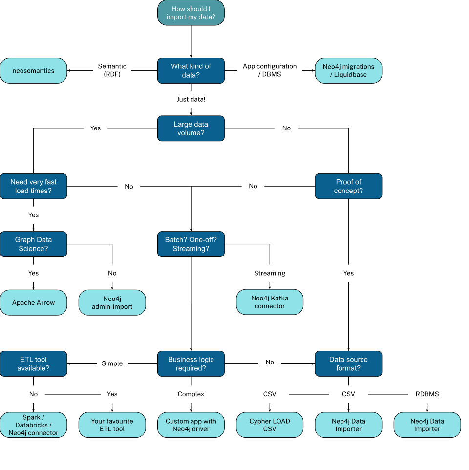

= How can I import data into Neo4j?
:order: 2
:type: video

In this lesson, you will explore the different approaches for importing data into Neo4j. 

[.video]
video::Pv9IK6h4EdY[youtube,width=560,height=315]

[.transcript]

== Approaches for Importing Data

When I say importing data, I mean the process of moving data from one system into Neo4j. 
The import could be a one-time operation, or it could be a regular process that you need to automate.

Typically, the source system would have a different data model than Neo4j, and by importing data, you would transform the data into a graph model.

The source may expose data in different ways, for example:

* Relational Database Management Systems (RDBMS)
* Web APIs
* Public data directories
* BI tools
* Excel
* Flat files (CSV, JSON, XML)

The method by which you import data into Neo4j will depend on several factors, including:

* The source of the data
* The volume of data
* The frequency of the import
* The complexity of the data model
* The transformation required

The options available to you are numerous, and include:

* One-off batch import of all data 
* One-off load with a regular update
* Continuous import of data
* Real-time application updates
* ETL (Extract, Transform, Load) pipelines

Ultimately, how you import data into Neo4j will depend on your specific requirements.

== Options for Importing Data

I asked the Neo4j field team about the most common ways they see data imported into Neo4j.
They shared this flowchart of potential options and tools.

This flowchart is not an exhaustive list or a decision-making tool.

It is a conversation starter, a way to understand some options, decision points, and tools available.

In the next lesson, you will look at some of the tools available for importing data into Neo4j.

[.quiz]
== Check Your Understanding

include::questions/1-best-solution.adoc[leveloffset=+2]

[.summary]
== Summary

In this lesson, you explored some of the approaches for importing data.

In the next lesson, you will explore some tools you can use to import data into Neo4j.