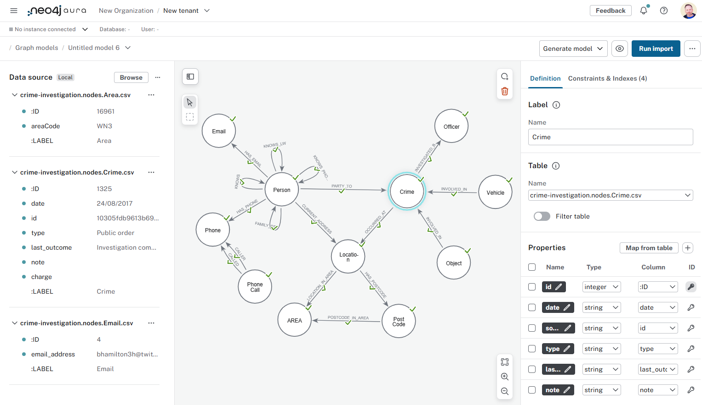

= Tools
:order: 3
:type: lesson

In this lesson, you will explore some tools you can use to import data into Neo4j. 

You will learn about:

* Data Importer
* Cypher and LOAD CSV
* neo4j-admin
* ETL tools
* Custom application

== Data Importer

The link:https://neo4j.com/docs/data-importer/current/[Neo4j Data Importer^] is a "no-code" tool that facilitates CSV data importing into Neo4j.
Its graphical user interface allows for simple data conversion into nodes and relationships.

Data Importer allows you to:

* Visually define the graph data model, including nodes, relationships, and properties.
* Upload source data files
* Map CSV columns to properties
* Define unique ID constraints and indexes

Data Importer is an excellent tool for quickly importing data into Neo4j without writing any code.

== Cypher and LOAD CSV

Cypher has built-in support for importing data from CSV files using the `LOAD CSV` clause.

[source, cypher, role=noplay nocopy]
----
LOAD CSV WITH HEADERS FROM 'file:///transactions.csv' AS row

MERGE (t:Transactions {id: row.id})
SET 
    t.reference = row.reference,
    t.amount = toInteger(row.amount),
    t.timestamp = datetime(row.timestamp)
----

You can control the import process by writing Cypher queries to:

* Load data from CSV files
* Create the data model
* Transform and aggregate data
* Control transactions

You can learn more about using Cypher and `LOAD CSV` in the link:https://graphacademy.neo4j.com/courses/importing-cypher/[Importing CSV data into Neo4j]
GraphAcademy course.

== neo4j-admin

The link:https://neo4j.com/docs/operations-manual/current/tools/neo4j-admin/neo4j-admin-import/[`neo4j-admin import` command line interface^] supports importing large data sets. `neo4j-admin import` converts CSV files into the internal binary format of Neo4j and can import millions of rows within minutes. 

The `neo4j-admin import` command expects you to format the data in a specific way and requires the database to be offline during the import process.

Data should preferably be clean and transformed before importing, as faults in the data will reduce the performance of the import process.

The `neo4j-admin import` is a highly configurable high-performance tool, applicable when you need to import large data sets very quickly.

You can learn more about using `neo4j-admin import` in the link:https://neo4j.com/docs/operations-manual/current/tutorial/neo4j-admin-import/[Neo4j-admin import tutorial].

== ETL (Extract, Transform, Load) Tool

An ETL tool, for example link:https://hop.apache.org/[Apache Hop^], is a good choice for importing data from multiple sources. 
ETL tools generally support various data sources, can transform data into the desired format, and have visualization tools.

Many organizations use ETL tools to import data into Neo4j because they can handle complex data transformations and integrations.

== Custom integration using Neo4j drivers

Building a custom application to load data into the graph database is a good option if you have complex business rules or need to integrate with other systems. 
A custom application will allow you complete control over the import process and integration with other systems and data sources.

There are several link:https://graphacademy.neo4j.com/categories/developer/[GraphAcademy courses for developers^], where you can learn how to build applications using Neo4j drivers.

== Mixed approaches

In practice, you may use a combination of these tools to import data into Neo4j. 
For example, you may use Data Importer for quick prototyping, Cypher for small data sets, and ETL tools for complex data transformations.

You may also choose to do one-off batch imports using one tool and real-time data ingestion using another tool.

read::Continue[]

[.summary]
== Summary

In this lesson, you learned about various tools to import data into Neo4j.

In the next module, you will learn how to import CSV data using Data Importer.