= Data Importer
:order: 1
:type: lesson
:disable-cache: true
:shared-dir: ../../../../shared
:solution-filename: person-import.zip

In this lesson, you will connect the Neo4j Data Importer to your sandbox, upload a CSV file, and create `Person` nodes.

// [.video]
// video::YouTubeVideoID

// [.transcript]
== Creating nodes

To create nodes in Neo4j using Data Importer, you will need to:

. Connect to a Neo4j database
. Upload a CSV file
. Create a node 
. Map properties from the CSV file to the node
. Run the import

=== Connect to your sandbox

A Neo4j sandbox was created for you when you enrolled on this course. 
You can connect the Neo4j Data Importer to your sandbox to import data.

. Open the link:https://workspace.neo4j.io/workspace/import[Import tab in Neo4j Workspace^] at link:https://workspace.neo4j.io/workspace/import[https://workspace.neo4j.io].
. Select the `Connect` button from the connection menu to connect to your sandbox.
+ 
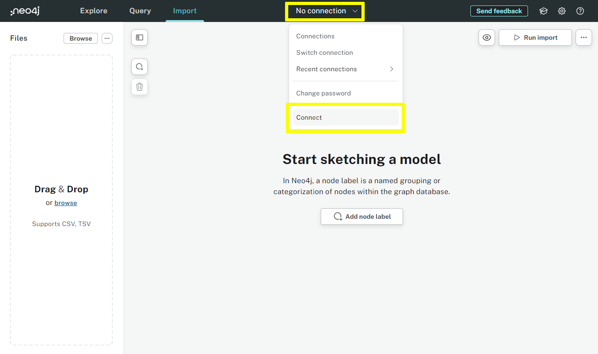
. Enter the following details to connect to your Neo4j sandbox.
+
Connection URL:: [copy]#{sandbox_host}:{sandbox_boltPort}#
Username:: [copy]#{sandbox_username}#
Password:: [copy]#{sandbox_password}#
+
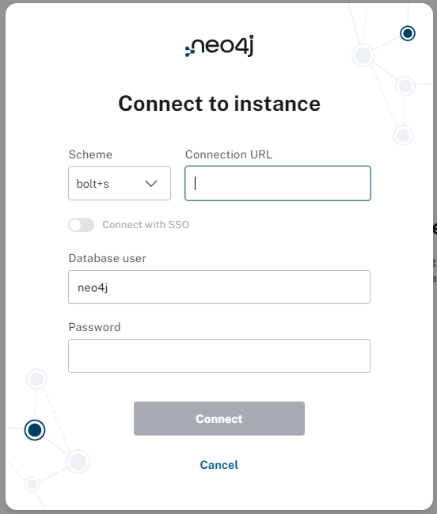
. Click *Connect*.

[%collapsible]
.Clear an existing model
====
If you have an existing data importer model, you can clear it by selecting the `Clear all` option from the menu `...`.

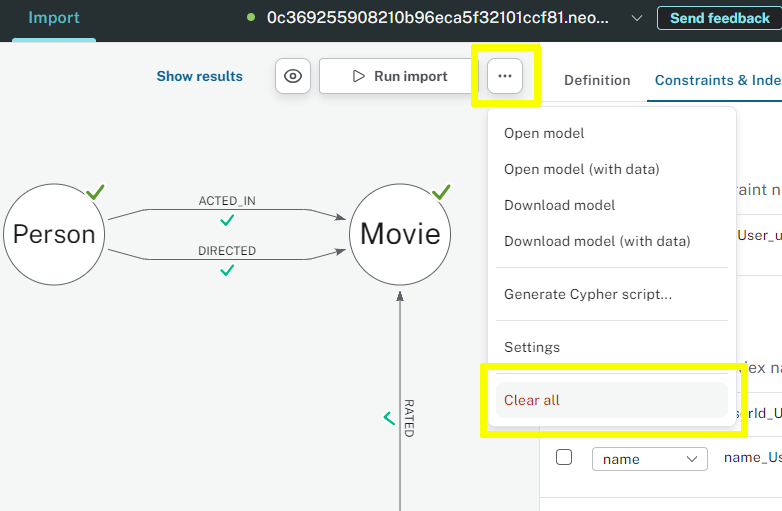
====

Any data import you run will be against the connected Neo4j database.

=== Upload a file

Data Importer can import data from CSV (Comma Separated Values) and TSV (Tab Separated Values) files.

You need to upload the file to Data Importer before importing from it.

All the link:https://data.neo4j.com/importing-fundamentals/importing-fundamentals.zip[CSV source files^] you need for this course are available to download.

The link:https://data.neo4j.com/importing-fundamentals/persons.csv[`persons.csv`^] file contains data about movies.
You will use Data Importer to import this data and create `Person` nodes.

. Download the link:https://data.neo4j.com/importing-fundamentals/persons.csv[`persons.csv`^] file.
. Upload the `persons.csv` file to Data Importer using the `Files` panel.
+ 
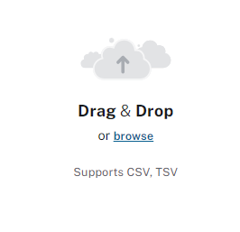
. Once uploaded, the file and its contents will be displayed.
+ 
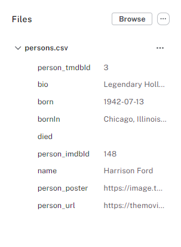

The `persons.csv` file contains fields such as `name`, `born`, `bio`, and `person_tmdbId`.

You will use the data in this file to create `Person` nodes and their properties.

=== Create a Person node

To create new nodes in Data Importer you must create a new node label, before mapping the fields from the CSV file to node properties.

. Add a new node label.
+ 
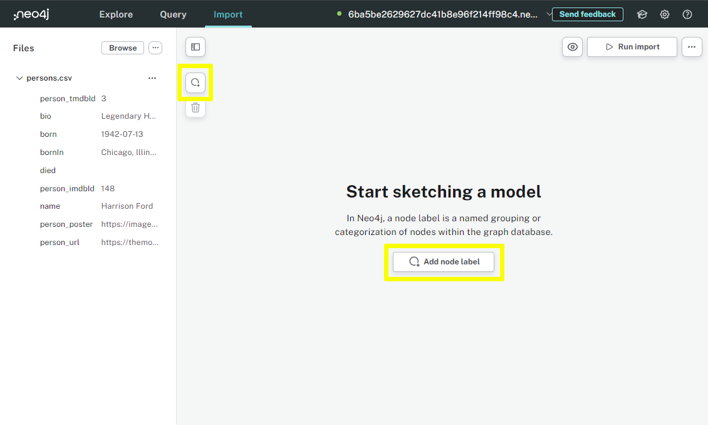
. Label the node as `Person` in the `Definition` panel.
. The `persons.csv` file should be automatically selected.
+ 
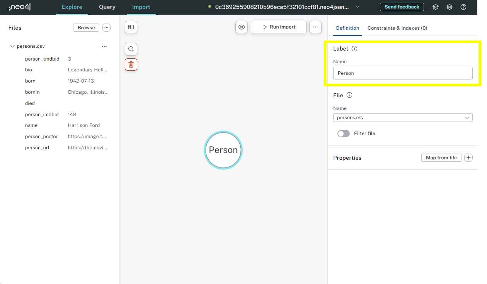
. To import data from the file, you must map the fields in the CSV file to properties on the `Person` node. Click the `Map from file` button.
+ 
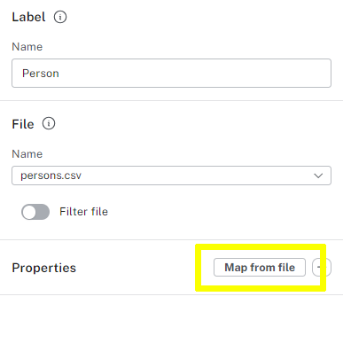
. You can then choose which fields from the CSV file to map to the node properties.
Click `Select all` to map all the fields and `Confirm`.
+ 
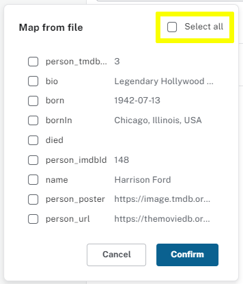
+
The fields from the CSV file will be added as properties to the `Person` node.
+
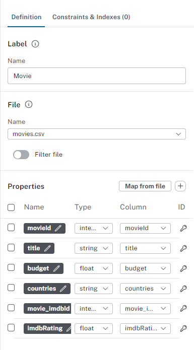

Data importer creates a `Name` for each property and assigns a `Type` based on the data in the file. The `Column` refers to the field in the CSV file.

=== Update Properties

You can modify the properties before running the import.

It is good practice to check the data types and, depending on the source data, update the names of the properties.

Some of the default property names should be updated to be more concise:

[caption=]
.Update property names
|===
| From | To

| `person_tmdbId` | `tmdbId`
| `person_imdbId` | `imdbId`
| `person_poster` | `poster`
| `person_url` | `url

|===

You can rename the properties by selecting the property name and typing the new name.

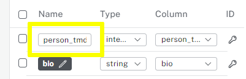

You must also assign a property as the node's unique identifier (ID).

You can use the `tmdbId` as the unique identifier for the `Person` nodes. 
To set the unique identifier, click the _key_ icon next to the `tmdbId` property.

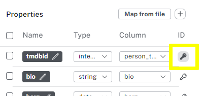

Once the properties are updated and a unique ID set, you can run the import and create the `Person` nodes from data in the `persons.csv` file.

=== Run the import

Click the `Run import` button to create the `Person` nodes.

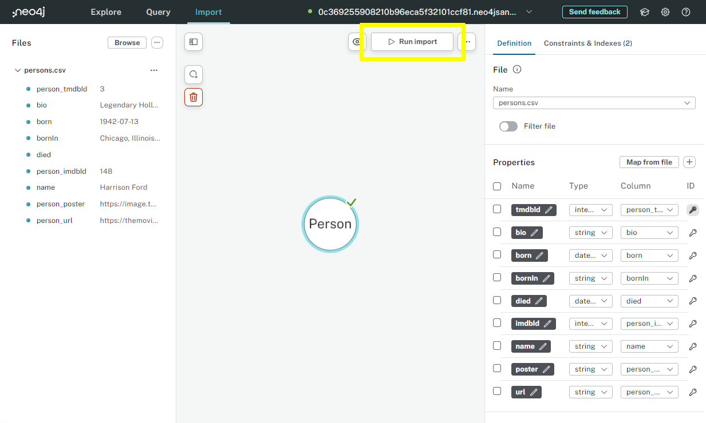

Using your configuration, Data importer will load the data from the CSV file and create the data in the Neo4j database.

Once complete, you will see an import summary, including counts of the nodes created and properties set. 

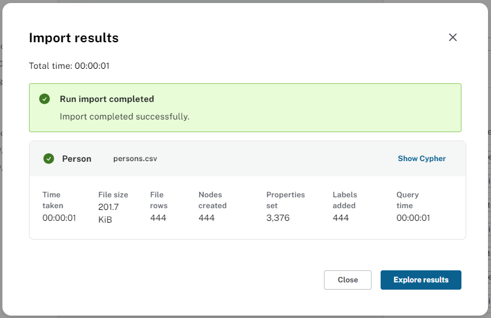

Click `Close` to return to Data Importer.

You can modify the import configuration and rerun the import multiple times.

[TIP]
.Backup your work
====
Data Importer saves changes automatically, but you can download your import model and data by selecting the `Download model (with data)` option from the menu `...`.

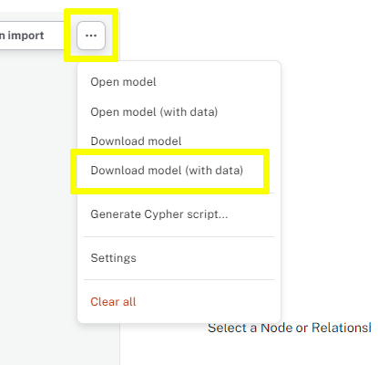

You can restore your model using the `Open model (with data)` option and selecting the downloaded file.
====

=== View the data

You can view the data in the Neo4j using this Cypher, which returns the first 25 `Person` nodes:

[source, cypher]
----
MATCH (p:Person) RETURN p LIMIT 25
----

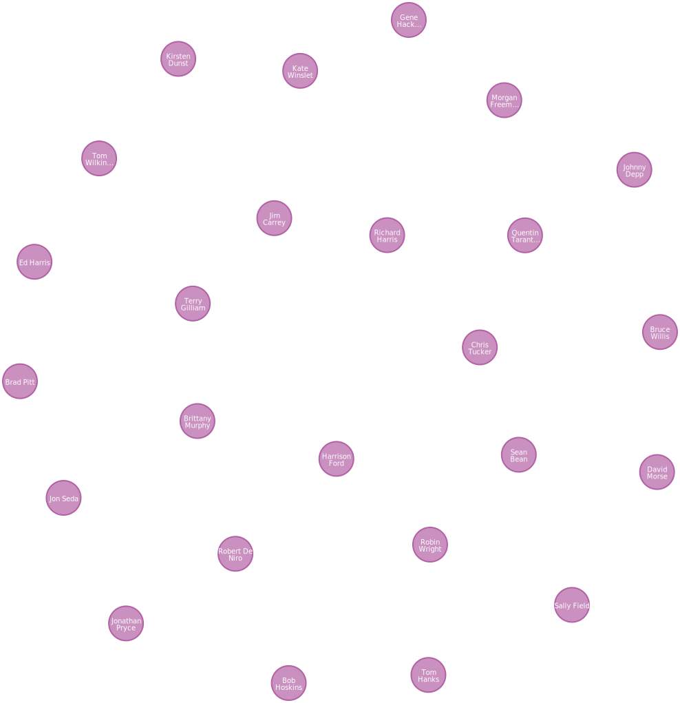

[%collapsible]
.Need to download a working solution?
====
include::{shared-dir}/solution.adoc[]
====

[.quiz]
== Check Your Understanding

include::questions/1-requirements.adoc[leveloffset=+1]

[.summary]
== Summary

In this lesson, you learned to import nodes from a CSV file using Data Importer.

In the next lesson, you will learn about the options for setting properties and data types.