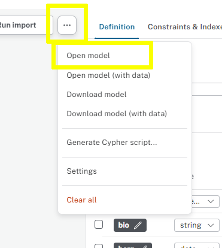

[.verify]
= Validate Results

Once you have successfully imported the `Person` nodes, click the **Check Database** button to verify that the task is complete.

verify::[]

[TIP,role=hint]
.Hint
====
After running the import, review the import summary to ensure that Data Importer successfully created the `Person` nodes.
====

[TIP,role=solution]
.Solution
====

. Download the link:../person-nodes-solutions.json[person-nodes-solutions.json] Data Importer model.

. Use `Open Model` from the Data Importer menu `...` to open the `person-nodes-solutions.json` model.
+

====
