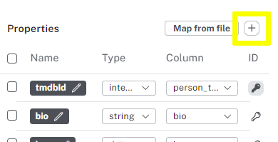

= Properties and Types
:order: 2
:type: lesson

In the last lesson, you created properties on `Person` nodes by automatically mapping them from the source CSV file.

Data Importer allows you to select specific properties to import and assign custom names and data types - this is useful when the source data is not in the format you want in the graph.

== Select properties to import

You can add custom properties using the `+` button in the `Properties` panel.

You must define:

* The name of the property 
* The data type of the property
* The column from the source file

You can import as few or as many properties as you need, providing you import at least one property you set as the unique identifier.

== Types

Data importer supports the import of data with the following data types:

|===
| Data type | Description

| `string` | Text data of variable length
| `integer` | Whole numbers
| `float` | Decimal numbers
| `boolean` | True or False values
| `datetime` | Date and time values

|===

[IMPORTANT]
.Type mismatch
====
Data Importer won't set a node property if it cannot convert the source data to the specified data type.

However, the import will continue and be successful, but that node won't have that specific property.
====

You can import multiple properties of different types from the same column in the source file.
For example, if your source data contained a field of `string` and `integer` values, you could import both as separate properties.

[.quiz]
== Check Your Understanding

include::questions/1-multiple-properties.adoc[leveloffset=+2]

[.summary]
== Summary

In this lesson, you learned about the options for importing properties and setting their data types.

In the next challenge, you will use what you have learned to import `Movie` nodes.