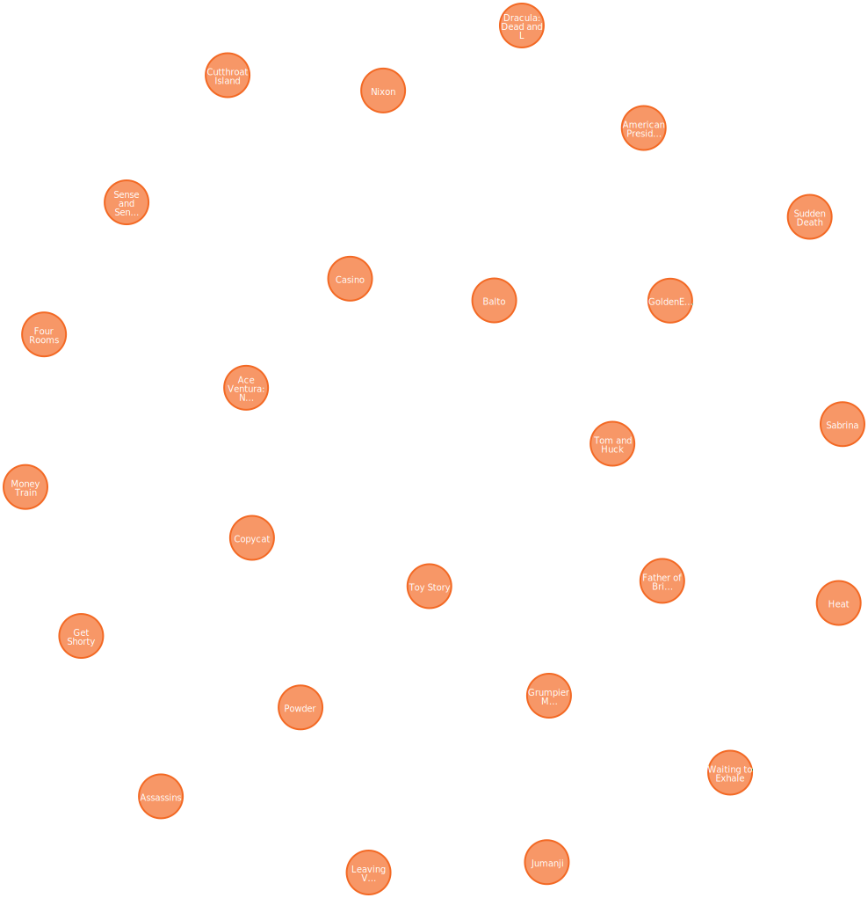

= Add Movie Nodes
:order: 3
:type: challenge
:shared-dir: ../../../../shared
:solution-filename: person-movie-import.zip

Your challenge is to import data about movies from a CSV file and create `Movie` nodes in the database.

To complete this challenge, you will need to:

. Download the link:https://data.neo4j.com/importing-fundamentals/movies.csv[`movies.csv`^] file and import it into Data Importer
. Update the model to add a new Node label `Movie`
. Map the columns from the CSV file to the properties of the `Movie` node
. Run the import to create `Movie` nodes in the database

You can use the `movieId` as the unique identifier for the `Movie` nodes. 

You should also update some of the default property names to be more concise:

[caption=]
.Update property names
|===
| From | To

| `movie_imdbId` | `imdbId`
| `movie_poster` | `poster`
| `movie_tmdbId` | `tmdbId`
| `movie_url` | `url

|===

You can verify that the `Movie` nodes have been created by running the following Cypher query to return the first 25 `Movie` nodes:

[source,cypher]
----
MATCH (m:Movie) RETURN m LIMIT 25
----

include::./questions/verify.adoc[leveloffset=+1]

[.summary]
== Summary

In this challenge, you create `Movie` nodes in the database by importing data from a CSV file.

In the next lesson, you will learn how to add relationships between nodes.