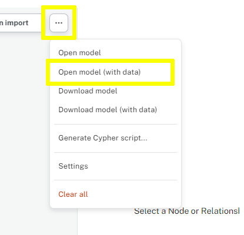

[.verify]
= Validate Results

Once you have imported the `Movie` nodes, click the **Check Database** button to verify that the task is complete.

verify::[]

[TIP,role=hint]
.Hint
====
Follow the same steps as the previous lesson to import the `Person` nodes from the `persons.csv` file.
====

[TIP,role=solution]
.Solution
====
This Data Importer model, link::./person-movie-solution.zip[person-movie-solution.zip^], contains a working solution for this exercise.

Download the link::./person-movie-solution.zip[model^] and open it using the `Open model (with data) button in the `...` menu.

Review the model; you will see that a `Movie` node has properties mapped from the `movies.csv` file.

Run the import to add the `Movie` nodes to the graph.
====
