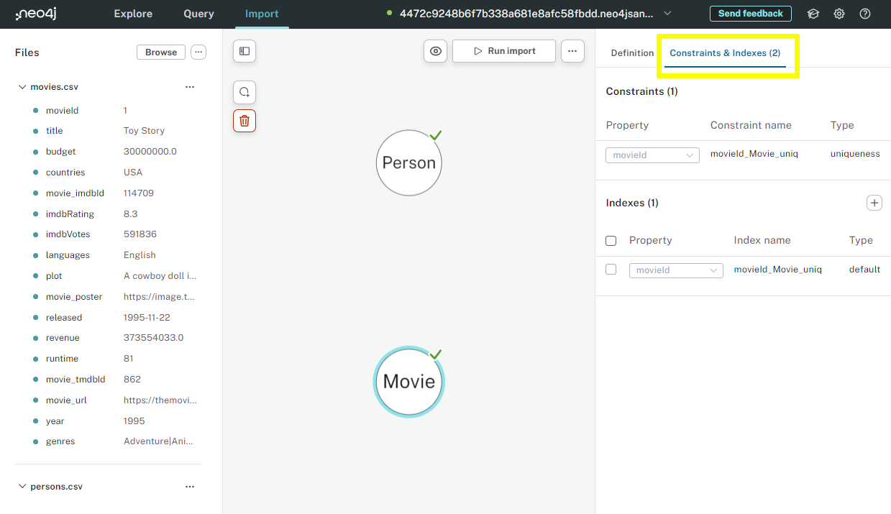
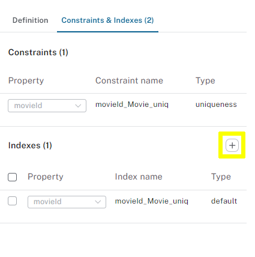
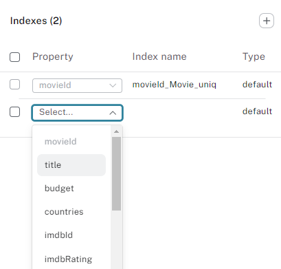

= Unique IDs and Constraints
:order: 4
:type: lesson

In the previous lessons, you set a unique ID when creating nodes.

In this lesson, you will explore the importance of unique IDs, constraints and indexes.

When you set a unique ID, Data Importer will automatically create a constraint and index for the property.

You can view the constraints and indexes by selecting a node and switching to the `Constraints & Indexes` tab.

== Constraints

The constraint ensures the property is unique for all nodes with that label.

Setting the unique ID for the `Movie` node to `movieId`, a link:https://neo4j.com/docs/cypher-manual/current/constraints/#unique-node-property[unique constraint^] named `movieId_Movie_uniq` is created against the `movieId` property.

Creating a new node with the same `movieId` will result in an error.

Setting the unique ID in Data Importer ensures that already existing nodes will be updated using link:https://neo4j.com/docs/cypher-manual/current/clauses/merge/[`MERGE`^] rather than creating new nodes using link:https://neo4j.com/docs/cypher-manual/5/clauses/create/[`CREATE`^].

== Indexes

When you query data, indexes improve performance by quickly finding the nodes with the specified property.

An index is created automatically for the unique ID property.
For example, the index `movieId_Movie_uniq` will be created for the `movieId` property on the `Movie` node.

You can use Data Importer to create additional indexes for other properties.

Adding an index to the `title` property on the `Movie` node will increase the speed of queries using movie title:

. Click the `+` button under the `Indexes` section to add a new index.
+

. Select the property `title`. 
+

+ 
An index named `title_Movie` will be created for you.
. Run the import to create the index.

[NOTE]
Data Importer will create a `default` index type. In Neo4j 5, the default is a link:https://neo4j.com/docs/cypher-manual/current/indexes/search-performance-indexes/managing-indexes/#create-range-index[RANGE index^].

You can view the indexes created in Neo4j by running the following Cypher:

[source, cypher]
SHOW INDEXES 

You should see an index named `title_Movie` for the `title` property on the `Movie` node.

[%collapsible]
.Optional indexes activity
====

Try creating a new index for the `name` property on the `Person` node.

You will need to:

1. Select the `Person` node.
2. Add a new index using `+` under the `Indexes` section.
3. Select the `name` property.
4. Run the import to create the index.

When running the `SHOW INDEXES` Cypher, you should see a new index named `name_Person`.
====

[.quiz]
== Check Your Understanding

include::questions/1-unique-id.adoc[leveloffset=+1]

[.summary]
== Summary

In this lesson, you learned about unique IDs, constraints, and indexes.

In the next lesson, you will learn how to create relationships.