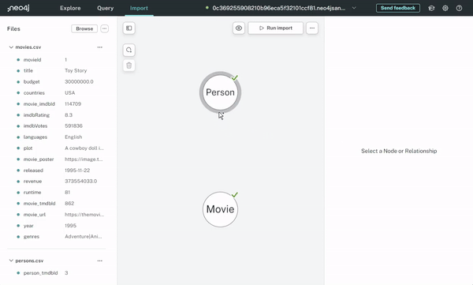
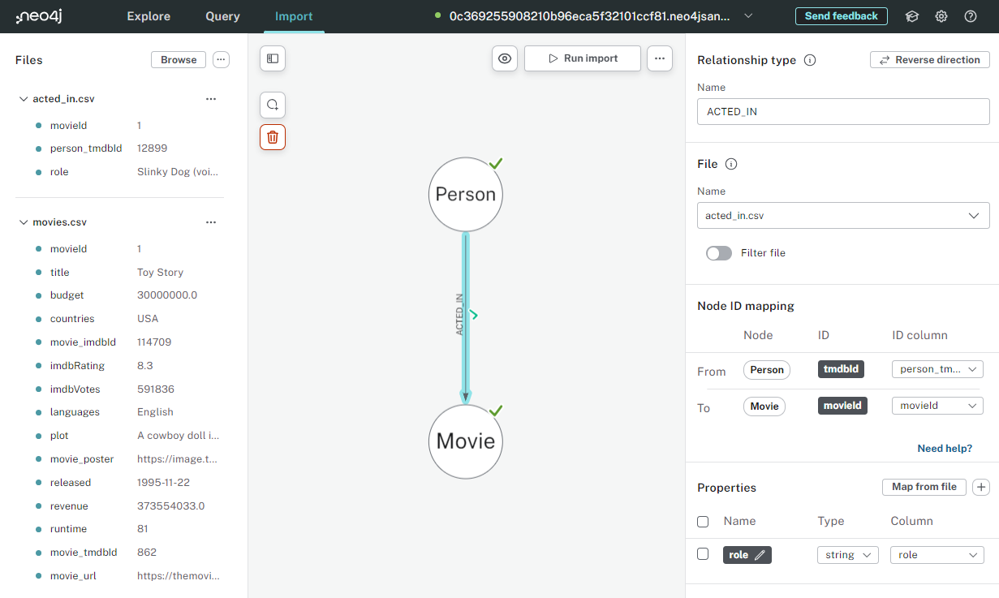
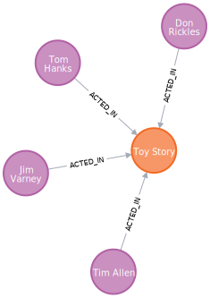

= Creating Relationships
:order: 5
:type: video
:shared-dir: ../../../../shared
:solution-filename: person-movie-acted_in-import.zip

In this lesson, you will learn how to create relationships between nodes.

[.video]

To complete this activity, you will need the link:https://data.neo4j.com/importing-fundamentals/acted_in.csv[`acted_in.csv`^] file that contains the data to match the `Person` nodes to the `Movie` nodes. 

video::i5bKAzp0IT4[youtube,width=560,height=315]

[.transcript]
== The ACTED_IN relationship

The `ACTED_IN` relationship connects a Person node to a Movie node. This relationship indicates that the person acted in the movie.

The relationship has a property called `role` that stores the name of the character a person played in the movie.

The process for creating relationships is similar to creating nodes:

. Upload the data
. Create the relationship in the model
. Map the fields
. Run the import

=== Upload the data

The link:https://data.neo4j.com/importing-fundamentals/acted_in.csv[`acted_in.csv`^] file contains the data to match the `Person` nodes to the `Movie` nodes. 
The file contains the following columns:

* `movieId` - The unique identifier of the movie
* `person_tmdbId` - the unique identifier of the person
* `role` - the role the person played

Download the link:https://data.neo4j.com/importing-fundamentals/acted_in.csv[`acted_in.csv`^] file and upload it to Data Importer.

=== Create the relationships

To create a relationship between nodes, hover over the edge of the start node, click, and drag the relationship to the end node.

You then give the relationship a type, choose which IDs to use to match the nodes in the relationship, and set up any properties.

To create the `ACTED_IN` relationship, you need to:

. Create a relationship between the `Person` and `Movie` nodes
. Set the relationship type to `ACTED_IN`
. Select the `acted_in.csv` file
. Set the Node ID mapping for the `Person` and `Movie` nodes:
+
|===
|  | Node | ID | ID column
| From | `Person` | `tmdbId` | `person_tmdbId`
| To | `Movie` | `movieId` | `movieId`
|===
. Map the `role` property from the file to the relationship

[TIP]
.Deleting relationships
====
You can remove an unwanted relationship by selecting the relationship and pressing the delete key.
====

Once you have set up the relationship, you can run the import.

== View the data

You can check that the `ACTED_IN` relationships have been created by running the following query to find the actors in the movie "Toy Story":

[source, cypher]
----
MATCH (p:Person)-[r:ACTED_IN]->(m:Movie)
WHERE m.title = 'Toy Story'
RETURN p,r,m
----

[%collapsible]
.Need to download a working solution?
====
include::{shared-dir}/solution.adoc[]
====

[.quiz]
== Check Your Understanding

include::questions/1-relationship-properties.adoc[leveloffset=+1]

[.summary]
== Summary

In this lesson, you learned how to create relationships between nodes.

In the next challenge, you will use what you have learned to import the `DIRECTED` relationship between `Person` and `Movie` nodes.