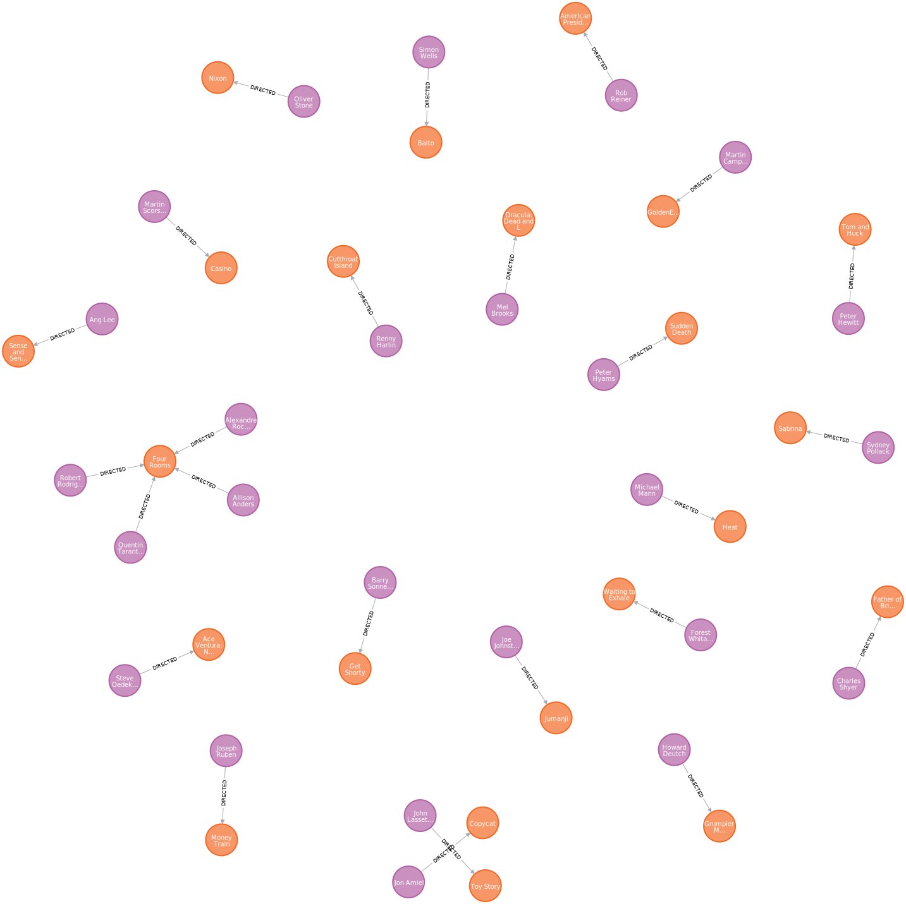

= Add Directed relationship
:order: 6
:type: challenge
:includes-dir: ../../../../includes
:solution-filename: person-movie-acted_in-directed-import.zip

Your challenge is to add the `DIRECTED` relationship between the `Person` and `Movie` nodes. 

The link:https://data.neo4j.com/importing-fundamentals/directed.csv[`directed.csv`^] file contains the data to match the `Person` nodes to the `Movie` nodes. 
The file contains the following columns:

* `movieId` - The unique identifier of the movie
* `person_tmdbId` - the unique identifier of the person who directed the movie

You will need to:

. Upload the link:https://data.neo4j.com/importing-fundamentals/directed.csv[`directed.csv`^] file
. Create the `DIRECTED` relationship between the `Person` and `Movie` nodes
. Set the Node ID mapping 
. Run the import

Once you have imported the data, you can run the following query to view the `DIRECTED` relationships:

[source,cypher]
----
MATCH (p:Person)-[d:DIRECTED]->(m:Movie)
RETURN p,d,m
LIMIT 25
----

include::questions/verify.adoc[leveloffset=+1]

[.summary]
== Summary

In this challenge, you used data importer to create a relationship between nodes.

In the next lesson, you will learn how to import data and nodes from a single CSV file.