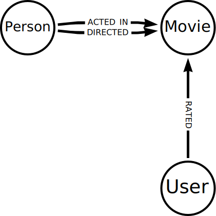

= Neo4j Data Importer
:order: 2

In this module, you will learn how to import data into Neo4j using the Neo4j Data Importer.

You will import data about movies and people from CSV files into a graph of `Movie`, `Person`, and `User` nodes.
Relationships between the nodes will allow you to understand which people directed or acted in movies and how users rated movies.

You will create the following data model:

If you are ready, let's get going!

link:./1-importing-nodes/[Ready? Let's go →, role=btn]
