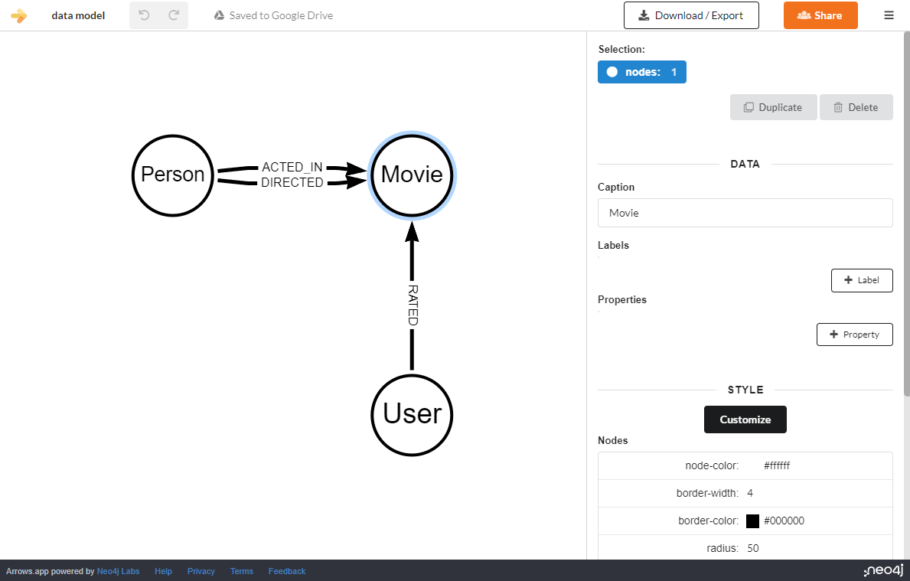
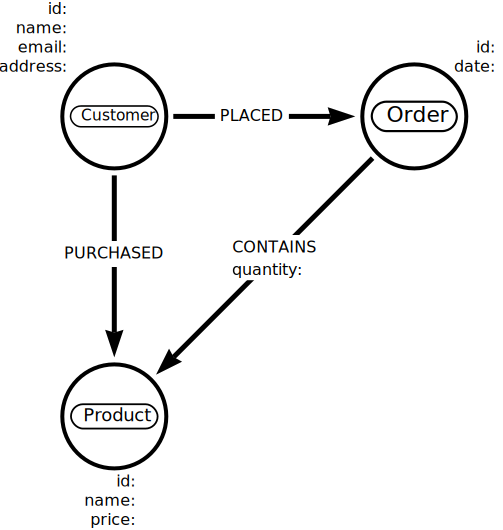

= Developing a data model
:order: 2
:type: lesson

In the last lesson, you learned the importance of understanding the source data before importing it into Neo4j. 

In this lesson, you will learn how the data model influences and directs the import process.

Before you create data within Neo4j, there is no data model. 
Neo4j is _schema-optional_ and allows you to create data without a predefined schema.
You create the data model as you import data into Neo4j.

As a result, your import process will also define the data model.
As you import data, you create nodes and relationships, dynamically forming the data model.

[IMPORTANT]
====
You should not let the source data structure dictate the graph data model.
Instead, build a data model that works for your project's objectives.

Create an import process that transforms the source data into a graph data model; don't create a model that fits the source data.
====

== Modelling

You can use link:https://arrows.app/[Arrows^] to develop a conceptual model of the data model you want to create.

Arrows allows you to create a visual representation of the data model. Arrows supports:

* Creation of nodes, relationships, properties, and labels. 
* Styling including colors, sizes, and layouts.
* Export as an image or Cypher.

[%collapsible]
.Optional arrows activity
====
Use link:https://arrows.app/[Arrows^] to create a simple data model.

The data model should include the following nodes, properties, and relationships:

* Node labels - `Customer`, `Product`, `Order`
* Relationships
** `Customer` - `PURCHASED` -> `Product`
** `Customer` - `PLACED` -> `Order`
** `Order` - `CONTAINS` -> `Product`
* Properties
** `Customer` - `id`, `name`, `email`, `address`
** `Product` - `id`, `name`, `price`
** `Order` - `id`, `date`
** `CONTAINS` - `quantity`

====

The data model in Neo4j is flexible and can evolve as you import data. 
Neo4j supports a schema-less approach, allowing you to create data without a predefined schema.

== Data types

As part of your data modeling and import process, you should consider data types and how you will represent them in Neo4j.

Neo4j supports a range of data types, including `BOOLEAN`, `DATE`, `DURATION`, `FLOAT`, `INTEGER`, `LIST`, `LOCAL DATETIME`, `LOCAL TIME`, `POINT`, `STRING`, `ZONED DATETIME`, and `ZONED TIME`.

You can learn more about Neo4j data types in the link:https://neo4j.com/docs/cypher-manual/current/values-and-types/[Neo4j documentation^].

[.quiz]
== Check Your Understanding

include::questions/1-data-model.adoc[leveloffset=+1]

[.summary]
== Summary

In this lesson, you explored how the data model influences how you import data into Neo4j.

In the next optional challenge, you will import your own data into Neo4j.