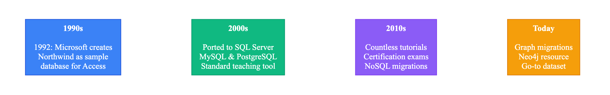
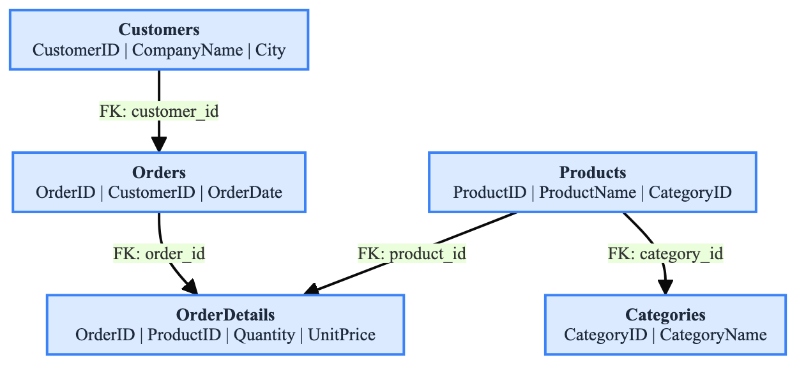
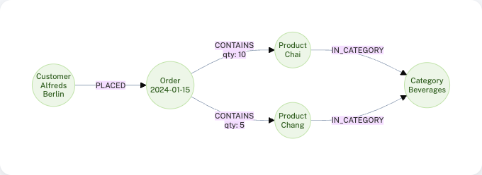

= Comparing relational and graph data
:order: 1
:type: lesson

Welcome to "Importing Relational Data to Neo4j"!

In this course, you will learn how to migrate data from relational databases into Neo4j. You will explore the differences between relational and graph data models, and learn practical techniques for transforming and importing relational data into Neo4j.

== What you will learn

In this course, you will:

. Understand the differences between relational and graph data models
. Learn how to analyze relational database schemas and identify entities, relationships, and properties
. Discover techniques for mapping relational tables to graph nodes and relationships
. Use tools and methods to extract data from relational databases
. Import relational data into Neo4j using various approaches
. Validate and query your imported graph data

== Course dataset: Northwind

Throughout this course, you will work with the **Northwind** database, a classic relational database sample that represents a company selling food products.

=== A brief history of Northwind

The Northwind database was originally created by Microsoft in the 1990s as a sample database for Microsoft Access. It was designed to demonstrate relational database concepts and has since become one of the most widely used educational datasets in the database community.

The database models a fictional company called "Northwind Traders" that imports and exports specialty foods. It includes realistic business data: customers placing orders, employees processing those orders, products organized into categories, and suppliers providing inventory.

Over the decades, Northwind has been ported to virtually every relational database system - SQL Server, MySQL, PostgreSQL, Oracle, and others. It appears in countless database textbooks, tutorials, and certification exams.

=== What the Northwind database contains

The Northwind database includes data about:

* **Customers** - Companies that purchase products
* **Orders** - Purchase transactions with dates and shipping information
* **Products** - Items available for sale with pricing
* **Categories** - Product groupings (Beverages, Condiments, Seafood, etc.)
* **Suppliers** - Companies that provide products
* **Employees** - Staff members who process orders
* **Shippers** - Delivery companies

You can download the SQL script for the Northwind dataset from: link:https://github.com/pthom/northwind_psql[Northwind SQL script^]

If you are ready to import the data into Neo4j, this repository contains the CSV files: link:https://github.com/neo4j-graph-examples/northwind/tree/main/imported[Northwind CSV files^]

In this course, you will:

* Analyze the Northwind relational schema
* Design an equivalent graph data model
* Extract data from the Northwind database
* Transform and import the data into Neo4j
* Query the graph to answer business questions

== Understanding relational vs graph data models

Before importing relational data into Neo4j, it helps to understand how these two data models differ. This understanding will guide your migration strategy and help you design a graph data model that actually makes sense for your use case.

== Relational data model

Relational databases organize data into **tables** (also called relations), where each table contains **rows** (records) and **columns** (attributes). Relationships between tables are established through **foreign keys**, which reference primary keys in other tables.

Characteristics of relational databases:

* **Tabular structure** - Data is organized in rows and columns
* **Normalization** - Data is split across multiple tables to reduce redundancy
* **Foreign key relationships** - Tables are connected through key references
* **Schema rigidity** - Tables must be defined before data can be inserted
* **JOIN operations** - Relationships are discovered through SQL JOIN queries

=== Example relational schema

In this course, you will work with the **Northwind** database, a classic sample relational database that represents a company selling food products. The Northwind database includes tables such as:

* `Customers` table: `CustomerID`, `CompanyName`, `ContactName`, `City`, `Country`
* `Orders` table: `OrderID`, `CustomerID`, `EmployeeID`, `OrderDate`, `ShipCity`
* `OrderDetails` table: `OrderID`, `ProductID`, `Quantity`, `UnitPrice`, `Discount`
* `Products` table: `ProductID`, `ProductName`, `CategoryID`, `SupplierID`, `UnitPrice`
* `Categories` table: `CategoryID`, `CategoryName`, `Description`
* `Suppliers` table: `SupplierID`, `CompanyName`, `ContactName`, `City`, `Country`
* `Employees` table: `EmployeeID`, `FirstName`, `LastName`, `Title`, `ReportsTo`

The relationships are implicit through foreign keys:
* `Orders.CustomerID` references `Customers.CustomerID`
* `Orders.EmployeeID` references `Employees.EmployeeID`
* `OrderDetails.OrderID` references `Orders.OrderID`
* `OrderDetails.ProductID` references `Products.ProductID`
* `Products.CategoryID` references `Categories.CategoryID`
* `Products.SupplierID` references `Suppliers.SupplierID`

== Graph data model

Graph databases organize data as **nodes** (entities) and **relationships** (connections between entities). Both nodes and relationships can have **properties** (key-value pairs) that store data.

Characteristics of graph databases:

* **Explicit relationships** - Relationships are first-class citizens, stored directly in the database
* **Flexible schema** - Schema is optional and can evolve as you add data
* **Traversal-based queries** - Relationships are navigated directly, not computed through JOINs
* **Natural representation** - Data structures mirror real-world relationships
* **Performance** - Relationship traversal is constant time O(1), regardless of graph size.

=== Example graph model

The equivalent Northwind data in a graph would have:

* `Customer` nodes with properties: `companyName`, `contactName`, `city`, `country`
* `Order` nodes with properties: `orderDate`, `shipCity`
* `Product` nodes with properties: `productName`, `unitPrice`
* `Category` nodes with properties: `categoryName`, `description`
* `Supplier` nodes with properties: `companyName`, `contactName`, `city`, `country`
* `Employee` nodes with properties: `firstName`, `lastName`, `title`
* `PLACED` relationships from `Customer` to `Order`
* `CONTAINS` relationships from `Order` to `Product` with properties: `quantity`, `unitPrice`, `discount`
* `BELONGS_TO` relationships from `Product` to `Category`
* `SUPPLIES` relationships from `Supplier` to `Product`
* `SOLD` relationships from `Employee` to `Order`
* `REPORTS_TO` relationships from `Employee` to `Employee` (for the management hierarchy)

== Main differences

=== Structural differences

**Relational Model:**

[cols="1,1"]
|===
| Data is stored in separate tables
| Relationships are implicit (foreign keys)
| Requires JOIN operations to traverse relationships
| Schema must be defined upfront
| Normalized structure reduces redundancy but increases query complexity
|===

**Graph Model:**

[cols="1,1"]
|===
| Data is stored as connected nodes
| Relationships are explicit and stored directly
| Relationships are traversed directly (no JOINs needed)
| Schema is optional and flexible
| Natural representation of connected data
|===

=== Query differences

**Relational queries** require JOIN operations to connect related data:

[source,sql]
----
SELECT c.CompanyName, o.OrderDate, p.ProductName, od.Quantity, od.UnitPrice
FROM Customers c
JOIN Orders o ON c.CustomerID = o.CustomerID
JOIN OrderDetails od ON o.OrderID = od.OrderID
JOIN Products p ON od.ProductID = p.ProductID
WHERE c.CustomerID = 'ALFKI';
----

**Graph queries** traverse relationships directly:

[source,cypher]
----
MATCH (c:Customer)-[:PLACED]->(o:Order)-[r:CONTAINS]->(p:Product)
WHERE c.customerID = 'ALFKI'
RETURN c.companyName, o.orderDate, p.productName, r.quantity, r.unitPrice
----

=== Performance implications

* **Relational databases**: JOIN performance degrades as the number of tables and data volume increases. Complex queries with multiple JOINs can become slow.
* **Graph databases**: Relationship traversal is constant time O(1). This means following a relationship takes the same amount of time whether you have 1,000 nodes or 1 billion nodes - a property that has significant implications for query performance at scale.

== When to use each model

=== Use relational databases when:

* Data is primarily structured and tabular
* Relationships are simple and well-defined
* You need ACID transactions across multiple tables
* Your queries primarily aggregate data
* Your data model is stable and unlikely to change

=== Use graph databases when:

* Relationships between entities are complex and important
* You need to traverse relationships frequently
* Your data model represents a network or connected structure
* You need to find patterns in relationships
* Your schema needs to evolve over time
* You're working with recommendation systems, fraud detection, or social networks

== Migration considerations

When migrating from relational to graph databases, consider:

* **Not all relational data needs to be a graph** - Some data may be better suited to remain in relational format
* **Transform, do not translate** - Do not simply recreate tables as nodes; design a graph model that serves your use case
* **Relationships are explicit** - Foreign keys become first-class relationships with properties
* **Denormalization is acceptable** - Unlike relational databases, some data duplication in graphs can improve query performance
* **Schema flexibility** - You can evolve your graph model as requirements change

=== How relational concepts map to graph concepts

The following table shows how the concepts map:

[cols="1,1"]
|===
| Relational | Graph

| Entity table (e.g., `customers`)
| Node label (e.g., `Customer`)

| Row/record
| Individual node instance

| Column/attribute
| Property on a node

| Foreign key column
| Relationship to another node

| Junction table
| Relationship (often with properties)

|===

[TIP]
.Bookmark this reference
====
Bookmark this mapping table. It serves as a quick reference when analyzing any relational schema for graph migration. These are the two most common sources of confusion when designing graph models from relational schemas.
====

== Common Misconceptions

When learning about relational-to-graph migration, several misconceptions can lead to poor data models:

[IMPORTANT]
.Misconception 1: "Every table becomes a node"
====
**Wrong:** Automatically converting every SQL table to a graph node.

**Reality:** 
*Entity tables (customers, products, orders) → Nodes
*Junction tables (order_details) → Relationships with properties
*Lookup tables (status codes) → Often become properties, not nodes
*Audit tables → May not belong in the graph at all
====

[IMPORTANT]
.Misconception 2: "Rows become nodes, columns become relationships"
====
**Wrong:** Thinking columns map to relationships.

**Reality:**
*Rows → Individual node instances
*Columns → Properties on nodes
*Foreign key columns → Relationships to other nodes
*Junction tables → Relationships with properties
*Lookup tables → Often become properties, not nodes
*Audit tables → May not belong in the graph at all
====

[IMPORTANT]
.Misconception 3: "The graph should mirror the relational schema"
====
**Wrong:** Creating a 1:1 copy of the relational structure.

**Reality:** The graph model should be designed for your query patterns and use cases, not to replicate the source schema. A good graph model often looks quite different from the source relational model.
====

[IMPORTANT]
.Misconception 4: "All data must be migrated"
====
**Wrong:** Assuming every piece of relational data needs to be in the graph.

**Reality:** Only migrate data that benefits from graph representation. Some data (logs, archives, simple lookups) may be better left in relational storage or omitted entirely.
====

[IMPORTANT]
.Design for your use case, not for schema replication
====
The goal of migration is not to replicate your relational schema in a graph database, but to design a graph model that better represents your data and serves your project's objectives.
====

[.quiz]
== Check your understanding

include::questions/1-differences.adoc[leveloffset=+1]

[.summary]
== Summary

In this lesson, you learned:

* The fundamental differences between relational and graph data models
* How relational databases use tables, rows, and foreign keys to represent data and relationships
* How graph databases use nodes, relationships, and properties to explicitly represent connected data
* That graph databases excel at traversing relationships, while relational databases require JOIN operations
* The choice between models depends on your use case and data structure

In the next lesson, you will learn about the prerequisites and tools needed for importing relational data into Neo4j.
