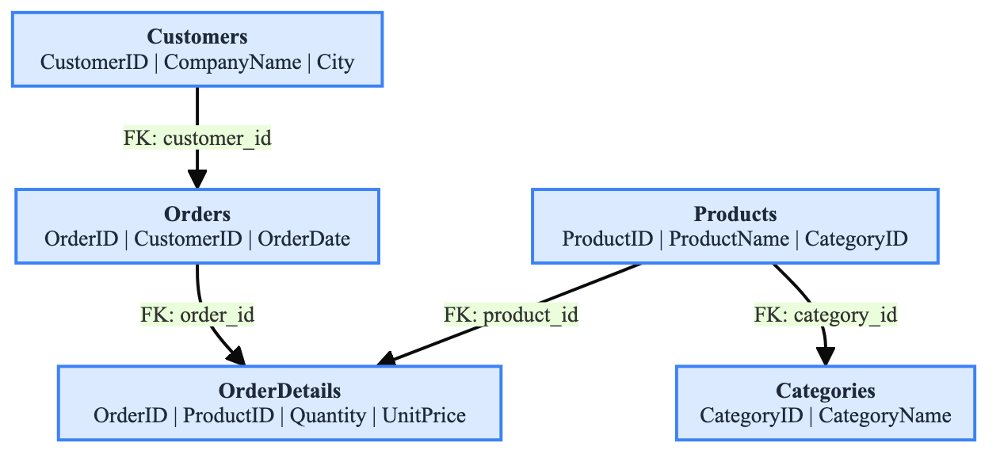
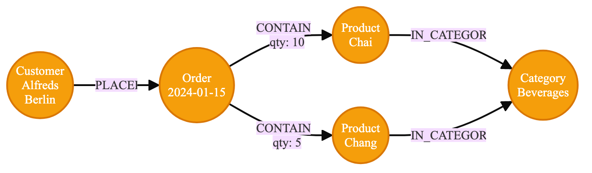

= Comparing relational and graph data
:order: 1
:type: lesson

In this lesson, you will explore the differences between relational and graph data models and how they affect migration.

[.slide]
== What you will learn

In this lesson, you will:

* Understand the differences between relational and graph data models
* Learn about the Northwind dataset used in this course
* See example questions that are difficult in SQL but straightforward in a graph

[.slide]
== Business problems graphs solve

These business questions are easier to answer with graphs:

* **Management hierarchy**: Who reports to whom? SQL needs recursive queries; Cypher follows the path directly.
* **Supply chain**: Trace customer → orders → products → supplier. SQL needs many JOINs; Cypher traverses in one pattern.
* **Frequently bought together**: Which products share an order? SQL needs self-joins; Cypher matches by pattern.
* **Category overlap**: Which customers bought from two or more categories? SQL needs complex aggregates; Cypher traverses and checks.
* **Recommendations**: What might a customer like based on similar customers? SQL needs nested queries; Cypher follows paths.
* **Supplier diversity**: Which customers use the most suppliers? SQL needs subqueries; Cypher counts along the path.

If your queries follow paths between entities, a graph database may fit better.

[.slide]
== Understanding relational and graph data models

Use this comparison to choose the right model and plan your migration.

[.slide]
== Relational data model

Relational databases store data in **tables**: **rows** (records), **columns** (attributes), and **foreign keys** linking tables. You connect data at query time with JOINs. Schema is fixed upfront; normalization spreads data across tables. Relationship-heavy queries can get expensive.

[.slide.discrete]
=== Example relational schema: Northwind

In this course, you will work with the **Northwind** database, a classic sample that represents a company selling food products. It includes tables such as:

* `Customers`: `CustomerID`, `CompanyName`, `ContactName`, `City`, `Country`
* `Orders`: `OrderID`, `CustomerID`, `EmployeeID`, `OrderDate`, `ShipCity`
* `OrderDetails`: `OrderID`, `ProductID`, `Quantity`, `UnitPrice`, `Discount`
* `Products`: `ProductID`, `ProductName`, `CategoryID`, `SupplierID`, `UnitPrice`
* `Categories`: `CategoryID`, `CategoryName`, `Description`
* `Suppliers`: `SupplierID`, `CompanyName`, `ContactName`, `City`, `Country`
* `Employees`: `EmployeeID`, `FirstName`, `LastName`, `Title`, `ReportsTo`

[.slide.discrete]
=== Implicit relationships in Northwind

In a relational schema, relationships come from two places:

* **Foreign keys** — A column in one table references the primary key of another (e.g. `Orders.CustomerID` → `Customers.CustomerID`, `Products.CategoryID` → `Categories.CategoryID`).
* **Join tables** — A table whose main role is to link two others (e.g. `OrderDetails` links `Orders` and `Products` via `OrderID` and `ProductID`).

In Northwind, the relationship structure is:

* `Orders.CustomerID` references `Customers.CustomerID`
* `Orders.EmployeeID` references `Employees.EmployeeID`
* `OrderDetails.OrderID` references `Orders.OrderID` and `OrderDetails.ProductID` references `Products.ProductID` (join table)
* `Products.CategoryID` references `Categories.CategoryID`
* `Products.SupplierID` references `Suppliers.SupplierID`

image::images/ER.png[Northwind Entity-Relationship Diagram: tables and their relationships—foreign keys and join tables such as OrderDetails link the entities.,width=800,align=center]

[.slide.discrete]
=== Northwind schema links

The Northwind schema originates from Microsoft. For the canonical relational schema and official diagram, see link:https://github.com/microsoft/sql-server-samples/tree/master/samples/databases/northwind-pubs[Microsoft sql-server-samples northwind-pubs^] and link:https://support.microsoft.com/en-us/office/northwind-database-diagram-cd422d47-e4e3-4819-8100-cdae6aaa0857[Microsoft Northwind database diagram^].

[.slide]
== Course dataset: Northwind

Throughout this course, you will work with the **Northwind** database, a classic relational database sample that represents a company selling food products.

[.slide.discrete]
=== What the Northwind database contains

The Northwind database includes data about:

* **Customers** - Companies that purchase products
* **Orders** - Purchase transactions with dates and shipping information
* **Products** - Items available for sale with pricing
* **Categories**: Product groupings such as Beverages, Condiments, Seafood
* **Suppliers** - Companies that provide products
* **Employees** - Staff members who process orders
* **Shippers** - Delivery companies

[.slide.discrete]
=== Northwind data sources

You can download the SQL script for the Northwind dataset from: link:https://github.com/pthom/northwind_psql[Northwind SQL script^]

If you are ready to import the data into Neo4j, this repository contains the CSV files: link:https://github.com/neo4j-graph-examples/northwind/tree/main/imported[Northwind CSV files^]

[.slide]
== Graph data model

Graph databases use **nodes** (entities), **relationships** (links between them), and **properties** (key-value pairs). Relationships are stored directly—you follow them instead of JOINing. Schema is flexible; traversal cost stays roughly constant as the graph grows.

[.slide.discrete]
=== Example graph model: nodes

The equivalent Northwind data in a graph would have these **nodes**:

* `Customer` — properties: `companyName`, `contactName`, `city`, `country`
* `Order` — properties: `orderDate`, `shipCity`
* `Product` — properties: `productName`, `unitPrice`
* `Category` — properties: `categoryName`, `description`
* `Supplier` — properties: `companyName`, `contactName`, `city`, `country`
* `Employee` — properties: `firstName`, `lastName`, `title`
* `Shipper` — properties for the delivery companies

[.slide.discrete]
=== Example graph model: relationships

And these **relationships**:

* `PLACED` from `Customer` to `Order`
* `CONTAINS` from `Order` to `Product` (with properties: `quantity`, `unitPrice`, `discount`)
* `BELONGS_TO` from `Product` to `Category`
* `SUPPLIES` from `Supplier` to `Product`
* `SOLD` from `Employee` to `Order`
* `REPORTS_TO` from `Employee` to `Employee` (management hierarchy)
* `SHIPPED_BY` from `Order` to `Shipper`

[.slide]
== Main differences

Summary of how the two models differ:

[cols="1,1"]
|===
| Relational model
| Graph model

| Data is stored in separate tables
| Data is stored as connected nodes

| Relationships are implicit as foreign keys
| Relationships are explicit and stored directly

| Requires JOIN operations to traverse
| Relationships are traversed directly, no JOINs

| Schema must be defined upfront
| Schema is optional and flexible

| Normalization spreads data out, which can complicate queries
| Structure matches how you think about connections
|===

[.slide.col-2]
== Query comparison: same result, different approach

Compare these queries side by side. Both should return a customer's orders and products.

.SQL: JOIN tables at query time
[source,sql]
----
SELECT c.CompanyName, o.OrderDate,
       p.ProductName, od.Quantity,
       od.UnitPrice
FROM Customers c
JOIN Orders o ON c.CustomerID = o.CustomerID
JOIN OrderDetails od ON o.OrderID = od.OrderID
JOIN Products p ON od.ProductID = p.ProductID
WHERE c.CustomerID = 'ALFKI';
----

.Cypher: Traverse relationships directly
[source,cypher]
----
MATCH (c:Customer)-[:PLACED]->
      (o:Order)-[r:CONTAINS]->
      (p:Product)
WHERE c.customerID = 'ALFKI'
RETURN c.companyName, o.orderDate,
       p.productName, r.quantity,
       r.unitPrice
----

SQL joins by keys; Cypher follows the path. More hops = heavier SQL; Cypher stays consistent.

[.slide.discrete]
=== Performance

JOIN cost grows with tables and data size. Graph traversal stays roughly constant per hop—path length matters, not graph size.

[.slide]
== When to use each model

With unstructured data in the mix, a key differentiator is **schema**: relational is static and defined upfront; graph is flexible and can evolve. Use this comparison to choose:

[cols="1,1"]
|===
| Relational
| Graph

| **Schema:** Fixed upfront; columns and tables defined before data
| **Schema:** Optional and dynamic; add labels and properties as you go

| Data is tabular; relationships are simple
| Relationships matter and are complex

| Queries are mostly aggregations
| You traverse paths often; you look for patterns (recommendations, fraud, networks)

| Best when structure is stable
| Best when structure may evolve or vary by entity
|===

[.slide]
== Migration considerations

* **Not everything belongs in a graph** — A **hybrid storage pattern** is common: keep tabular or low-connection data in relational storage and move only the access patterns that benefit from graph (traversals, pattern matching) into the graph. This incremental approach reduces risk and lets you validate value before migrating more.
* **Transform, don't copy** — Design a graph model for your use case; don't mirror tables 1:1.
* **Foreign keys → relationships** — They become first-class links with optional properties.
* **Some duplication is OK** — Graphs can duplicate data to speed up queries.
* **Schema can change** — Evolve your model as needs change.

[.slide]
== Common Misconceptions

Avoid these common misconceptions. Each of these is a big consideration and is covered in depth in later lessons (Module 2: Identifying Nodes, Mapping Relationships, and related topics).

[.slide.discrete]
=== Misconception 1: "Every table becomes a node"

[IMPORTANT]
.Not every table becomes a node
====
**Wrong:** Automatically converting every SQL table to a graph node.

**Reality:**
* Entity tables (customers, products, orders) → Nodes
* Junction tables (order_details) → Relationships with properties
* Lookup tables (status codes) → Often become properties, not nodes
* Audit tables → May not belong in the graph at all (see below)
====

Northwind's `order_details` links orders to products with quantity and price. It becomes a `CONTAINS` relationship between Order and Product, not an OrderDetail node.

[.slide.discrete]
=== Why audit tables may stay out of the graph

Audit tables (who changed what, when) are a trade-off. Keeping them in the relational store can make sense for:

* **Polyglot persistence** — Use the right store per access pattern: relational for append-only audit trails and compliance queries; graph for connectivity and pattern analysis.
* **Migration scope** — Leaving audit data in place avoids moving high-volume, low-graph-value data and keeps the graph focused on core entities and relationships.
* **Operational complexity** — Running both relational and graph adds operational cost; the benefit of putting audit data in the graph should be clear (e.g. you need to analyze it as a graph). If you only need sequential or aggregate audit queries, keeping audit in relational (or a dedicated log store) is often simpler.

[.slide.discrete]
=== Misconception 2: "Rows become nodes, columns become relationships"

[IMPORTANT]
.Rows, columns, and foreign keys map to graph elements
====
**Wrong:** Thinking columns map to relationships.

**Reality:**
* Rows → Individual node instances
* Columns → Properties on nodes
* Foreign key columns → Relationships to other nodes
* Junction tables → Relationships with properties
====

Example: `customer_id` in `orders` becomes a `PLACED` relationship to Customer, not an Order property. `company_name` becomes a `companyName` property on Customer.

[.slide.discrete]
=== Misconception 3: "The graph should mirror the relational schema"

[IMPORTANT]
.Design for query patterns, not schema replication
====
**Wrong:** Copying the relational schema 1:1.

**Reality:** Design the graph for your queries. A good graph model often looks different from the source schema.
====

Example: For "products bought by customers in the same region," add a `SAME_REGION` relationship between Customer nodes. It doesn't exist in the relational schema but makes the query simpler.

[.slide.discrete]
=== Misconception 4: "All data must be migrated"

[IMPORTANT]
.Migrate only what benefits from graph representation
====
**Wrong:** Import everything into the graph.

**Reality:** Migrate only what benefits from being a graph. Logs, archives, and simple lookups often stay in relational storage or get omitted.
====

Example: A `us_states` lookup table rarely benefits from being in the graph. Keep it in the relational database or omit it. Audit tables may stay in relational storage unless you need to analyze them as a graph (see "Why audit tables may stay out of the graph" above).

[IMPORTANT]
.Design for your use case, not for schema replication
====
Design a graph model that serves your project—don't replicate the relational schema.
====

[.slide]
[.quiz]
== Check Your Understanding

include::questions/1-differences.adoc[leveloffset=+1]

[.slide]
[.summary]
== Summary

* Relational: tables, rows, columns, foreign keys; connect with JOINs.
* Graph: nodes, relationships, properties; follow links directly.
* Choose graph when your queries follow paths between entities.
* Migrate only what benefits; design for your use case, not schema replication.

In the next lesson, you will learn how to:

* Identify the tools and setup needed for the course
* Use the Neo4j Data Importer and Northwind CSV files

read::Continue[]
