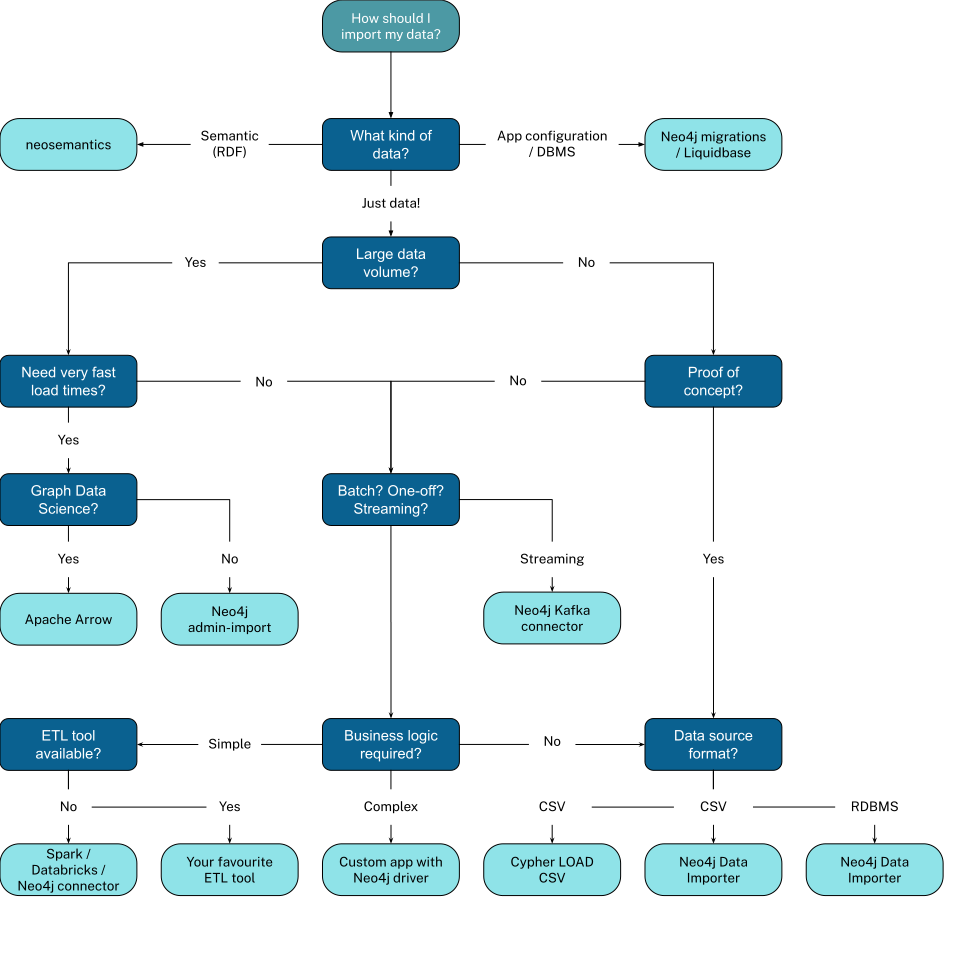

= Prerequisites and tools
:order: 2
:type: lesson

This lesson covers tools and setup. Use AuraDB Professional for Neo4j and Northwind CSV files for data. You'll use Data Importer in Module 3. The course focuses on schema analysis and modeling decisions; the source could be PostgreSQL, BigQuery, Snowflake, or any relational store.
This lesson covers tools and setup. Use AuraDB Professional for Neo4j and Northwind CSV files for data. You'll use Data Importer in Module 3. The course focuses on schema analysis and modeling decisions; the source could be PostgreSQL, BigQuery, Snowflake, or any relational store.

[.slide]
== What you need

To complete this course, you will need:

* A Neo4j AuraDB Professional instance (no credit card required)
* The Northwind CSV files (instructions below)
* Basic understanding of relational databases: tables, rows, columns, foreign keys
* Basic understanding of graph databases: nodes, relationships, properties
* Familiarity with SQL queries
* Basic knowledge of Cypher query language

[.slide.discrete]
=== Recommended prerequisite courses

[NOTE]
.Prerequisites
====
If you're new to Neo4j or graphs, complete these first:

* link:https://graphacademy.neo4j.com/courses/neo4j-fundamentals/[Neo4j Fundamentals^]
* link:https://graphacademy.neo4j.com/courses/cypher-fundamentals/[Cypher Fundamentals^]
* link:https://graphacademy.neo4j.com/courses/modeling-fundamentals/[Graph Data Modeling Fundamentals^]
====

[.slide]
=== Neo4j Database

You can complete this course using AuraDB Professional (recommended), GraphAcademy Sandbox, or Self-Managed Neo4j.

==== Option A: Neo4j Aura (Recommended)

Create an **AuraDB Professional** instance for this course:
Create an **AuraDB Professional** instance for this course:

* **No credit card required** - AuraDB Professional includes a free tier
* **Graph Data Science** - Run algorithms (PageRank, community detection) after importing
* **Data Importer included** - The visual import tool is built into the Aura console

[.slide.discrete]
=== Creating an AuraDB Professional instance

To create an AuraDB Professional instance:

. Go to link:https://console.neo4j.io/graphacademy[console.neo4j.io/graphacademy^]
. Sign in or create a Neo4j account
. Click **New Instance**
. Select **AuraDB Professional**
. Choose a region close to you
. Save your connection credentials securely

[.slide.discrete]
=== Why AuraDB Professional?

[TIP]
.Why AuraDB Professional?
====
AuraDB Professional provides access to Graph Data Science algorithms without requiring a credit card. After importing your data, you can run algorithms like PageRank, community detection, and pathfinding directly on your graph.
====

[.slide]
=== Northwind Dataset

The Northwind data is available as pre-exported CSV files in the Neo4j GitHub repository, ready to import directly into Neo4j:

Northwind CSV files: `https://github.com/neo4j-graph-examples/northwind/tree/main/import`
Northwind CSV files: `https://github.com/neo4j-graph-examples/northwind/tree/main/import`

You can:
You can:

* Download the CSV files and upload them to the Neo4j Data Importer
* Use `LOAD CSV` in Cypher to import directly from the GitHub raw URLs

[TIP]
.Quick start
.Quick start
====
The import process is covered in Module 3. Use these CSV files with the Data Importer or Cypher in your AuraDB instance.
>>>>>>> 70de014d9 (removed sandbox references)
====

[.slide]
== Using the Data Importer

The Data Importer is built into the AuraDB console. For Northwind, use the CSV files from the previous section:

[.slide]
=== Open the Data Importer

. In Neo4j Aura, open your AuraDB Professional instance
. Click **Import** in the left sidebar

[.slide]
=== Add your data

. In the Data Importer, click **Files** and upload the Northwind CSV files from `https://github.com/neo4j-graph-examples/northwind/tree/main/import`
. Or drag and drop the CSV files into the Files panel

[.slide]
=== Map and import

After adding files to the canvas:

. Configure each file as a **Node** or use it to create **Relationships**
. Set the node labels and property mappings
. Define relationship types and connect nodes

Module 3 covers the mapping process in detail.

[.slide]
== Using the Data Importer

The Data Importer is built into the AuraDB console; for Sandbox or Self-Managed Neo4j, use `data-importer.neo4j.io`. For Northwind, use the CSV files from the previous section or connect PostgreSQL (Option B above).

[.slide]
=== Open the Data Importer

. In Neo4j Aura, open your AuraDB Professional instance and click **Import** in the left sidebar
. For Sandbox or Self-Managed: open `data-importer.neo4j.io` and connect with your instance credentials

[.slide]
=== Add your data

. In the Data Importer, click **Files** and upload the Northwind CSV files from `https://github.com/neo4j-graph-examples/northwind/tree/main/import`
. Or drag and drop the CSV files into the Files panel
. If you use PostgreSQL (Option B), add it as a Data Source instead and select tables to import
The Data Importer accepts local files only (no direct URL or remote file option). To use the Northwind data:

. Download the Northwind CSV files from link:https://github.com/neo4j-graph-examples/northwind/tree/main/import[neo4j-graph-examples/northwind^]. If a single archive (e.g. a zip with all CSVs) is available, download it and unzip it locally.
. In the Data Importer, click **New data source**, then choose **.CSV/.TSV (local)**.
. Upload each CSV file (or drag and drop into the Files panel). You will need files such as `customers.csv`, `orders.csv`, `products.csv`, `categories.csv`, `suppliers.csv`, `employees.csv`, `shippers.csv`, and `order-details.csv`.

[NOTE]
.Zip upload not supported
====
The Data Importer does not accept zip files directly; you must unzip and upload individual CSV files. If this is a blocker for your workflow, consider requesting a zip-upload option via the Neo4j feedback or feature-request channels.
====

[.slide]
=== Map and import

After adding files to the canvas:

. Configure each file as a **Node** or use it to create **Relationships**
. Set the node labels and property mappings
. Define relationship types and connect nodes

Module 3 covers the mapping process in detail.

[.slide]
== Approaches for Importing Data

Data sources and import methods:

* Relational Database Management Systems (RDBMS)
* Web APIs
* Public data directories
* BI tools
* Excel
* Flat files (CSV, JSON, XML)

[.slide.discrete]
=== Import factors and options

Import method depends on these factors:

* The source of the data
* The volume of data
* The frequency of the import
* The complexity of the data model
* The transformation required

Import approaches (choose based on your data volume, update frequency, and transformation needs):

* One-off batch import of all data 
* One-off load with a regular update
* Continuous import of data
* Real-time application updates
* ETL (Extract, Transform, Load) pipelines

[.slide]
== Options for Importing Data

Import options and tools:

Use this flowchart to pick an import tool for your data source. For this course, you will use the Neo4j Data Importer (Module 3).

[.slide]
[.quiz]
== Check Your Understanding

include::questions/1-best-solution.adoc[leveloffset=+1]

[.slide]
[.summary]
== Summary

In this lesson, you explored some of the approaches for importing data.

You can try the optional mapping challenge to practice the relational-to-graph concepts, or continue to the next module to start designing your graph model.
