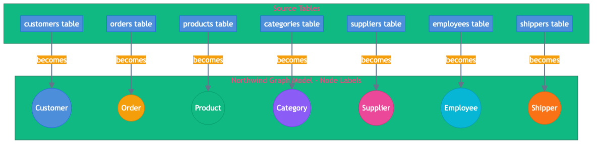

= Identifying Nodes from Tables
:order: 2
:type: lesson

In this lesson, you will determine which relational tables should become nodes in your graph model and which ones should not. Not every table becomes a node - some become relationships, some become properties, and some may not be needed at all.

== Understanding the Northwind Database Schema

image::images/ER.png[Northwind Entity-Relationship Diagram showing all tables and their relationships]

The Northwind database schema is a classic example of a relational database schema. It is a small database that is often used as a teaching example in database courses.

Make a note of the tables and their relationships.

== Understanding the Mapping

Before getting into the specifics, the following table shows how relational concepts map to graph concepts. This mapping forms the foundation for all transformation decisions:

[cols="1,1,2"]
|===
| Relational Concept | Graph Concept | Explanation

| Entity table
| Node label
| A table like `customers` becomes the `Customer` node label

| Row (record)
| Node instance
| Each row in the `customers` table becomes an individual `Customer` node

| Column (attribute)
| Property
| Columns like `company_name` and `city` become properties on the node

| Foreign key column
| Relationship
| A column like `customer_id` in the `orders` table becomes a `PLACED` relationship

| Junction table
| Relationship (often with properties)
| Tables like `order_details` become relationships like `CONTAINS`

|===

[IMPORTANT]
.Correct mapping of rows and columns
====
A common misconception is that "rows become nodes and columns become relationships." This is incorrect.

The correct mapping is:

* **Rows** → Individual **node instances** (one row = one node)
* **Columns** → **Properties** on nodes (or relationships)
* **Foreign key columns** → **Relationships** between nodes
====

[TIP]
.Bookmark this reference
====
Bookmark this mapping table and the misconception correction above. These are the two most common sources of confusion when designing graph models from relational schemas.
====

== From Tables to Nodes

Not every table in a relational database becomes a node in a graph. The transformation follows these general principles:

* **Entity tables** (tables representing real-world objects) typically become nodes
* **Junction tables** (tables that only connect other tables) often become relationships
* **Lookup tables** may become nodes, properties, or be merged into other nodes

== Analyzing Northwind Tables

The following sections categorize the Northwind tables:

=== Tables That Become Nodes

These tables represent distinct business entities and should become nodes:

[cols="1,2,2"]
|===
| Table | Node Label | Reasoning

| `customers`
| `Customer`
| Represents companies that place orders - a core business entity

| `orders`
| `Order`
| Represents purchase transactions - central to the business process

| `products`
| `Product`
| Represents items for sale - a core business entity

| `categories`
| `Category`
| Represents product groupings - useful for navigation and filtering

| `suppliers`
| `Supplier`
| Represents companies providing products - important business relationship

| `employees`
| `Employee`
| Represents staff members - needed for order processing and hierarchy

| `shippers`
| `Shipper`
| Represents delivery companies - part of the order fulfillment process

|===

=== Tables That Become Relationships

These tables exist primarily to connect other entities and do NOT become nodes:

[cols="1,2,2"]
|===
| Table | Becomes | Reasoning

| `order_details`
| `CONTAINS` relationship (Order to Product)
| Junction table connecting orders to products. The `quantity`, `unit_price`, and `discount` columns become properties on the relationship.

| `employee_territories`
| `ASSIGNED_TO` relationship (Employee to Territory)
| Pure junction table with only two foreign keys - no additional data to store.

| `customer_customer_demo`
| `HAS_DEMOGRAPHIC` relationship (Customer to Demographics)
| Junction table for customer classifications with no additional properties.

|===

[NOTE]
.Junction tables become relationships, not nodes
====
**Why do these tables not become nodes?**

Junction tables exist solely to implement many-to-many relationships in relational databases. They do not represent independent business entities - they represent the *connection* between entities.

In the graph model, this connection is naturally represented as a relationship, which can also have properties.
====

=== Tables That Become Properties (Not Nodes)

Some tables are better represented as properties on other nodes rather than separate nodes:

[cols="1,2,2"]
|===
| Table | Becomes | Reasoning

| `us_states`
| Not imported (or properties if needed)
| Reference data with state codes and names. If needed, `state_name` could be a property on Customer or Supplier nodes instead of a separate node.

| `customer_demographics`
| Property or label on Customer
| Contains only `customer_type_id` and `customer_desc`. Instead of creating a separate node, the description could become a property or additional label on Customer nodes.

|===

=== Tables That Could Go Either Way

Some tables require careful consideration based on your query patterns:

[cols="1,3"]
|===
| Table | Consideration

| `territories`
| **As nodes:** If you need to query "which employees cover territory X?" or "what territories are in region Y?" then Territory nodes make sense.

**As properties:** If you only need to know an employee's territory name, store it as a property on the Employee node or the ASSIGNED_TO relationship.

| `region`
| **As nodes:** Useful if you need geographic hierarchy traversal (Employee → Territory → Region).

**As properties:** If regions are just labels, store `region_name` as a property on Territory nodes.

|===

== When Tables Should NOT Become Nodes

Here are common scenarios where tables should not become nodes:

=== Scenario 1: Pure Junction Tables

A table with only foreign keys and no meaningful additional data should become a relationship.

**Example:** `employee_territories`
[source,sql]
----
CREATE TABLE employee_territories (
    employee_id INTEGER,
    territory_id VARCHAR(20),
    PRIMARY KEY (employee_id, territory_id)
);
----

This table has no additional columns - it only connects employees to territories. It becomes:

[source]
----
(Employee)-[:ASSIGNED_TO]->(Territory)
----

=== Scenario 2: Lookup Tables with Few Values

Small reference tables with static values can often be eliminated.

**Example:** `customer_demographics`
[source,sql]
----
CREATE TABLE customer_demographics (
    customer_type_id VARCHAR(10) PRIMARY KEY,
    customer_desc TEXT
);
----

If this table only has 3-5 values like "Premium", "Standard", "Basic", consider:

* Using **node labels** instead: `(:Customer:Premium)`, `(:Customer:Standard)`
* Using a **property**: `(c:Customer {customerType: "Premium"})`

=== Scenario 3: Audit/Log Tables

Tables that track changes or history may not belong in the main graph.

**Example:** An `order_audit` table tracking who modified orders and when:

* If you rarely query this data, keep it in the relational database
* If you need it, consider a separate audit graph or time-series database

=== Scenario 4: Denormalized Reference Data

Tables created purely for reporting or denormalization may be redundant.

**Example:** A `customer_order_summary` table with pre-calculated totals:

* This data can be calculated with Cypher queries
* No need to import redundant summary tables

== Step-by-Step Node Identification

Follow these steps to identify nodes in any relational schema:

=== Step 1: Identify Primary Entities

Look for tables that:

* Have a single-column primary key (e.g., `customer_id`, `order_id`)
* Represent real-world objects or concepts
* Are referenced by other tables via foreign keys

In Northwind, these are: `customers`, `orders`, `products`, `categories`, `suppliers`, `employees`, `shippers`

=== Step 2: Examine Junction Tables

Junction tables typically have:

* Composite primary keys (two or more columns)
* Foreign keys to two or more other tables
* Few or no additional columns beyond the keys

In Northwind, `order_details` is a junction table connecting `orders` and `products`.

=== Step 3: Decide on Junction Table Handling

For each junction table, decide whether it should become:

**A relationship** - when the table primarily connects two entities:

[source]
----
order_details → CONTAINS relationship from Order to Product
----

**A node** - when the junction table has significant properties or is queried independently:

[source]
----
If order_details had complex data like shipment tracking, 
it might warrant its own OrderLine node
----

=== Step 4: Handle Lookup Tables

Small lookup tables can be:

* **Nodes** - if you need to query or traverse them
* **Properties** - if they're just labels or categories
* **Node labels** - if they represent types of another entity

== The Northwind Graph Model

Based on this analysis, the Northwind graph model will include:

=== Node Labels

* `Customer` - from `customers` table
* `Order` - from `orders` table
* `Product` - from `products` table
* `Category` - from `categories` table
* `Supplier` - from `suppliers` table
* `Employee` - from `employees` table
* `Shipper` - from `shippers` table

=== Simplified Model

For this course, you will focus on the core business entities. The simplified model excludes:

* Territory and region data (can be added as an extension)
* Customer demographics (rarely used in the sample data)
* US states reference data

This keeps the import manageable while covering all the relevant concepts.

== Naming Conventions

When converting table names to node labels:

[cols="1,1,2"]
|===
| Convention | Example | Notes

| Singular form
| `Customer` not `Customers`
| Nodes represent individual entities

| PascalCase
| `OrderDetail` not `order_detail`
| Standard Neo4j naming convention

| Descriptive names
| `Category` not `Cat`
| Clear, readable labels

|===

[.quiz]
== Check Your Understanding

include::questions/1-multiple-properties.adoc[leveloffset=+1]

include::questions/2-mapping.adoc[leveloffset=+1]

include::questions/3-not-nodes.adoc[leveloffset=+1]

[.summary]
== Summary

In this lesson, you learned:

* How to categorize relational tables as entities, junction tables, or lookup tables
* Which Northwind tables will become nodes in the graph
* How to handle junction tables (as relationships vs. nodes)
* Naming conventions for node labels

In the next lesson, you will map the foreign key relationships to graph relationships.
