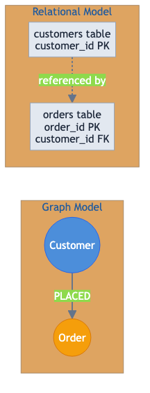
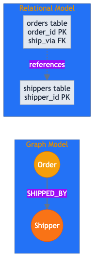
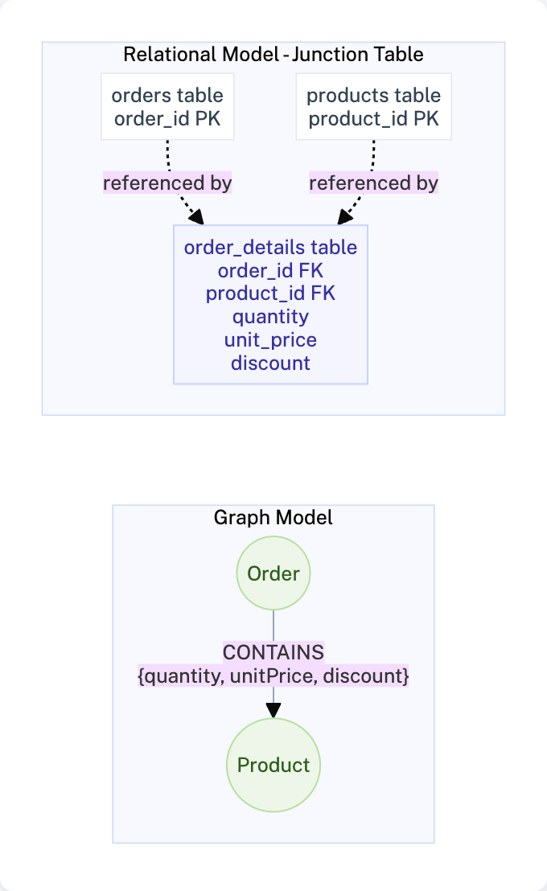
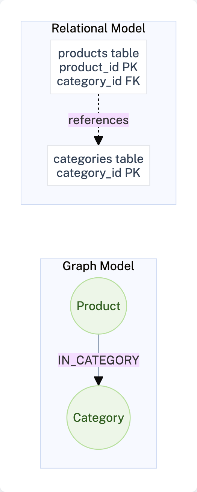
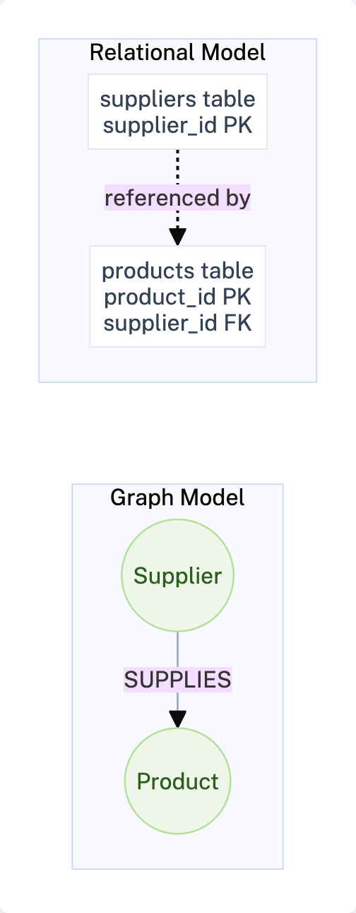
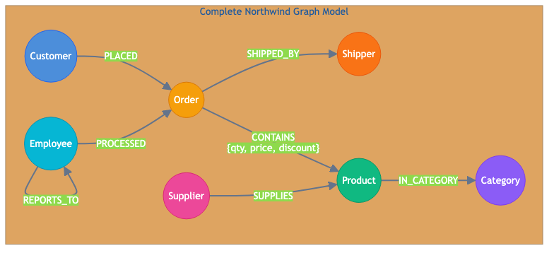

= Mapping Relationships
:order: 3
:type: lesson

In this lesson, you will learn how to transform foreign key relationships from the relational schema into graph relationships. This transformation is where the graph model begins to diverge structurally from the relational model.

[.slide]
== From Foreign Keys to Relationships

In relational databases, relationships between tables are implicit - defined through foreign keys. In a graph database, relationships are explicit and first-class citizens.

image::images/model.svg[Northwind graph model showing nodes and relationships,width=600,align=center]

The transformation process involves:

. Identifying foreign key constraints
. Determining relationship direction
. Naming relationships meaningfully
. Deciding which properties belong on relationships

[.slide]
== Common Misconceptions About Relationships

Common misconceptions that cause problems during migration:

[.slide.discrete]
=== Not every foreign key becomes a relationship

Assuming that every foreign key column in the relational schema should be modeled as a relationship in the graph.

[IMPORTANT]
.Lookup tables may become properties
====
Some foreign keys reference lookup tables that might become properties instead of relationships.
====

If you have a `status_id` foreign key pointing to a `statuses` table with values like "Pending", "Shipped", "Delivered", you might choose to store `status` as a property on the Order node rather than creating a separate Status node and relationship. In Northwind, `ship_via` references shippers; shippers are distinct business entities, so a `SHIPPED_BY` relationship makes sense. But a `region` lookup with only four values might stay as a `region` property on Customer.

[.slide.discrete]
=== Use meaningful verbs, not column names

Using the foreign key column name (e.g. `customer_id`) as the relationship type instead of a verb that describes the business relationship.

[IMPORTANT]
.Use verbs, not column names
====
The foreign key column (like `customer_id`) does NOT become the relationship type. Instead, use a meaningful verb that describes the business relationship.

**Wrong:** `(Order)-[:CUSTOMER_ID]->(Customer)`

**Correct:** `(Customer)-[:PLACED]->(Order)`
====

Northwind's `orders.ship_via` references `shippers.shipper_id`. The relationship type should be `SHIPPED_BY`, not `SHIP_VIA`. Similarly, `products.supplier_id` becomes `SUPPLIES` from Supplier to Product.

[.slide.discrete]
=== Direction follows business semantics, not foreign key direction

Inferring relationship direction from the foreign key column location (e.g. Order points to Customer because `orders.customer_id` references `customers`) instead of from business meaning.

[IMPORTANT]
.Direction follows business semantics
====
In SQL, `orders.customer_id` references `customers.customer_id`, but this does not mean the relationship should point from Order to Customer.

Choose direction based on **business semantics**: A customer places an order, so `(Customer)-[:PLACED]->(Order)` reads better than `(Order)-[:PLACED_BY]->(Customer)`.
====

In Northwind, `orders.employee_id` references employees. The relationship should be `(Employee)-[:PROCESSED]->(Order)` because an employee processes an order, not `(Order)-[:EMPLOYEE_ID]->(Employee)`. The foreign key lives on Order, but the natural direction is Employee to Order.

[.slide.discrete]
=== Junction table rows create one relationship each

Misinterpreting junction table rows as creating multiple relationships or as nodes, when each row typically represents a single relationship between two entities.

[IMPORTANT]
.One row, one relationship
====
True for regular foreign keys, but be careful with junction tables. In `order_details`, each row represents ONE relationship between an Order and a Product - not two separate relationships.
====

One `order_details` row with `order_id=10248`, `product_id=11`, `quantity=12`, `unit_price=14` creates a single `(Order)-[:CONTAINS {quantity:12, unitPrice:14}]->(Product)` relationship. It does not create an OrderDetail node, nor does it create two relationships (Order to Product and Product to Order).

[TIP]
.Bookmark these misconceptions
====
Bookmark these four misconceptions. They represent the most frequent errors made when transforming foreign keys into graph relationships. Review them before starting any migration project.
====

[.slide]
== Foreign Key Analysis

Recall the foreign keys in the Northwind database:

[cols="1,1,1,1"]
|===
| Source Table | Foreign Key | Target Table | Target Key

| `orders`
| `customer_id`
| `customers`
| `customer_id`

| `orders`
| `employee_id`
| `employees`
| `employee_id`

| `orders`
| `ship_via`
| `shippers`
| `shipper_id`

| `order_details`
| `order_id`
| `orders`
| `order_id`

| `order_details`
| `product_id`
| `products`
| `product_id`

| `products`
| `category_id`
| `categories`
| `category_id`

| `products`
| `supplier_id`
| `suppliers`
| `supplier_id`

| `employees`
| `reports_to`
| `employees`
| `employee_id`

|===

[.slide]
== Designing Graph Relationships

For each foreign key, design a meaningful graph relationship:

=== Customer Orders

**Foreign Key:** `orders.customer_id` references `customers.customer_id`

**Graph Relationship:**

[source]
----
(Customer)-[:PLACED]->(Order)
----

The customer places an order. The relationship direction reflects the business action.

=== Employee Processes Order

**Foreign Key:** `orders.employee_id` references `employees.employee_id`

**Graph Relationship:**

[source]
----
(Employee)-[:PROCESSED]->(Order)
----

Alternatively, use `(Order)-[:PROCESSED_BY]->(Employee)` if you mostly query "which employee processed this order?" instead of "which orders did this employee process?"

image::images/employee-processed-order.png[Employee PROCESSED Order relationship mapping,width=700,align=center]

=== Order Shipped By

**Foreign Key:** `orders.ship_via` references `shippers.shipper_id`

**Graph Relationship:**

[source]
----
(Order)-[:SHIPPED_BY]->(Shipper)
----

=== Order Contains Products

**Foreign Key:** `order_details.order_id` references `orders.order_id` and `order_details.product_id` references `products.product_id`

This junction table becomes a relationship with properties:

**Graph Relationship:**

[source]
----
(Order)-[:CONTAINS {quantity, unitPrice, discount}]->(Product)
----

The `order_details` table data becomes properties on the `CONTAINS` relationship.

=== Product Categorization

**Foreign Key:** `products.category_id` references `categories.category_id`

**Graph Relationship:**

[source]
----
(Product)-[:IN_CATEGORY]->(Category)
----

=== Product Supplier

**Foreign Key:** `products.supplier_id` references `suppliers.supplier_id`

**Graph Relationship:**

[source]
----
(Supplier)-[:SUPPLIES]->(Product)
----

Or alternatively: `(Product)-[:SUPPLIED_BY]->(Supplier)`

=== Employee Hierarchy

**Foreign Key:** `employees.reports_to` references `employees.employee_id`

**Graph Relationship:**

[source]
----
(Employee)-[:REPORTS_TO]->(Employee)
----

This self-referencing relationship creates the management hierarchy.

image::images/employee-reports-to.png[Employee REPORTS_TO Employee - Self-referencing relationship for hierarchy,width=700,align=center]

[.slide]
== Complete Relationship Model

The full Northwind graph model includes these relationships:

[cols="1,2,2"]
|===
| Relationship Type | From Node | To Node

| `PLACED`
| `Customer`
| `Order`

| `PROCESSED`
| `Employee`
| `Order`

| `SHIPPED_BY`
| `Order`
| `Shipper`

| `CONTAINS`
| `Order`
| `Product`

| `IN_CATEGORY`
| `Product`
| `Category`

| `SUPPLIES`
| `Supplier`
| `Product`

| `REPORTS_TO`
| `Employee`
| `Employee`

|===

[.slide]
== Relationship Direction Guidelines

When deciding relationship direction, consider:

. **Business semantics** - Which direction makes logical sense? (Customer places Order, not Order places Customer)

. **Query patterns** - Which direction will you traverse most often?

. **Readability** - The relationship should read naturally in a sentence

[NOTE]
.Traversal works in both directions
====
In Neo4j, you can traverse relationships in either direction regardless of how they are stored. The direction you choose affects query readability and can have minor performance implications for very large graphs.
====

[.slide]
== Relationship Naming Conventions

Follow these conventions for relationship types:

[cols="1,2"]
|===
| Convention | Example

| UPPER_SNAKE_CASE
| `PLACED`, `REPORTS_TO`, `IN_CATEGORY`

| Active voice verbs
| `SUPPLIES` not `SUPPLIED`

| Descriptive names
| `SHIPPED_BY` not `SHIP`

| Past tense for completed actions
| `PLACED` for orders that were placed

|===

[.slide]
== Handling Many-to-Many Relationships

The `order_details` table represents a many-to-many relationship between orders and products. In the graph model:

* Each row in `order_details` becomes a `CONTAINS` relationship
* The `quantity`, `unit_price`, and `discount` columns become relationship properties
* No separate node is needed for order details

This is an advantage of graph databases: relationship properties eliminate the need for junction tables. In relational databases, storing attributes on a many-to-many relationship requires an intermediary table; in graph databases, these attributes become properties on the relationship itself.

[.slide]
== What Does NOT Become a Relationship

Not every foreign key should become a relationship. Here are scenarios where you might choose differently:

=== Scenario 1: Foreign Keys to Small Lookup Tables

When a foreign key references a small lookup table with static values, consider using a property instead.

**Example:** A `priority_id` foreign key to a `priorities` table:

[source,sql]
----
-- Relational model
SELECT o.order_id, p.priority_name
FROM orders o
JOIN priorities p ON o.priority_id = p.priority_id;
----

**Option A - As a relationship (more complex):**
[source]
----
(Order)-[:HAS_PRIORITY]->(Priority {name: "High"})
----

**Option B - As a property (simpler):**
[source]
----
(Order {priority: "High"})
----

Choose Option B when:

* The lookup table has few values (< 10)
* You do not need to traverse or query the lookup values independently
* The values are unlikely to change

=== Scenario 2: Redundant Relationships

Sometimes a relationship can be inferred from other relationships and does not need to be stored.

**Example:** If you have:
[source]
----
(Customer)-[:PLACED]->(Order)-[:CONTAINS]->(Product)
----

You might be tempted to also create:
[source]
----
(Customer)-[:PURCHASED]->(Product)
----

But this is redundant - you can always find what products a customer purchased by traversing through orders. Only create direct relationships if:

* The traversal path is very long (performance concern)
* The direct relationship has unique properties not derivable from the path

=== Scenario 3: Self-Referencing Foreign Keys That Represent Hierarchy Levels

Sometimes self-referencing tables encode fixed hierarchy levels rather than flexible relationships.

**Example:** An `employees` table with `level_1_manager_id`, `level_2_manager_id`, `level_3_manager_id` columns.

Instead of creating three different relationship types, consider:

* Using a single `REPORTS_TO` relationship and traversing the hierarchy
* Or storing the level as a property on the relationship

=== Scenario 4: Foreign Keys for Audit/Metadata

Foreign keys that track who created or modified records might not need relationships.

**Example:** `created_by_user_id` and `modified_by_user_id` columns:

[source,sql]
----
CREATE TABLE orders (
    order_id INTEGER PRIMARY KEY,
    created_by_user_id INTEGER,
    modified_by_user_id INTEGER,
    -- ... other columns
);
----

Consider:

* **As relationships** - If you need to query "what orders did user X create?"
* **As properties** - If this is just audit data you rarely query: `(Order {createdBy: "user123"})`

[.slide]
== Relationship Cardinality Considerations

Understanding cardinality helps you design better relationships:

[cols="1,2,2"]
|===
| SQL Cardinality | Graph Representation | Example

| One-to-One
| Single relationship (consider merging nodes)
| `(Person)-[:HAS_PASSPORT]->(Passport)` - Could also be properties on Person

| One-to-Many
| Multiple relationships from one node
| `(Customer)-[:PLACED]->(Order)` - One customer, many orders

| Many-to-Many
| Junction table becomes relationship with properties
| `(Order)-[:CONTAINS {quantity}]->(Product)`

|===

[NOTE]
.Consider merging one-to-one relationships
====
**One-to-One relationships** are rare in graph databases. If two entities always exist together and are always queried together, consider merging them into a single node with combined properties.
====

[.slide]
[.quiz]
== Check Your Understanding

include::questions/verify.adoc[leveloffset=+1]

include::questions/2-misconceptions.adoc[leveloffset=+1,fragment]

include::questions/3-not-relationships.adoc[leveloffset=+1]

[.slide]
[.summary]
== Summary

In this lesson, you learned:

* How to transform foreign keys into graph relationships
* Guidelines for choosing relationship direction
* Naming conventions for relationship types
* How to handle junction tables as relationships with properties

In the next lesson, you will design the properties for nodes and relationships.
