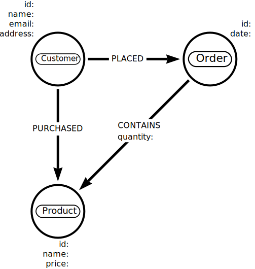

= Developing a data model
:order: 2
:type: lesson

In the last lesson, you learned the importance of understanding the source data before importing it into Neo4j. 

In this lesson, you will see how the data model influences and directs the import process.

Before you create data within Neo4j, there is no data model. 
Neo4j is _schema-optional_ and allows you to create data without a predefined schema.
You create the data model as you import data into Neo4j.

As a result, your import process will also define the data model.
As you import data, you create nodes and relationships, dynamically forming the data model.

[IMPORTANT]
.Design for your objectives, not for the source structure
====
You should not let the source data structure dictate the graph data model.
Instead, build a data model that works for your project's objectives.

Create an import process that transforms the source data into a graph data model; do not create a model that fits the source data.
====

== Common Import Misconceptions

When extracting and preparing data for import, avoid these common mistakes:

[IMPORTANT]
.Misconception 1: "Export all columns from every table"
====
**Wrong:** Extracting every column from the relational database.

**Reality:** Only extract columns that will become:
* Node properties you actually need
* Relationship properties
* Foreign keys needed to create relationships

Columns like `created_at`, `updated_at`, or internal flags may not be needed in the graph.
====

[IMPORTANT]
.Misconception 2: "Keep the same column names as properties"
====
**Wrong:** Using SQL column names directly as Neo4j property names.

**Reality:** Transform column names to follow Neo4j conventions:
* Use camelCase: `company_name` → `companyName`
* Remove prefixes: `customer_id` → `customerID` or just use as identifier
* Make names meaningful: `ship_via` → relationship to Shipper, not a property
====

[IMPORTANT]
.Misconception 3: "Import everything in one step"
====
**Wrong:** Trying to import all data, nodes, and relationships in a single operation.

**Reality:** Import in phases:
1. Create constraints first
2. Import nodes (one label at a time)
3. Create relationships (after all referenced nodes exist)

This ensures referential integrity and better error handling.
====

[IMPORTANT]
.Misconception 4: "CSV structure must match the final graph structure"
====
**Wrong:** Assuming you need one CSV file per node type with exact property names.

**Reality:** You can:
* Transform data during import using Cypher
* Use a single CSV to create multiple node types
* Derive properties from combinations of columns
* Skip columns you do not need
====

== Modelling

You have two options for developing your graph data model visually:

=== Option A: Neo4j Data Importer (Aura)

If you are using Aura, the Data Importer provides built-in modelling:

. Open your AuraDB instance and click **Import**
. Add node labels by clicking **Add node label** on the canvas
. Drag between nodes to create relationships
. The model is automatically saved and can be exported

The Data Importer combines modelling and import in one tool - you design the model and import data in the same interface.

=== Option B: Arrows.app

link:https://arrows.app/[Arrows^] is a standalone tool for creating graph data models.

image::images/arrows.png[A screenshot of the Arrows user interface]

Arrows allows you to create a visual representation of the data model. Arrows supports:

* Creation of nodes, relationships, properties, and labels
* Styling including colors, sizes, and layouts
* Export as an image or Cypher

[TIP]
.When to use which tool
====
* **Data Importer** - Best when you want to model and import in one step
* **Arrows.app** - Best for creating documentation, sharing models, or planning before import
====

[%collapsible]
.Optional arrows activity
====
Use link:https://arrows.app/[Arrows^] to create a simple data model.

The data model should include the following nodes, properties, and relationships:

* Node labels - `Customer`, `Product`, `Order`
* Relationships
** `Customer` - `PURCHASED` -> `Product`
** `Customer` - `PLACED` -> `Order`
** `Order` - `CONTAINS` -> `Product`
* Properties
** `Customer` - `id`, `name`, `email`, `address`
** `Product` - `id`, `name`, `price`
** `Order` - `id`, `date`
** `CONTAINS` - `quantity`

====

The data model in Neo4j is flexible and can evolve as you import data. 
Neo4j supports a schema-less approach, allowing you to create data without a predefined schema.

== Data types

As part of your data modeling and import process, you should consider data types and how you will represent them in Neo4j.

Neo4j supports a range of data types, including `BOOLEAN`, `DATE`, `DURATION`, `FLOAT`, `INTEGER`, `LIST`, `LOCAL DATETIME`, `LOCAL TIME`, `POINT`, `STRING`, `ZONED DATETIME`, and `ZONED TIME`.

You can learn more about Neo4j data types in the link:https://neo4j.com/docs/cypher-manual/current/values-and-types/[Neo4j documentation^].

[.quiz]
== Check Your Understanding

include::questions/1-data-model.adoc[leveloffset=+1]

[.summary]
== Summary

In this lesson, you explored how the data model influences how you import data into Neo4j.

In the next optional challenge, you will import your own data into Neo4j.