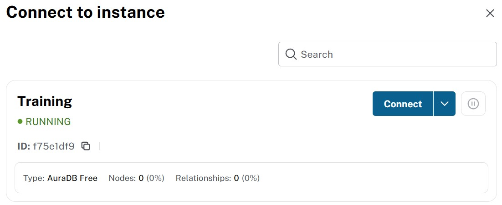

= Import Northwind Nodes
:order: 3
:type: challenge
:disable-cache: true
:shared-dir: ../../../../shared
:solution-filename: person-import.zip

Your challenge is to use the Neo4j Data Importer to upload Northwind CSV files, model your data, and create nodes.

To complete this challenge:

. Upload the Northwind CSV files to Data Importer
. Create node labels for Customer, Order, Product, Category, Supplier, Employee, and Shipper
. Map CSV columns to node properties and set unique identifiers
. Run the import to create nodes in your database

image::images/01_data_importer_main.jpg[Neo4j Data Importer main interface,width=600,align=center]

[.slide]
== Choosing Your Import Environment

You have two options for accessing the Data Importer:

=== Option A: Neo4j Aura (Recommended)

If you are using AuraDB:

. Log in to Neo4j Aura at link:https://console.neo4j.io/graphacademy[console.neo4j.io/graphacademy^]
. Open your AuraDB instance
. Click **Import** in the left sidebar

The Data Importer opens directly connected to your Aura database.

=== Option B: Neo4j Workspace (Sandbox)

If you are using the GraphAcademy sandbox:

. Open Neo4j Data Importer at `data-importer.neo4j.io`
. Click **Connect** and enter your sandbox credentials:
+
Connection URL:: [copy]#{instance-host}:{instance-boltPort}#
Username:: [copy]#{instance-username}#
Password:: [copy]#{instance-password}#

[%collapsible]
.Need to clear an existing model?
====
If you have an existing data importer model, you can clear it by selecting the `Clear all` option from the menu `...`.

image::images/clear-model-annotated.png[The clear all option in the data importer menu '...']
====

[.slide]
== Creating Nodes

Create nodes with Data Importer:

. Add a data source (CSV file)
. Create a node label
. Map properties from the CSV file to the node
. Set a unique identifier
. Run the import

[.slide.discrete]
=== Step 1: Add a Data Source

Data Importer can import data from CSV (Comma Separated Values) and TSV (Tab Separated Values) files.

. Click **New data source** in the Files panel
. Select **CSV** as the data source type
+
image::images/01_data_importer_source.jpg[Add new data source,width=450,align=center]

. Drag and drop your CSV file or click to browse
+
image::images/01_data_importer_drop.jpg[Drop CSV file,width=200,align=center]

. Once uploaded, the file contents will be displayed
+
image::images/01_data_importer_manual.jpg[CSV file contents displayed,width=450,align=center]

For this course, you can use the Northwind CSV files from: `https://github.com/neo4j-graph-examples/northwind/tree/main/import`

[.slide.discrete]
=== Step 2: Create a Node Label

Start with a blank canvas:

image::images/01_data_importer_model_blank.jpg[Blank data model canvas,width=600,align=center]

Create new nodes:

. Click **Add node label** on the canvas
. Enter the label name such as `Customer`, `Product`, or `Order`
. In the Definition panel, select the corresponding CSV file
. Click **Map from table** to map CSV columns to node properties
. Select the columns you want to import and click **Confirm**

image::images/01_data_importer_model_person.jpg[Node with mapped properties,width=600,align=center]

[TIP]
.Editing properties
====
You can edit property names and types by clicking the pencil icon next to each property. This allows you to:

* Rename columns to follow Neo4j naming conventions, for example `customer_id` to `customerID`
* Change data types: String, Integer, Float, Boolean, Date
* Remove columns you do not need
====

[.slide.discrete]
=== Type mismatch in Data Importer

[NOTE]
.Type mismatch in Data Importer
====
If Data Importer cannot convert a source value to the specified data type (e.g. text in a column you set as Integer), the import continues successfully but that node will not have that property. Check your data types and verify node counts if you suspect type mismatches.
====

[.slide.discrete]
=== Step 3: Set a Unique Identifier

Every node type needs a unique identifier to:

* Prevent duplicate nodes during import
* Enable efficient lookups
* Create relationships between nodes

Click the **key icon** next to the ID property to set it as the unique identifier.

image::images/set-id-annotated.png[The key icon next to the ID property]

Data Importer creates a `Name` for each property and assigns a `Type` based on the data in the file. The `Column` refers to the field in the CSV file.

When you set a unique identifier, Data Importer automatically creates a unique constraint and index for that property. This enables MERGE semantics on re-import and faster lookups.

[.slide.discrete]
=== Constraints and Indexes in Data Importer

You can view and manage constraints and indexes from the Data Importer UI:

. Select a node in your model
. Switch to the **Constraints & Indexes** tab in the Definition panel
. The unique ID property creates a constraint and index automatically
. To add an extra index for query performance (e.g. on `companyName` for Customer), click the **+** button under Indexes, select the property, and run the import

image::images/constraints-tab-annotated.png[Constraints & Indexes tab in Data Importer]

Adding indexes improves query performance for filters and lookups. For example, an index on `orderDate` speeds up date-range queries on Order nodes.

[.slide.discrete]
=== Step 4: Run the Import

Once your model is complete:

. Click **Run import**
+
image::images/run-import-annotated.png[The run import button]

. If using Workspace (not Aura), you will need to connect to your database:
+

. Wait for the import to complete. You will see a summary of the results:
+
image::images/01_data_importer_result.jpg[Import results summary,width=450,align=center]

. Click **Close** to return to Data Importer

[.slide.discrete]
=== Step 5: Save Your Model

After a successful import:

. Give your data model a name such as "Northwind Model"
. Click **Save**

image::images/01_data_importer_model_named.jpg[Named data model,width=450,align=center]

[TIP]
.Reusing your model
====
Saved models can be reused for future imports. You can also download your model using the **...** menu > **Download model (with data)** to back it up or share with colleagues.
====

[.slide]
== Verify the Import

Verify your data in the Query tool:

[source,cypher]
----
// Count nodes by label
MATCH (n) 
RETURN labels(n)[0] AS label, COUNT(*) AS count
ORDER BY count DESC
----

[source,cypher]
----
// View sample data
MATCH (c:Customer) RETURN c LIMIT 10
----

image::images/result.svg[Query results showing imported nodes]

[.slide]
== Common Import Mistakes to Avoid

Common mistakes to avoid:

[IMPORTANT]
.Mistake 1: Not setting a unique identifier
====
**Problem:** Importing nodes without a unique ID property.

**Consequence:** 
* Cannot use MERGE to update existing nodes
* May create duplicate nodes on re-import
* Difficult to create relationships later

**Solution:** Always set a unique identifier for each node type before importing.
====

[IMPORTANT]
.Mistake 2: Importing foreign keys as properties
====
**Problem:** Keeping foreign key columns as node properties.

**Example:** Creating a `Customer` node with `customerID` AND keeping `order_id` as a property.

**Reality:** Foreign keys should become relationships, not properties. The `order_id` on a customer does not make sense - instead, create a relationship from Customer to Order.
====

[IMPORTANT]
.Mistake 3: Wrong data types
====
**Problem:** Importing all data as strings when other types are appropriate.

**Examples:**
* Dates stored as strings instead of Date type
* Numbers stored as strings instead of Integer/Float
* Booleans stored as "true"/"false" strings

**Solution:** Check and set appropriate data types in Data Importer or convert during Cypher import.
====

[IMPORTANT]
.Mistake 4: Creating nodes before constraints
====
**Problem:** Importing nodes first, then trying to add constraints.

**Consequence:** If duplicate data exists, constraint creation will fail.

**Solution:** Always create constraints BEFORE importing data:
[source,cypher,role=noplay]
----
CREATE CONSTRAINT customer_id IF NOT EXISTS
FOR (c:Customer) REQUIRE c.customerID IS UNIQUE
----
====

[TIP]
.Backup your work
====
Data Importer saves changes automatically, but you can download your import model and data by selecting the `Download model (with data)` option from the menu `...`.

image::images/download-model-data-annotated.png[The download model (with data) option in the data importer menu '...']

You can restore your model using the `Open model (with data)` option and selecting the downloaded file.
====

[%collapsible]
.Need to download a working solution?
====
include::{shared-dir}/solution.adoc[]
====

[.slide]
[.quiz]
== Check Your Understanding

include::questions/1-requirements.adoc[leveloffset=+1]

[.slide]
[.summary]
== Summary

In this challenge, you imported Northwind nodes using the Data Importer. In the next lesson, you will create relationships between them.
