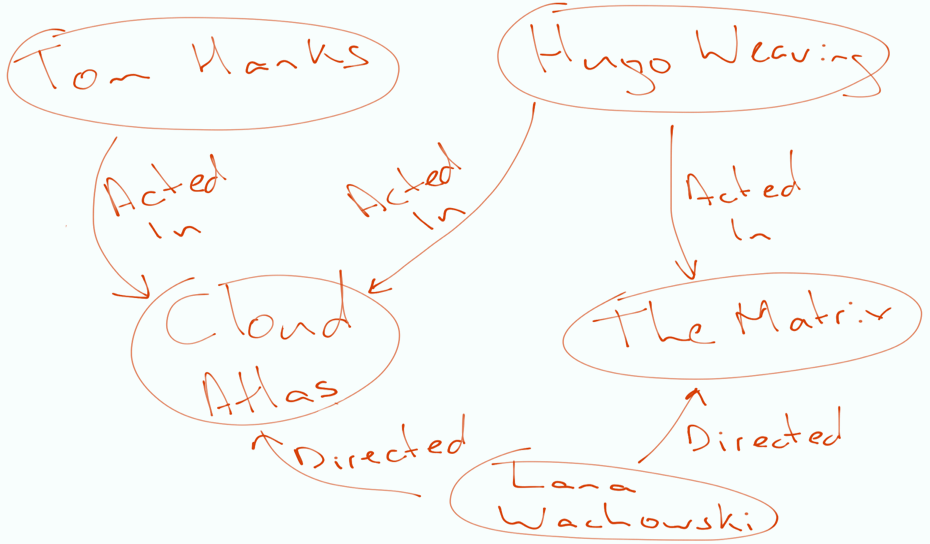

= Cypherの紹介
:type: quiz
:order: 1

// [.video]
// video::jEIE_b1MzAE[youtube,width=560,height=315]

//https://youtu.be/jEIE_b1MzAE

////
Script: 1-Reading-Intro to Cypher

https://docs.google.com/document/d/1u5OO6OOUnD0JVdnsGjj5Zs1DLPzUiqFKVO7W4tmBh9k/edit?usp=sharing

////

// [TIP]
// .Our goal:
// As a *movie fanatic* +
// I would like to *find my favorite actor* +
// so that I can *find out more about him*

[.transcript]
== Cypherとは？
Cypherはグラフのために設計されたクエリ言語です。

私たちのドメインエンティティのホワイトボードモデルは、グラフとしてデータベースに格納されています。
ホワイトボードにグラフを描くと、エンティティを矢印で結ばれた円として表現します。
この例では、実体は「人」と「映画」です。グラフには、_Person_ と _Movie_ のノードがあります。

ホワイトボードに丸や矢印を描くように、Cypherでパターンを書き出していくのです。

* ノードは括弧 `()` で表される。
* ラベルはコロンで表し、例えば `(:Person)` とします。
* ノード間の関係は2本のダッシュで記述される(例えば `(:Person)--(:Movie)`).
* リレーションシップの方向は、大なり小なり記号 `<` または `>` を用いて示されます（例： `(:Person)-->(:Movie)` ）。
* リレーションシップのタイプは、2つのダッシュの間にある角括弧 `[` と `]` を使って記述されます。
* スピーチバブルで描かれるプロパティは、JSONのような構文で指定されます。
** Neo4jのプロパティはキーと値のペアで、例えば `{name: 'Tom Hanks'}` のようになります。

例えば、グラフの中のCypherパターンは以下のようになります。

[source,Partial,role=nocopy noplay]
----
// example Cypher pattern
(m:Movie {title: 'Cloud Atlas'})<-[:ACTED_IN]-(p:Person)
----

このパターンでは、_Movie_ と _Person_ という2つのノードタイプがあります。
Person_ ノードは、_Movie_ ノードに対して _ACTED_IN_ の有向リレーションシップを持ちます。
このパターンの特定の_Movie_ノードは、_title_プロパティの値が_Cloud Atlas_であることによってフィルタリングされます。
つまり、このパターンは、グラフ内で映画_Cloud Atlas_に出演したすべての人を表しています。

=== Cypherの仕組み

Cypherはデータ中のパターンをマッチングすることで動作します。
グラフからデータを取得するには、 `MATCH` キーワードを使用します。
MATCH` 節は、SQL 文の FROM 節と同じように考えることができます。

例えば、グラフから _Person_ を見つけたい場合、ラベルが `:Person` で、プレフィックスがコロン `:` のノード1つのパターンを `MATCH` とします。

[source,Partial,role=nocopy noplay]
----
MATCH (:Person)
// incomplete MATCH clause because we need to return something
----

例えば、グラフからすべての_Person_ノードを取得したいとする。コロンの前に値を置くことで、変数を代入することができる。
ここでは、変数 `p` を使ってみましょう。これで `p` がグラフから取得したすべての _Person_ ノードを表すようになったので、 `RETURN` 節を使用してそれらを返すことができる。

このCypherのコードを実行してみてください。

[TIP]
コードサンプルの右上にある*Run in Sandbox*ボタンをクリックすると、右側にサンドボックスが開き、クエリが実行されます。

[source,cypher]
----
MATCH (p:Person)
RETURN p
----

このクエリは、グラフ内の _Person_ ラベルを持つすべてのノードを返します。
返された結果は、グラフ・ビューまたはテーブル・ビューを使用して表示できます。
テーブル・ビューを選択すると、返されたノードのプロパティも表示されます。

ここで、名前が _Tom Hanks_ である _Person_ を表すノードを探したいとします。
Person_ ノードはすべて _name_ プロパティを持っています。
この場合、__braces__ `{..}` を使用して、_name_ と _Tom Hanks_ のキー/値のペアをフィルターとして指定します。
Tom Hanks_は文字列なので、一重引用符または二重引用符で囲む必要があります。

[source,cypher]
----
MATCH (p:Person {name: 'Tom Hanks'})
RETURN p
----

このクエリは、_Tom Hanks_を表す1つのノードを返します。
Neo4j Browserのグラフビューでは、ノードはバブルとして可視化されます。
また、返された結果はテーブルビューで見ることができ、ノードのプロパティを見ることができます。

Cypherステートメントでは、_dot記法_を使ってプロパティにアクセスできます。
例えば、_name_のプロパティ値を返すには、そのプロパティキー `p.name` を使用します。

[source,cypher]
----
MATCH (p:Person {name: 'Tom Hanks'})
RETURN  p.born
----

このクエリは、_Tom Hanks_ノードの_born_プロパティの値を返します。

[IMPORTANT]
--
Cypherでは、ラベル、プロパティキー、変数は、大文字と小文字が区別されます。
Cypherのキーワードは、大文字と小文字が区別されません。

Neo4jのベストプラクティスは以下の通りです。

* ラベルには**CamelCase**を使用して名前を付けます。
* プロパティキーと変数に**camelCase**を使用した名前を付けます。
* Cypherキーワードには、**UPPERCASE**を使用します。
--

クエリをフィルタリングするもう一つの方法は、中括弧でプロパティ値をインラインで指定するのではなく、`WHERE`句を使用することです。

このクエリは、前のクエリと同じデータを返します。

[source,cypher]
----
MATCH (p:Person)
WHERE p.name = 'Tom Hanks'
RETURN p.name
----

Cypher の使用経験を積むと、 `WHERE` 句にさらにロジックを追加できるので、 `WHERE` を使ってクエリをフィルタリングすることが非常に強力であることがわかるでしょう。
以下は、_name_ の 2 つの値でフィルタリングする例です。

[source,cypher]
----
MATCH (p:Person)
WHERE p.name = 'Tom Hanks' OR p.name = 'Rita Wilson'
RETURN p.name, p.born
----

このクエリは、2人の名前とそれに関連する生年月日を返します。

// | p.name |
// | -- |
// | Tom Hanks |

== 理解度の確認

include::questions/1-read-clause.adoc[leveloffset=+1]

include::questions/2-valid-clauses.adoc[leveloffset=+1]

include::questions/3-complete-query.adoc[leveloffset=+1]

[.summary]
== まとめ

このレッスンでは、グラフからノードを取得するためのクエリの書き方を学びました。
次の課題では、グラフからノードを取得するスキルを発揮していただきます。
